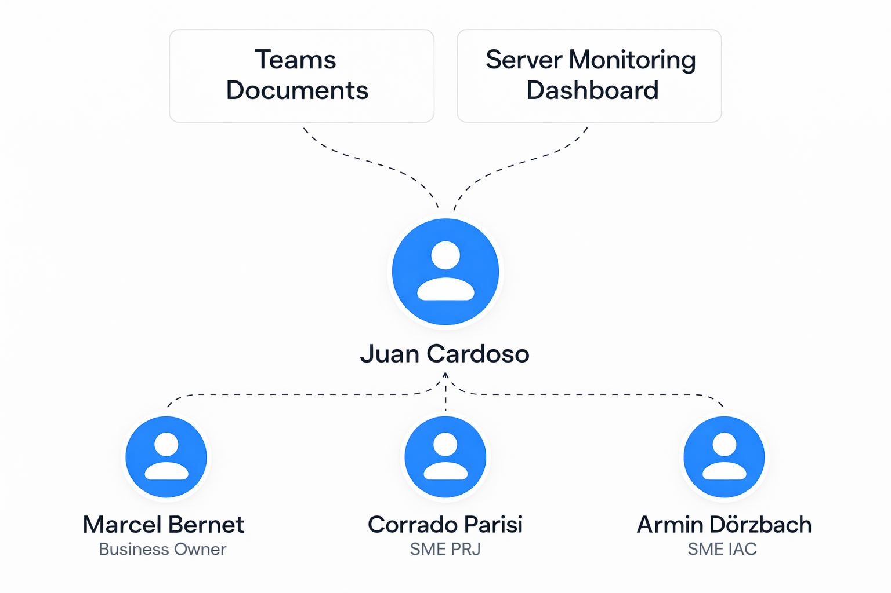

# 3.2 Project Organization
 
# Definition of roles

The project organization is defined as per the following image:

## Project & Student

This project will be planned and executed by Juan Cardoso. Juan Cardoso will also serve as both the Scrum Master and Product Owner, following the Scrum Project Management Methodology.

Product Owner: The Product Owner ensures that all the needs and goals of the Business Owners are implemented.
Scrum Master: The Scrum Master ensures the team follows the Agile project management methodology, facilitates Scrum events, removes obstacles, and acts as a representative of the team.

#  Subject Matter Expert (SME)

The SME is the assigned expert for the project, which thanks to their wide knowledge will be able to assist and support its development.
Armin D. is the assigned SME for IAC, and Corrado Parisi oversees the project management.

# Business Owner (BO) & Stakeholder

The Business Owner defines the vision and goals for the project, making sure everything is in line with the organization’s needs and objectives.
They work hand in hand with the Product Owner, communicating the business needs and requirements. They also make sure that the development prioritizes features based on business value and impact.
The Business Owner also servers as a middleman between the project team and the stakeholders, ensuring everyone is on the same page through clear communication.

The main goal is to maximize the value of the project for the company.

The stakeholders are in this case the school itself.