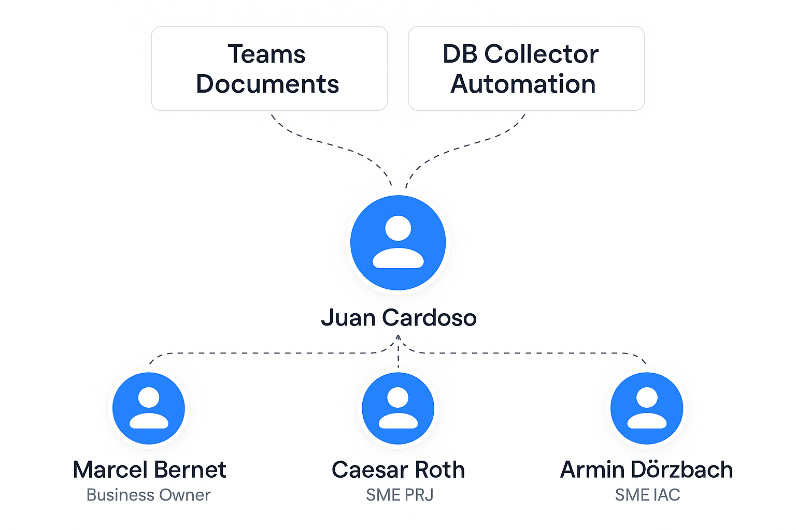

# 3.2 Project Organization
 

# Definition of roles

The project organization is defined as per the following image:

## Project & Student

This project will be planned and executed by Juan Cardoso. Juan Cardoso will also serve as both the Scrum Master and Product Owner, following the Scrum Project Management Methodology.

Product Owner: The Product Owner ensures that all the needs and goals of the Business Owners are implemented.
Scrum Master: The Scrum Master ensures the team follows the Agile project management methodology, facilitates Scrum events, removes obstacles, and acts as a representative of the team.

#  Subject Matter Expert (SME)

The SME is the assigned expert for the project, which thanks to their wide knowledge will be able to assist and support its development.
Armin D. is the assigned SME for IAC, and Caesar Roth oversees the project management.

# Business Owner (BO) & Stakeholder

The Business Owner defines the vision and goals for the project, making sure everything is in line with the organization’s needs and objectives.
They work hand in hand with the Product Owner, communicating the business needs and requirements. They also make sure that the development prioritizes features based on business value and impact.
The Business Owner also servers as a middleman between the project team and the stakeholders, ensuring everyone is on the same page through clear communication.

The main goal is to maximize the value of the project for the company.

The stakeholders are in this case the school itself.

# Jira

Jira makes it easy to have a project overview through Scrum and Kanban boards, as well as monitoring the progress made.

The Kanban board displays the status of each task as it progresses through the sprint:

| To Do (Open)         | In Progress              | Done (Completed)         |
|----------------------|--------------------------|--------------------------|
| Tasks that are yet to be started | Tasks currently being worked on | Tasks that have been completed |

This visual workflow helps the team quickly identify bottlenecks and maintain a steady pace.

## Task Fields

Each task in Jira includes several key fields to support organization and prioritization:

| Field      | Description                                  |
|------------|----------------------------------------------|
| Tag        | Unique identifier or label for the task       |
| Assignee   | Person responsible for completing the task    |
| Status     | Current state (e.g., To Do, In Progress, Done)|
| Epic       | High-level feature or initiative grouping tasks|
| Start Date | Date when work on the task begins            |
| End Date   | Target or actual completion date             |
| Priority   | Importance level (e.g., High, Medium, Low)   |
| Sprint     | The sprint to which the task is assigned      |
| Stories    | User stories or requirements addressed by the task |

This structured approach ensures transparency, accountability, and effective sprint planning.

By leveraging Jira's boards and detailed task fields, teams can maintain clarity, focus on priorities, and continuously improve their workflow.
 

# GitHub Repository & Pages
 
The project’s documentation is written in markdown format and stored in a git-repository in GitHub. This repository contains all the project’s documents, images, and configuration files.

GitHub facilitates the visual progression of the project through versioning and commit history.

Thanks to GitHub pages, the project can be hosted in a website for free directly through the contents of my repository. This is ideal for static websites like this one.

With the use of Jekyll, markdown formatted text can be converted into static HTML websites. It also counts with a nice and clean layout “Just the Docs” which has been implemented for this project.