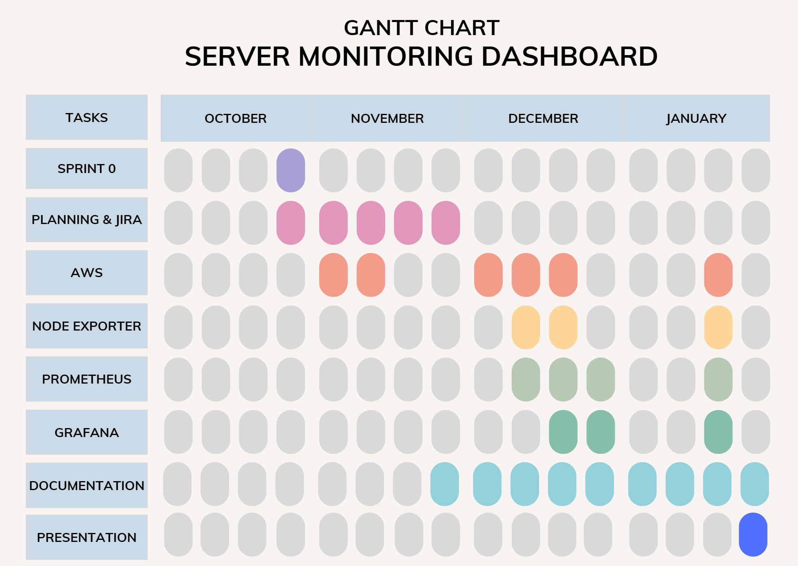

# 3.3 Charts and Analysis

## SWOT Analysis

A SWOT analysis helps identify the influencing factors of a project: what is working well (strengths), what could cause problems (weaknesses), where there are chances to improve or grow (opportunities), and what might go wrong (threats). It is a good way to get a clear picture of the project's situation.

## Gantt Chart

A Gantt Chart is a visual project timeline, displaying tasks as horizontal bars. Each bar shows when a task starts, how long it takes, and when it ends. This helps visualize the entire project and track the progress against what was initally planned. This can also help finding scheduling conflicts before they happen.

