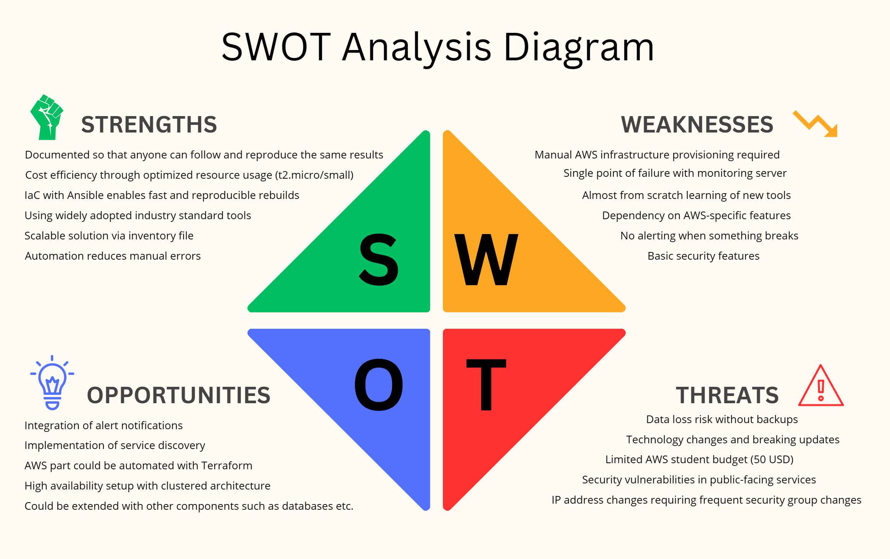

# 3.3 SWOT Analysis

A SWOT analysis helps identify the influencing factors of a project: what is working well (strengths), what could cause problems (weaknesses), where there are chances to improve or grow (opportunities), and what might go wrong (threats). It is a good way to get a clear picture of the project's situation.

