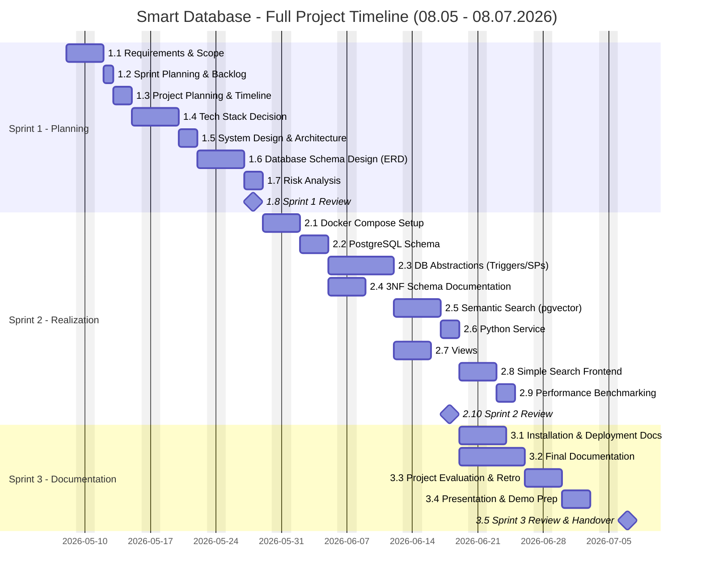

# 3.3 Project Timeline

## Gantt Diagram

## Fibonacci Story Points Estimation
 
| Story | Points | Description |
|-------|--------|-------------|
| 0.1 GitHub Repository, Pages & Documentation Structure Setup | 2 | GitHub repository, Pages and folder structure for code, docs and diagrams. |
| 0.2 Local Development Environment Setup | 2 | Local installation and verification of Docker, PostgreSQL and Python. |
| 0.3 Jira Project Configuration | 1 | Jira project setup: epics, stories, board and sprint structure. |
| 0.4 Sprint 0 Review | 1 | Sprint review and handover. |
 
**Sprint 0 total: 6 points**
 
| Story | Points | Description |
|-------|--------|-------------|
| 1.1 Analysis of Project Requirements & Scope | 3 | Functional and non-functional requirements definition and scope boundaries. |
| 1.2 Sprint Planning & Backlog Refinement | 2 | Full product backlog in Jira: stories, point assignment and sprint allocation. |
| 1.3 Project Planning & Timeline | 3 | Gantt chart with milestones and story point estimation against the 50h budget. |
| 1.4 Architecture Design & Tech Stack Decision | 5 | Technology evaluation per component with documented justification for each choice. |
| 1.5 System Design & Architecture Documentation | 5 | Architecture diagram, data flow description and interface/dependency listing. |
| 1.6 Database Schema Design (ERD) | 5 | Full relational schema with tables, relationships, constraints, indexes and pgvector column. |
| 1.7 Risk Analysis | 3 | Risk register with probability, impact and mitigation per risk across technical, time and scope dimensions. |
| 1.8 Sprint 1 Review | 1 | Sprint review and handover. |
 
**Sprint 1 total: 27 points**
 
| Story | Points | Description |
|-------|--------|-------------|
| 2.1 Docker Compose Setup | 3 | Docker Compose configuration for PostgreSQL with pgvector and the Python service. |
| 2.2 PostgreSQL Schema Implementation | 5 | Full DDL implementation: tables, data types, keys, constraints and indexes. |
| 2.3 Database Abstractions (Triggers, SPs, Functions) | 13 | PL/pgSQL triggers, stored procedures and functions with documented scenario and justification per abstraction. |
| 2.4 3NF Schema Documentation | 3 | Functional dependencies and Third Normal Form compliance documented per table. |
| 2.5 Semantic Search Implementation (pgvector) | 8 | pgvector extension, Python embedding generation and nearest-neighbour query implementation. |
| 2.6 Python Service | 5 | Minimal Python service connecting to PostgreSQL, calling stored procedures and exposing semantic search. |
| 2.7 Views | 3 | SQL views: inventory value, top selling cards, low stock, revenue by set and order summary. |
| 2.8 Simple Search Frontend | 3 | GitHub Pages search interface with semantic and LIKE search toggle. |
| 2.9 Performance Benchmarking (Vector vs LIKE) | 5 | Comparative test queries with measured response times and documented conclusion. |
| 2.10 Sprint 2 Review | 1 | Sprint review and handover. |
 
**Sprint 2 total: 46 points**
 
| Story | Points | Description |
|-------|--------|-------------|
| 3.1 Installation & Deployment Documentation | 3 | Step-by-step setup guide for the full stack, verified on a clean environment. |
| 3.2 Final Documentation | 8 | Complete project document consolidating all sprint outputs. |
| 3.3 Project Evaluation & Retrospective | 5 | Actual vs planned Gantt comparison, deviation analysis and project retrospective. |
| 3.4 Presentation & Demo Preparation | 5 | Kolloquium slide deck and end-to-end live demo preparation. |
| 3.5 Sprint 3 Review & Project Handover | 1 | Final sprint review and formal project handover. |
 
**Sprint 3 total: 20 points**
 
---
 
| Sprint | Points |
|--------|--------|
| Sprint 0 | 6 |
| Sprint 1 | 27 |
| Sprint 2 | 46 |
| Sprint 3 | 20 |
| **Total** | **99** |

## Burndown chart
