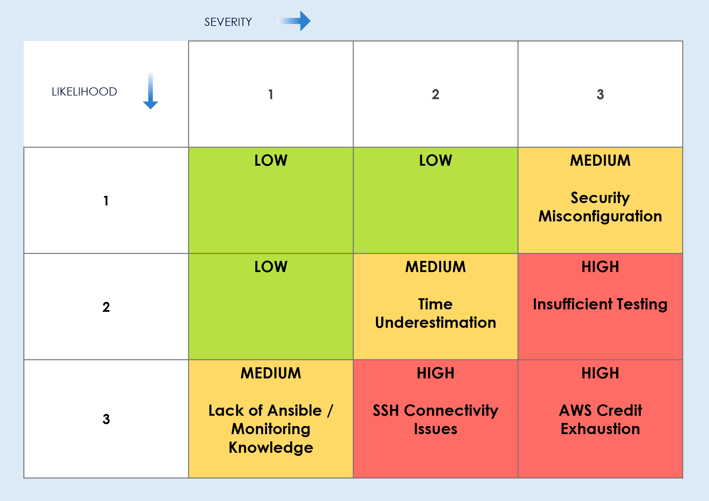

# 3.5 Risk Management Matrix

For the risk management matrix, a straightforward markdown approach was chosen to keep things simple and focus on what can keep the project from being completed on time.

The biggest challenge for this project will be the learning curve for the software, as this is the team's first time using Ansible outside of an already established company structure, and the first time using Grafana and Prometheus. Time pressure combined with knowledge gaps could delay the implementation phase.

Another big risk that would halt the project as a whole would be running out of budget on AWS. Everytime something is being tested, new servers need to be deployed, and then removed. Forgetting even once to do this could cost most of the budget for the project if not all, depending on how many days this is left unatended.

## 3.5.1 Risk Management handling

To manage the project risks, weekly meetings are held to review the current risk matrix and discuss any possible changes or new problems that might have come up. During these meetings, the risk likely-hood is reassesed to see if something within the project needs to be changed, or what the best course of action is in case any of these risks were to actually affect the project. This regular review helps with proactivity and helps adjusting plans quickly to minimize negative effects on the project and stay within the deadline.

### Risks & Mitigation

1. **AWS Credit Exhaustion** (High)

**The Problem:** With only 50$ AWS student credit and 3 EC2 instances running, costs can quickly add up.

**Mitigation Strategies:**
- AWS Billing alert
- Stop and delete instances after every work session
- AWS Templates for quick instance deployment

2. **SSH Connectivity Issues** (High)

**The Problem:** Ansible depends entirely on SSH. If SSH doesn't work, nothing works.

**Mitigation Strategies:**
- Test SSH before Ansible
- Verify Security Groups
- Document working configuration

3. **Insufficient Testing** (High)

**The Problem:** Insufficient Testing

**Mitigation Strategies:**
- Validating syntax before running
- Manual Verification Checklist
- Incremental Deployment

4. **Security Misconfiguration** (Medium)

**The Problem:**  Exposing monitoring services to the public internet could allow unauthorized access.

**Mitigation Strategies:**

- Security Group Configuration
- SSH Key Protection
- Network Segmentation

5. **Time Underestimation** (Medium)

**The Problem:** Complex project with multiple technologies might take longer than the 50 hours estimated.

**Mitigation Strategies:**

- Identify Must-have features
- Setting a time limit for tasks
- Sprint Reviews

6. **Lack of Ansible / Monitoring Knowledge** (Medium)

**The Problem:** First time using Ansible outside of an already existing structure, and very firs ttime using Prometheus and Grafana.

**Mitigation Strategies:**
- Structured learning
- One component at a time
- Taking notes of problems and things learnt

