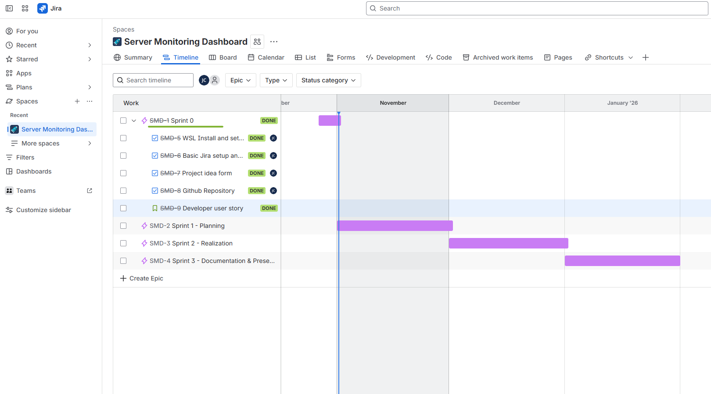

# Sprint 0 Review

**Date**: 01.11.2025  
**Duration**: 1 Week
**Location**: Microsoft Teams

**Participants**:
* Student: Juan Cardoso
* PRJ SME: Corrado Parisi
* IAC SME: Armin Dörzbach

---

### Progress Overview

* Documentation: 0%
* Implementation: 0%
* Presentation: 0%

---

### Timeline!

---

### Status of the project

* **Environment Setup**: WSL2 installed in my Windows desktop.
* **Ansible Installation**: Ansible installed and verified.
* **Project Structure**: Directory structure created following Ansible best practices.
* **Git Repository**: Repository created and configured with GitHub Pages.
* **Project Form**: Project form filled up and delivered to project SMEs for review.
* **Documentation**: Bare bones documentation and layout created.

---

### Comparison to Project Goals

* **Project Goals**: Completed. Development environment enabled to support all work done in this project.
* **Sprint 0 Objectives**: All stories completed successfully.
  - SMD-5: Environment Setup & Planning

---

### To do

* **Planning**: Begin Sprint 1, Planning, which will focus mainly on setting up all Epics, Stories and tasks in Jira.
* **Design Infrastructure**: Plan the design for the AWS Infrastructure and Ansible configuration files.
* **Documentation**: Continue documenting project progress.

---

### Issues Encountered

* **None**

