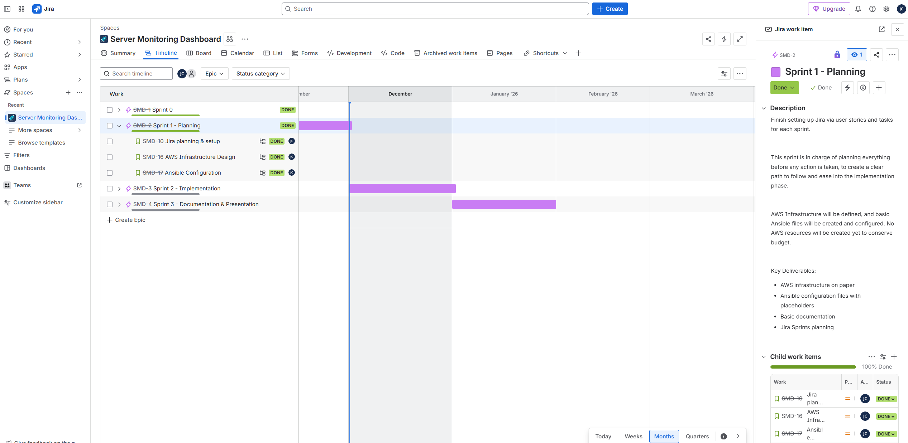
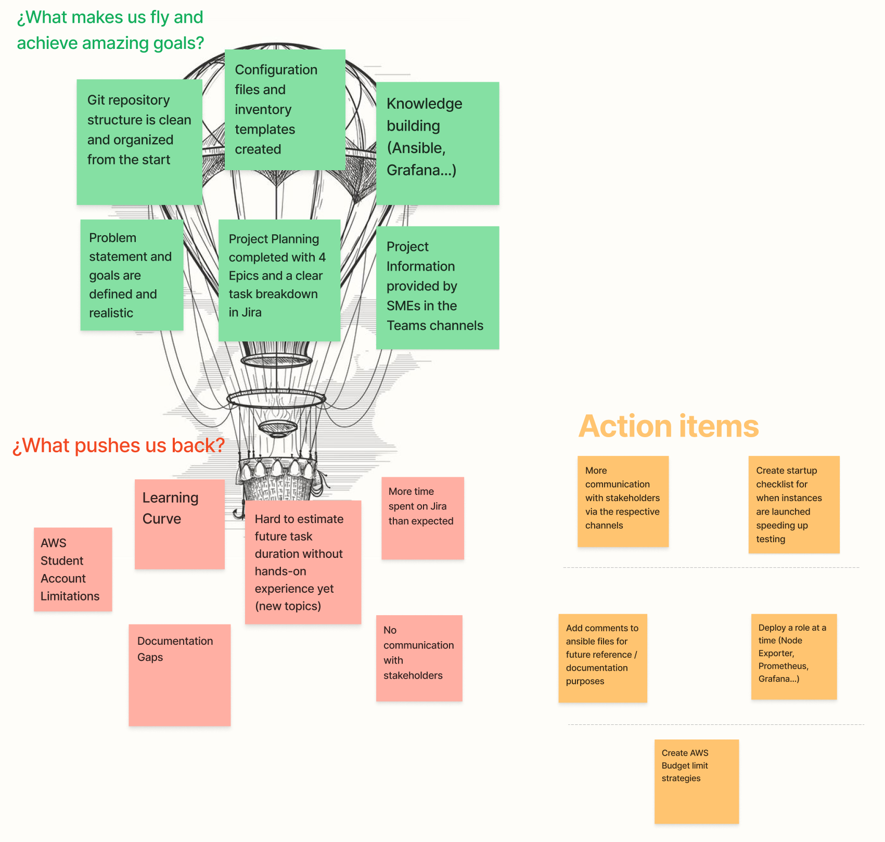

# Sprint 1 Review & Retrospective

**Date**: 12.01.2025  
**Location**: Microsoft Teams

**Participants**:
* Student: Juan Cardoso
* PRJ SME: Corrado Parisi
* IAC SME: Armin Dörzbach

---

### Progress Overview

* Documentation: 20%
* Implementation: 0%
* Presentation: 0%

---

### Timeline

---

### Status of the project

* **Jira Setup**: Project structure complete with 4 epics and 13 user stories across all sprints.
* **AWS Infrastructure Design**: Security groups defined, EC2 specifications documented.
* **Ansible Configuration**: ansible.cfg and inventory.yml created following best practices. Directory structure established with role placeholders.
* **Documentation**: Bare bones documentation and layout created.
* **Questions for Experts**: None.

---

### Comparison to Project Goals

* **Project Goals**: Mostly on track. Planning phase complete as scheduled.
* **Sprint 1 Objectives**: All stories completed successfully.

---

### To do

* **Implementation**: Provision EC2 instances and begin with the Implementation part of the project in Sprint 2.
* **Documentation**: Continue documenting project progress.
* **Testing**: Test Ansible connectivity and Grafana functionanlity once instances are running and packages have been deployed.

---

### Issues Encountered

* **AWS Budget Constraints**: Student account limited to $50. Instances will be provisioned only when actively needed.
* **Time management:** There were no major problems except for a 
* **Learning Curve**: First time working with Ansible outside of already existing work environment & first time working with Grafana.

### Backlog

## Sprint Retrospective

