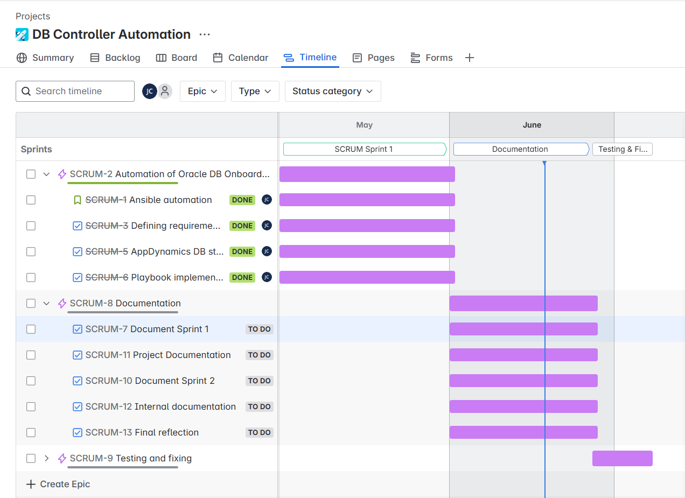

# Sprint 1 Review

**Date**: 31.05.2025 **Location**: Microsoft Teams

**Participants**

Student: Juan Cardoso
PRJ SME: Caesar Roth
IAC SME: Armin Dörzbach

During the Sprint 1 only the student was present during the review, due to the lack of progress in the documentation, there was not a lot to discuss or review from the SMEs.

### Project Progress

- **Implementation:** 95%
- **Documentation:** 0%
- **Testing & Fixing:** 20%

### Timeline

### Status of the project
- **Creation of the projects structure:** All necessary directories have been created in the ansible controllers of each environment.
- **Admin rights on AppDynamics:** All rights have been ordered so that I can easily remove or edit DB controllers in our monitoring tool.
- **Ansible playbook:** The playbook has been written and tested with at least one successful run and DB creation.
- **Documentation:** Not started.
- **Questions for the experts:** None

### Project Goals
Nothing has changed so far.

### To do

- **Documentation:** Start documentation.
- **Testing & Fixing :** Properly test all environments and add any changes necessary.

### Problems
- No problems were encountered so far.

### Backlog

Backlog for the next sprint is shown within the "Timeline" section.

## Review

The first sprint has been completed. Most of the code has been written and tested with at least one successful run. So far there are no problems encountered. The documentation is still yet to be done. The code still needs to be improved and throughout testing needs to be done for every environment. The project has not yet been shared with stakeholders and SME's.

