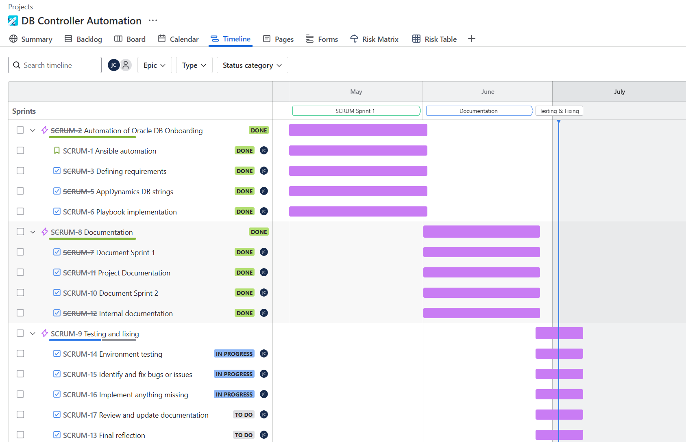

# Sprint 2 Review

**Date**: 16.06.2025 **Location**: Microsoft Teams

**Participants**

Student: Juan Cardoso
PRJ SME: Caesar Roth
IAC SME: Armin Dörzbach

During the Sprint 2, a call was organized between the project SME Caesar Roth and the Student Juan Cardoso. During this call the current progress was overviewed and tips were given to ensure the success and quality of the project.

### Project Progress

- **Implementation:** 95%
- **Documentation:** 85%
- **Testing & Fixing:** 20%

### Timeline

### Status of the project
- **Creation of the projects structure:** All necessary directories have been created in the ansible controllers of each environment.
- **Admin rights on AppDynamics:** All rights have been ordered so that I can easily remove or edit DB controllers in our monitoring tool.
- **Ansible playbook:** The playbook has been written and tested with at least one successful run and DB creation.
- **Documentation:** The project's documentation is about 85% completed.
- **Internal Documentation**: The internal documentation has been created.
- **Questions for the experts:** None

### Project Goals
Nothing has changed so far.

### To do

- **Documentation:** Finish documentation.
- **Testing & Fixing :** Properly test all environments and add any changes necessary.

### Problems
- There have been changes in the company structure for AppDynamics which need to be implemented in the code.
- Company policy doesn't allow the hardcoding of passwords, which I was using for the deployment of the database collectors.

### Backlog

Backlog for the next sprint is shown within the "Timeline" section.

## Review

The second sprint has been completed. Little of the documentation is left to be written, which has already been alotted into the third and final sprint, along with fixes to playbook, at hand of the current problems that have arised during the sprint. SME's and stakeholders have been informed of the progress and have reviewed the product created so far.

