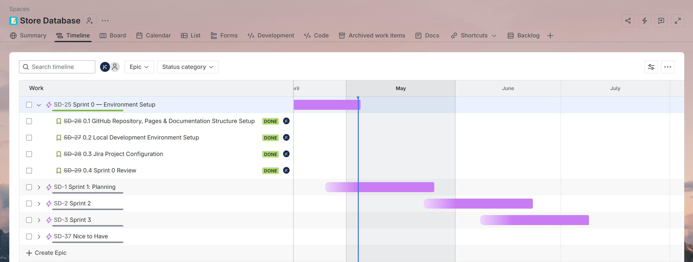

# Sprint 0 Review

**Date**: 27.04.2026 
**Duration**: 1 Week
**Location**: Microsoft Teams

**Participants**:
* Student: Juan Cardoso
* PRJ SME: Florian Huber
* SQL SME: Yves Nussle

---

### Progress Overview

* Documentation: 0%
* Implementation: 0%
* Presentation: 0%

---

### Timeline!

---

### Status of the project

* **GitHub Repository**: Repository created and configured with GitHub Pages, accessible to both experts.
* **Local Development Environment**: Docker Desktop, VSCode, and PostgreSQL client installed and verified.
* **Jira Setup**: Project configured with all epics, stories, priorities, due dates and Definition of Done.
* **Project Form**: Project form filled in and delivered to both SMEs for review and approval.
* **Documentation**: Bare bones documentation layout created on GitHub Pages.

---

### Comparison to Project Goals

* **Project Goals**: Completed. Development environment and project infrastructure set up to support all work in this project.
* **Sprint 0 Objectives**: All stories completed successfully.
  - SD-26: GitHub Repository, Pages & Documentation Structure Setup
  - SD-27: Local Development Environment Setup
  - SD-28: Jira Project Configuration

---

### To do

* **Planning**: Begin Sprint 1, which will focus on requirements analysis, backlog refinement, architecture design, ERD, risk analysis, effort estimation and Gantt planning.
* **Documentation**: Continue documenting project progress as work is completed.

---

### Issues Encountered

* **None**

