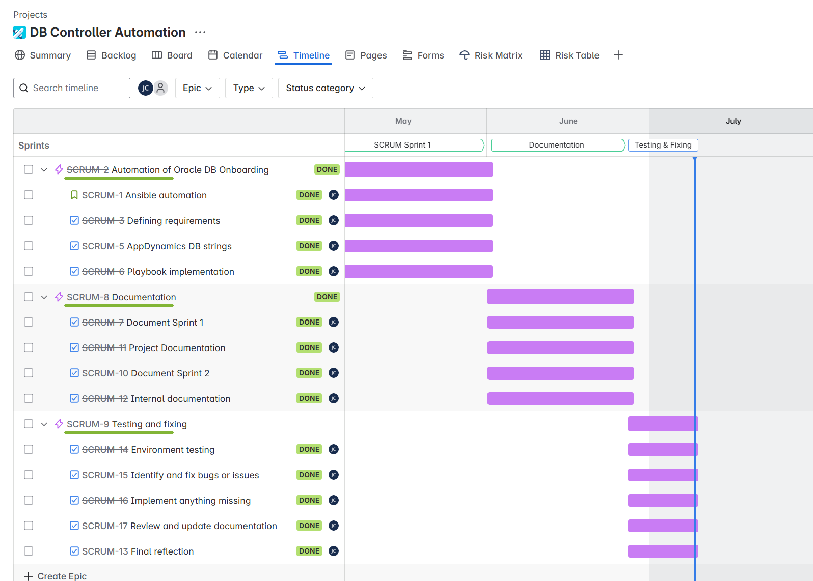

# Sprint 3 Review

**Date**: 07.07.2025 **Location**: Microsoft Teams
**Participants**

Student: Juan Cardoso
PRJ SME: Caesar Roth
IAC SME: Armin Dörzbach

During the Sprint 3, a call was organized between the project SME Caesar Roth and the Student Juan Cardoso. During this call, the almost finished project was showed and overviewed by Caesar, which gave some tips on how to further improve it, namely, in the Sprint review section of the project.

### Project Progress

- **Implementation:** 100%
- **Documentation:** 100%
- **Testing & Fixing:** 100%

### Timeline

### Status of the project
- **Creation of the projects structure:** All necessary directories have been created in the ansible controllers of each environment.
- **Admin rights on AppDynamics:** All rights have been ordered so that I can easily remove or edit DB controllers in our monitoring tool.
- **Ansible playbook:** The playbook if finished.
- **Documentation:** The project's documentation is completed.
- **Internal Documentation**: The internal documentation has been created.
- **Testing:**: All testing has been successfully completed in all environments.
- **Questions for the experts:** None

### Project Goals

Nothing has changed so far.

### To Do

- Deliver the finished project.

### Problems
- None.

### Backlog

All tasks have been completed. Refer to the timeline section.

## Review

Third and last sprint completed. All parts of the project are now finished with all problems fixed and all environments tested. The internal documentation of the project has already been used by other teams to support in the onboarding for new collectors. The sprint has been completed within the planned time and stakeholders are happy with the result.
