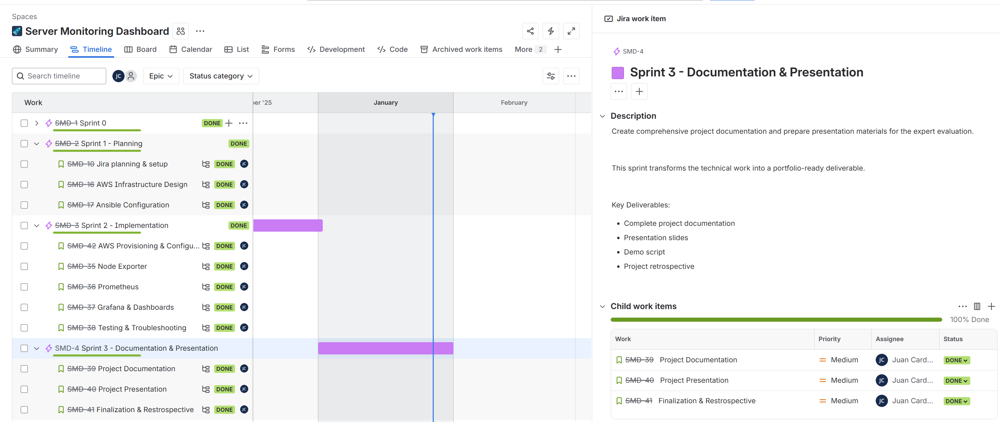
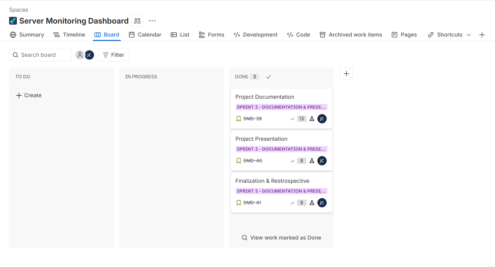
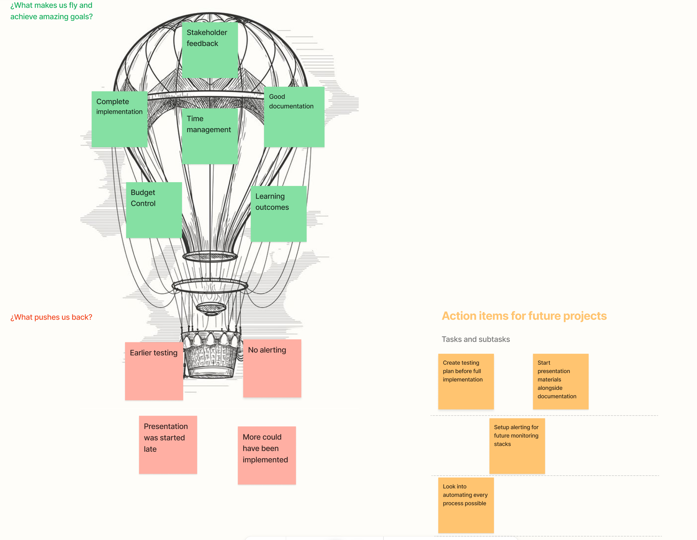

# Sprint 3 Review & Retrospective

**Date**: 28.01.2025  
**Duration**: 1 Month
**Location**: Microsoft Teams

**Participants**:
* Student: Juan Cardoso
* PRJ SME: Corrado Parisi
* IAC SME: Armin Dörzbach

---

### Progress Overview

* Documentation: 100%
* Implementation: 100%
* Presentation: 100%

---

### Timeline

---

### Status of the project

* **Documentation**: Made up for the time lost in previous sprints and completed the documentation succesfully.
* **Presentation**: The project was presented with animated slides, it counted with a live and pre-recorded demo in case things went wrong.
* **Final touches**: The project documentation has been proofread and any errors in formatting have been fixed.
* **Questions for Experts**: A meeting was held with the project SME to oversee the current progress and improve things that were lacking or missing.

---

### Comparison to Project Goals

* **Project Goals**: All goals have been achieved, we have a working project and solid documentation.
* **Sprint 3 Objectives**: All stories completed successfully.
  - SMD-39: Node Exporter
  - SMD-40: Prometheus
  - SMD-41: Grafana & Dashboards

---

### To do

* **Nothing**

---

### Issues Encountered

* **None**

---

### Backlog

---

## Sprint Retrospective

