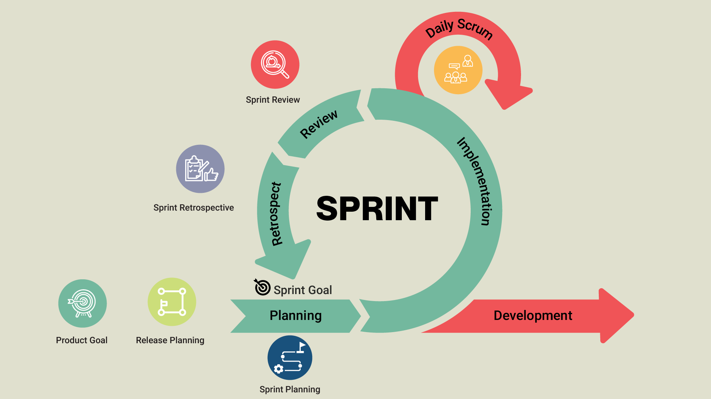

# 3.1 Project Management

For this project, I chose to combine aspects of both Scrum and Kanban, using Jira as my project management tool. 

With Kanban, I can easily visualize all the tasks on a board, making it simple to spot where work is piling up or moving too slow. This helps with adding new tasks or change priorities anytime, so that if an urgent change comes up, I can adapt my workflor without disrupting the rest of the planning.

Combining this with Scrum's structure, planning work in Sprints and reviewing the progress regularly creates a balance  between planning and being able to react to changes quickly. Jira supports this by allowing the updating of the board, moving tasks between columns and tracking progress in real time.

## Sprint

Sprints are periods of time, usually between 1 to 4 weeks, in which a specific part of the project's work is completed and reviewed. Sprints contain the following phases:

- Sprint Planning
- Daily Scrum
- Sprint Review
- Sprint Retrospective.

These phases ensure the quality and structure of the sprint.

## Sprint Planning

The tasks within the backlog are assigned to the different sprints. These tasks must be completed during the sprint period, as commited by the individual during the planning.

## Daily Scrum

A daily scrum is a short meeting that is carried everyday, at the same time. This helps identifying issues in time, as well as monitoring the current sprint progress. Although this project is carried out by just one person, a daily scrum will still take place in the form of a quick self check in. During this time, the following questions will be made:

- What was accomplished yesterday?
- What will be done today?
- Are there any issues or blockers?

This routine will help with staying focused, tracking progress and quickly addressing any challenges that come up during the sprint.

## Sprint review

At the end of each sprint, there will be a review to check the progress and quality of the sprints, checking if the tasks assigned were completed in time.

## Sprint Retrospective

## Kanban