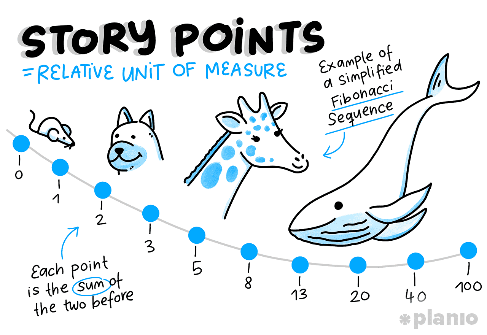
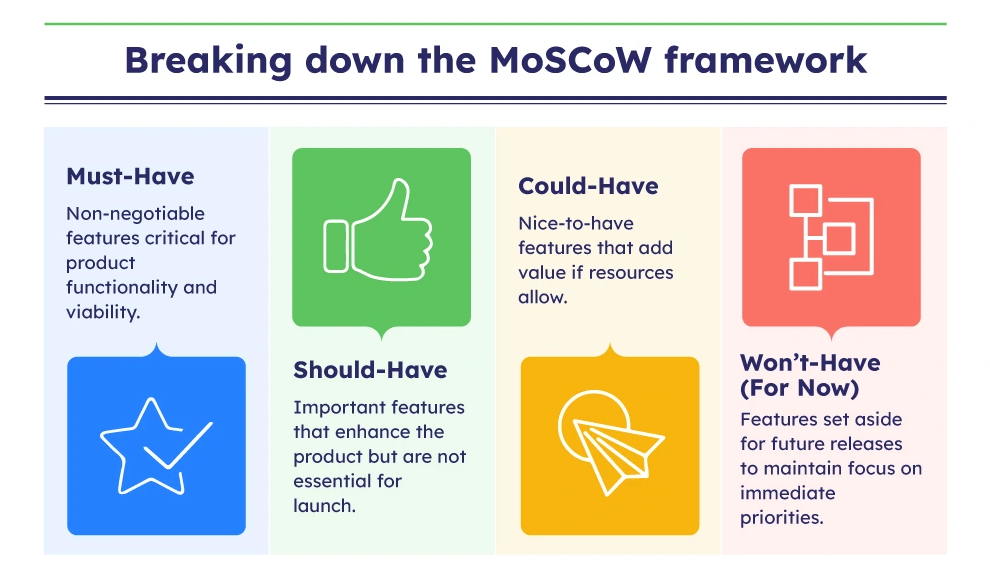
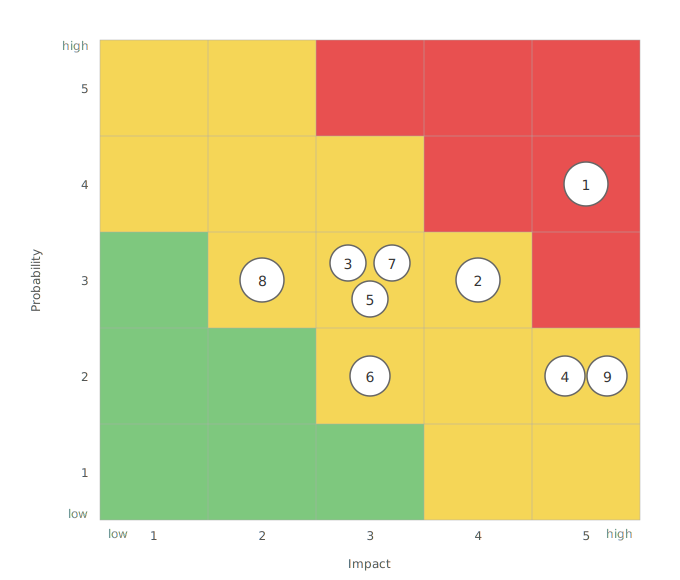

# 3.1 Project Management

## Methodology

This project is managed agile with Scrum, adapting sprints to changing requirements as the project progresses. Jira is used to capture user stories and tasks and to display them as a Kanban board. Gantt charts are used for the visual representation of work distribution across sprints.

---

## Product Backlog

This is the product backlog as it is defined within Jira.

| ID | Story | Sprint | Points | Priority |
|---|---|---|---|---|
| 0.1 | GitHub Repository, Pages & Documentation Structure Setup | 0 | 2 | Must |
| 0.2 | Local Development Environment Setup | 0 | 2 | Must |
| 0.3 | Jira Project Configuration | 0 | 1 | Must |
| 0.4 | Sprint 0 Review | 0 | 1 | Must |
| 1.1 | Analysis of Project Requirements & Scope | 1 | 3 | Must |
| 1.2 | Sprint Planning & Backlog Refinement | 1 | 2 | Must |
| 1.3 | Project Planning & Timeline | 1 | 3 | Must |
| 1.4 | Architecture Design & Tech Stack Decision | 1 | 5 | Must |
| 1.5 | System Design & Architecture Documentation | 1 | 5 | Must |
| 1.6 | Database Schema Design (ERD) | 1 | 5 | Must |
| 1.7 | Risk Analysis | 1 | 3 | Must |
| 1.8 | Sprint 1 Review | 1 | 1 | Must |
| 2.1 | Docker Compose Setup | 2 | 3 | Must |
| 2.2 | PostgreSQL Schema Implementation | 2 | 5 | Must |
| 2.3 | Database Abstractions (Triggers, SPs, Functions) | 2 | 13 | Must |
| 2.4 | 3NF Schema Documentation | 2 | 3 | Must |
| 2.5 | Semantic Search Implementation (pgvector) | 2 | 8 | Must |
| 2.6 | Python Service | 2 | 5 | Must |
| 2.7 | Views | 2 | 3 | Should |
| 2.8 | Simple Search Frontend | 2 | 3 | Should |
| 2.9 | Performance Benchmarking (Vector vs LIKE) | 2 | 5 | Should |
| 2.10 | Sprint 2 Review | 2 | 1 | Must |
| 3.1 | Installation & Deployment Documentation | 3 | 3 | Must |
| 3.2 | Final Documentation | 3 | 8 | Must |
| 3.3 | Project Evaluation & Retrospective | 3 | 5 | Must |
| 3.4 | Presentation & Demo Preparation | 3 | 5 | Must |
| 3.5 | Sprint 3 Review & Project Handover | 3 | 1 | Must |

**Total: 99 story points**

---

## Project Goals

**Goal 1:**
Design and implement a normalised PostgreSQL database schema for a simulated Pokémon TCG card shop, covering all entities: cards, inventory, customers, orders, order items, deliveries and payments.

**Goal 2:**
Implement database abstractions (triggers, stored procedures, views) that automate business logic and enforce data integrity at the database level, without relying on application code.

**Goal 3:**
Implement pgvector semantic search and benchmark it against traditional LIKE search, demonstrating a practical NoSQL use case integrated into a relational database.

---

## Story Points with Fibonacci

Story points are assigned to all user stories using the Fibonacci sequence (1, 2, 3, 5, 8, 13). This estimates complexity rather than hours, making the difference in effort between tasks visible. The calibration used is approximately 2 story points per hour, giving a total budget of 99 points across all sprints, corresponding to the 50-hour workload defined in the assignment.

---

## Prioritisation with MoSCoW

User stories are prioritised using MoSCoW (**M**ust have, **S**hould have, **C**ould have, **W**on't have). Must-have stories are the non-negotiable deliverables — the project fails without them. Should-have stories add value but can be reduced in scope if time runs short. Could-have and Won't-have items are kept in the backlog but are not committed to in any sprint.

| Priority | Stories |
|---|---|
| Must have | All schema, abstraction, pgvector, documentation and review stories |
| Should have | Views (2.7), Search Frontend (2.8), Performance Benchmarking (2.9) |
| Could have | Redis caching, Pokémon TCG API price sync |
| Won't have | Authentication, production deployment, multi-tenant support |

---

## Release Planning

| Sprint | Release | Description | Value delivered |
|---|---|---|---|
| 1 | MVP — Minimal Viable Product | Planning & Design | Architecture and database designed |
| 2 | MLP — Minimum Lovable Product | Realization | Database is operational, at least one automated trigger is active and inventory is searchable by meaning |
| 3 | MMP — Minimal Marketable Product | Documentation & Presentation | Documentation and presentation complete |

---

## Risk Management

| ID | Risk | Probability | Impact | Mitigation |
|---|---|---|---|---|
| 1 | PL/pgSQL is new — triggers and stored procedures take longer than estimated | 4 | 5 | Start with the simplest trigger first and build incrementally; contingency priority order defined in sprint planning. |
| 2 | Database schema poorly designed in Sprint 1, requiring re-work in Sprint 2 | 3 | 4 | Review schema with expert before Sprint 2 begins and validate against all use cases. |
| 3 | pgvector embedding generation slower or more complex than expected | 3 | 3 | Test a basic pgvector query as a spike before committing Sprint 2 stories. |
| 4 | Docker Compose environment fails during Kolloquium demo | 2 | 5 | Test full stack on a clean machine before presentation; pin all image versions. |
| 5 | Scope creep from nice-to-have items consuming Sprint 2 time | 3 | 3 | Nice-to-have items explicitly excluded from committed sprint scope. |
| 6 | Expert feedback arrives too late to act on before submission | 2 | 3 | Raise open questions early in each sprint, not at the end. |
| 7 | CSV card data import produces dirty or inconsistent data, affecting queries and embeddings | 3 | 3 | Validate and clean the CSV before import; check for missing fields and duplicates. |
| 8 | Benchmarking results inconclusive because the dataset is too small to show a meaningful difference | 3 | 2 | Use a sufficiently large card dataset and run each query multiple times to get stable averages. |
| 9 | Stored procedure ROLLBACK logic is incorrect, silently corrupting inventory data on failed purchases | 2 | 5 | Write explicit test cases for failure scenarios and verify inventory state after each rollback. |

---

## SWOT Matrix

## SWOT Matrix

| **Strengths** | **Weaknesses** |
|---|---|
| - Familiarity with Docker and Jira reduces setup risk. - Personal interest in the Pokémon TCG domain keeps motivation high. - Clear scope boundaries defined upfront with expert input. | - No prior experience with PL/pgSQL, triggers, or stored procedures. - No prior experience designing a relational schema from scratch. |

| **Opportunities** | **Threats** |
|---|---|
| - pgvector combines relational and vector search in one service, directly relevant to current industry trends. - Project serves as a portfolio piece demonstrating full-stack database design. | - Limited sprint duration leaves little room for re-work if core abstractions are poorly designed. - PL/pgSQL complexity could block multiple downstream stories. |

---

## Project Organisation

| Name | Role | Contact |
|---|---|---|
| Juan Cardoso | Student / Scrum Master / Product Owner | MS Teams |
| Yves Nussle | Subject Matter Expert — Databases & NoSQL | MS Teams |
| Florian Huber | Subject Matter Expert — Project Management | MS Teams |
| TBZ | Stakeholder / Assessment body | — |

---

## Stakeholder Analysis

| Name | Role | Attitude | Influence | Interest |
|---|---|---|---|---|
| Juan Cardoso | Student, development & documentation | High | Critical | Complete the project on time and meet all requirements |
| Yves Nussle | Technical coach | Medium | Supporting | Quality of technical implementation |
| Florian Huber | Project management coach | Medium | Supporting | Quality of project management process |
| TBZ | Assessment body | Low | Neutral | Student success in the programme |

**Juan Cardoso — Key figure**
Regular communication and updates with both experts. Act on feedback promptly and document changes made as a result.

**Yves Nussle — Supporter**
Share technical progress at each feedback session. Raise open technical questions early, not at the end of a sprint.

**Florian Huber — Supporter**
Keep project management artefacts (backlog, Gantt, retrospectives) up to date and accessible at all times.

**TBZ — Observer**
Ensure all deliverables comply with the Merkblatt requirements.

---

## Communication Plan

| Channel | Purpose |
|---|---|
| MS Teams | Primary communication with both experts |
| GitHub Pages | Documentation — publicly accessible to all parties |
| Jira | Sprint and backlog tracking |
| In person | Scheduled individual feedback sessions during class |

---

## Tools & Software

- Jira (project management, sprint tracking, Kanban board)
- GitHub / GitHub Pages (source code, documentation)
- Docker / Docker Compose (containerisation)
- PostgreSQL + pgvector (relational database with vector search)
- Python / psycopg2 (application layer)
- sentence-transformers (vector embedding generation)
- VSCode (code editor)
- DBeaver (database client, ERD generation)
