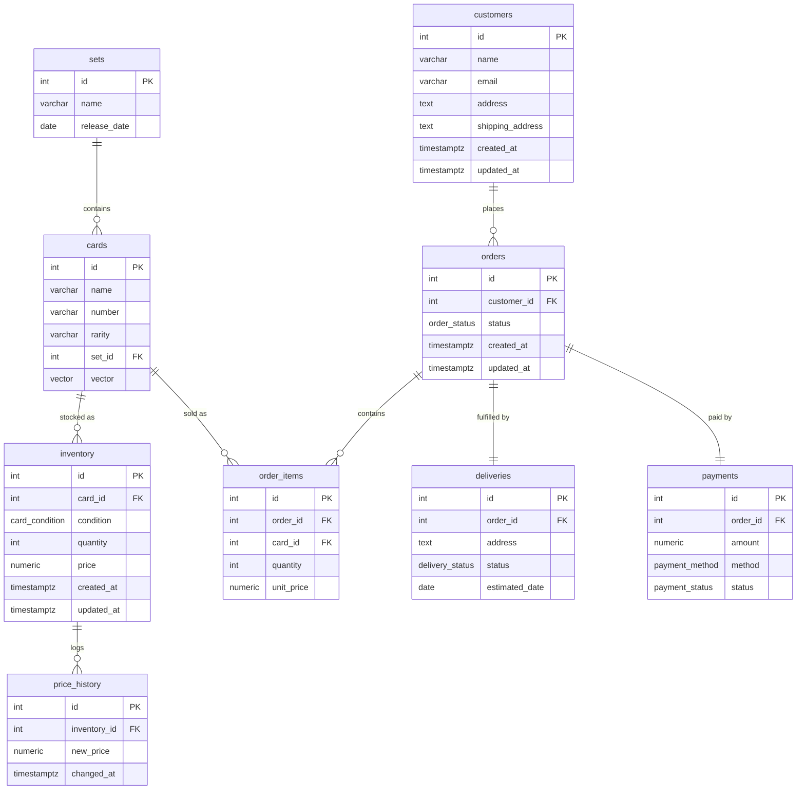

# 3.2 Architecture Design

## Technology Decisions

For each major component, options were compared before making a decision. The criteria focused on fit for the project scope, not on general capability.

### Relational Database: PostgreSQL vs MySQL

| Criteria | PostgreSQL | MySQL |
|---|---|---|
| Stored procedures | PL/pgSQL with full transaction control and error handling | Supported, but less flexible |
| Vector search | pgvector extension available | No built-in vector extension |
| Extensibility | Custom types, extensions, jsonb | More limited |
| Docker support | Official image | Official image |

**Decision: PostgreSQL.** The project requires stored procedures, triggers, and pgvector. MySQL has no native vector search and would need an external tool to cover that requirement.

### Vector Search: pgvector vs Elasticsearch

| Criteria | pgvector | Elasticsearch |
|---|---|---|
| Setup | `CREATE EXTENSION vector;` — one command inside PostgreSQL | Separate service with its own container |
| Integration | Standard SQL queries | Separate REST API |
| Resource usage | Minimal — runs inside PostgreSQL | Requires 1–2 GB of memory independently |
| Dataset fit | Good for small to medium datasets | Built for large-scale search |

**Decision: pgvector.** The card dataset is small. Running vector search inside PostgreSQL avoids an extra service and keeps the stack simple.

### Application Layer: Minimal Python Service vs Full REST Framework

| Criteria | Minimal Python service | FastAPI / Flask |
|---|---|---|
| Scope fit | Sufficient for calling stored procedures and exposing search | Full framework with routing, validation, docs |
| Setup | Only needs psycopg2 | Additional dependencies and project structure |
| Development time | Low | Higher — time spent on API design |

**Decision: Minimal Python service.** Based on feedback from the subject expert, the graded deliverable is the database, not the API. The Python service only calls stored procedures and exposes the semantic search endpoint. A full framework would shift time and focus away from the database work.

### Containerization: Docker Compose

Docker Compose was the only realistic option for this project. Running PostgreSQL and Python directly on the host differs per operating system and makes the setup hard to reproduce. With Docker Compose, the entire stack starts with `docker compose up`. The `docker-compose.yml` file itself serves as infrastructure documentation.

### Frontend: Static HTML/JS vs React SPA

| Criteria | Static HTML/JS | React SPA |
|---|---|---|
| Complexity | Single HTML file with fetch calls | Full framework with build tooling |
| Hosting | Served by the Python service inside Docker | Requires its own build and hosting |
| Purpose | Demo UI for the Kolloquium | Full application interface |

**Decision: Static HTML/JS.** The frontend is not a graded deliverable. It exists to demonstrate semantic search during the Kolloquium. Serving it from the Python service keeps everything inside Docker Compose.

### Summary

| Component | Choice | Reason |
|---|---|---|
| Database | PostgreSQL | Supports pgvector, PL/pgSQL, triggers natively |
| Vector search | pgvector | Runs inside PostgreSQL, no extra service |
| Application layer | Minimal Python service | DB is the deliverable, not the API |
| Containerization | Docker Compose | One-command reproducible setup |
| Frontend | Static HTML/JS | Demo UI only, not graded |
| Project management | Jira | Sprint and backlog tracking |
| Documentation | GitHub Pages (Jekyll) | Public, versioned, accessible to experts |

---

## System Design

The entire stack runs inside Docker Compose.

### Component Overview

```
┌─────────────────────────────────────────┐
│            Docker Compose               │
│                                         │
│  ┌───────────────────────────────────┐  │
│  │     Python Service (port 8000)    │  │
│  │     - Serves search frontend      │  │
│  │     - Calls stored procedures     │  │
│  │     - Generates embeddings        │  │
│  │     - Exposes search endpoint     │  │
│  └──────────────┬────────────────────┘  │
│                 │ psycopg2              │
│                 ▼                       │
│  ┌───────────────────────────────────┐  │
│  │     PostgreSQL + pgvector         │  │
│  │     - Relational schema           │  │
│  │     - Triggers & stored procs     │  │
│  │     - Views                       │  │
│  │     - Vector embeddings           │  │
│  └───────────────────────────────────┘  │
└─────────────────────────────────────────┘
```

### Docker Compose Services

| Service | Image | Purpose | Port |
|---|---|---|---|
| `db` | `pgvector/pgvector:pg16` | PostgreSQL with pgvector | 5432 |
| `app` | Custom Python image | Frontend, search, stored procedure calls | 8000 |

The PostgreSQL container mounts an `init.sql` volume that creates the schema, triggers, stored procedures, and views on first startup. The Python service waits for the database to be ready before starting.

### Data Flow

1. **Card import:** A CSV file with Pokémon card data is loaded into PostgreSQL via a bulk import script. The Python service generates vector embeddings for each card description and stores them in `cards.vector`.
2. **Semantic search:** The user opens `localhost:8000` and enters a search query. The Python service converts the query to an embedding, runs a nearest-neighbour search via pgvector, and returns the results as JSON.
3. **Business operations:** Purchases, cancellations, and restocking are handled by stored procedures. The Python service calls these procedures but contains no business logic.
4. **Automated side effects:** Triggers handle automatic operations — logging price changes to `price_history`, syncing order status when a payment is confirmed, and updating timestamps.

---

## Database Schema

### Entity Relationships

- A **set** contains many **cards** (1:N)
- A **card** appears in many **inventory** entries, one per condition (1:N)
- A **customer** places many **orders** (1:N)
- An **order** contains many **order items** (1:N), each referencing a card
- An **order** has one **delivery** (1:1)
- An **order** has one **payment** (1:1)
- An **inventory** entry can have many **price history** records (1:N)

### ERD



### Table Definitions

#### sets

| Column | Type | Constraints |
|---|---|---|
| id | SERIAL | PRIMARY KEY |
| name | VARCHAR(100) | NOT NULL |
| release_date | DATE | NOT NULL |

#### cards

| Column | Type | Constraints |
|---|---|---|
| id | SERIAL | PRIMARY KEY |
| name | VARCHAR(100) | NOT NULL |
| number | VARCHAR(20) | NOT NULL |
| rarity | VARCHAR(50) | NOT NULL |
| set_id | INTEGER | NOT NULL, FOREIGN KEY → sets(id) |
| vector | VECTOR(384) | pgvector embedding, nullable until import runs |
| image_url | TEXT | Nullable — populated by `sync_prices.py` (added via `08_add_image_url.sql`) |

Indexes: `set_id`, `rarity`

#### inventory

| Column | Type | Constraints |
|---|---|---|
| id | SERIAL | PRIMARY KEY |
| card_id | INTEGER | NOT NULL, FOREIGN KEY → cards(id) |
| condition | card_condition (ENUM) | NOT NULL |
| quantity | INTEGER | NOT NULL, DEFAULT 0, CHECK (quantity >= 0) |
| price | NUMERIC(10,2) | NOT NULL, CHECK (price > 0) |
| created_at | TIMESTAMPTZ | NOT NULL, DEFAULT NOW() |
| updated_at | TIMESTAMPTZ | NOT NULL, DEFAULT NOW() |

Index: `card_id`

#### price_history

| Column | Type | Constraints |
|---|---|---|
| id | SERIAL | PRIMARY KEY |
| inventory_id | INTEGER | NOT NULL, FOREIGN KEY → inventory(id) |
| new_price | NUMERIC(10,2) | NOT NULL |
| changed_at | TIMESTAMPTZ | NOT NULL, DEFAULT NOW() |

#### customers

| Column | Type | Constraints |
|---|---|---|
| id | SERIAL | PRIMARY KEY |
| name | VARCHAR(100) | NOT NULL |
| email | VARCHAR(150) | NOT NULL, UNIQUE |
| address | TEXT | Nullable |
| shipping_address | TEXT | Nullable |
| created_at | TIMESTAMPTZ | NOT NULL, DEFAULT NOW() |
| updated_at | TIMESTAMPTZ | NOT NULL, DEFAULT NOW() |

#### orders

| Column | Type | Constraints |
|---|---|---|
| id | SERIAL | PRIMARY KEY |
| customer_id | INTEGER | NOT NULL, FOREIGN KEY → customers(id) |
| status | order_status (ENUM) | NOT NULL, DEFAULT 'pending' — values: pending, confirmed, shipped, delivered, cancelled |
| created_at | TIMESTAMPTZ | NOT NULL, DEFAULT NOW() |
| updated_at | TIMESTAMPTZ | NOT NULL, DEFAULT NOW() |

Index: `customer_id`

#### order_items

| Column | Type | Constraints |
|---|---|---|
| id | SERIAL | PRIMARY KEY |
| order_id | INTEGER | NOT NULL, FOREIGN KEY → orders(id) |
| card_id | INTEGER | NOT NULL, FOREIGN KEY → cards(id) |
| quantity | INTEGER | NOT NULL, CHECK (quantity > 0) |
| unit_price | NUMERIC(10,2) | NOT NULL — snapshot of price at time of purchase |

Index: `order_id`

#### deliveries

| Column | Type | Constraints |
|---|---|---|
| id | SERIAL | PRIMARY KEY |
| order_id | INTEGER | NOT NULL, FOREIGN KEY → orders(id) |
| address | TEXT | NOT NULL — snapshot of `customers.shipping_address` at order time |
| status | delivery_status (ENUM) | NOT NULL, DEFAULT 'pending' — values: pending, dispatched, in_transit, delivered, returned |
| estimated_date | DATE | Nullable |

#### payments

| Column | Type | Constraints |
|---|---|---|
| id | SERIAL | PRIMARY KEY |
| order_id | INTEGER | NOT NULL, FOREIGN KEY → orders(id) |
| amount | NUMERIC(10,2) | NOT NULL, CHECK (amount > 0) |
| method | payment_method (ENUM) | NOT NULL — values: credit_card, debit_card, paypal, bank_transfer |
| status | payment_status (ENUM) | NOT NULL, DEFAULT 'pending' — values: pending, completed, failed, refunded |

---

### Views

| View | Purpose |
|---|---|
| `inventory_value` | Stock value per entry (quantity × price) |
| `top_selling_cards` | Units sold and revenue ranking per card |
| `low_stock` | Entries with quantity ≤ 2 |
| `out_of_stock` | Entries with quantity = 0 |
| `revenue_by_set` | Revenue grouped by set |
| `order_summary` | Full order overview across all related tables, computes total from order_items |

Full definitions and example output: [2.7 Views](../04_Sprint_overview/402_sprint2.md#27-views).

---

## Normalisation (3NF)

**3NF rule:** Every non-key column must depend only on the primary key — not on another non-key column.

**1NF:** All columns contain single atomic values. No repeating groups. Each table has a single-column primary key.

**2NF:** With single-column keys, partial dependencies are not possible by definition.

**3NF:** Two cases worth noting:

- `customers.shipping_address` is independent of `customers.address` — billing and shipping are not functionally related.
- `order_items.unit_price` stores the price at the time of purchase rather than referencing the current inventory price. This ensures historical orders remain accurate after price changes.

Full table-by-table analysis is in [2.4 3NF Schema Documentation](../04_Sprint_overview/402_sprint2.md#24-3nf-schema-documentation).

---

## Design Decisions

**ENUM for order status:** The `order_status` ENUM type (`PENDING`, `CONFIRMED`, `SHIPPED`, `DELIVERED`, `CANCELLED`) enforces a valid set of values at the database level without needing a separate lookup table.

**Separate `price_history` table:** Price changes are logged automatically by a trigger. Keeping this in its own table makes it easy to query price trends per item without adding columns to `inventory`.

**Surrogate keys (`SERIAL id`):** All tables use auto-incrementing integer primary keys. Card names are not unique across sets, and emails can change — natural keys would not be reliable.

**pgvector column on `cards`:** The vector embedding represents a card description, which is an attribute of the card. It does not change per inventory entry or order, so it belongs on `cards` rather than on `inventory` or a separate table.

---

## External Dependencies

| Dependency | Version | Purpose |
|---|---|---|
| PostgreSQL | 16 | Relational database |
| pgvector | 0.8.2 | Vector similarity search extension |
| Python | 3.12 | Application runtime |
| psycopg2 | 2.9.12 | PostgreSQL driver for Python |
| sentence-transformers | 5.5.1 | Generates vector embeddings for card descriptions |