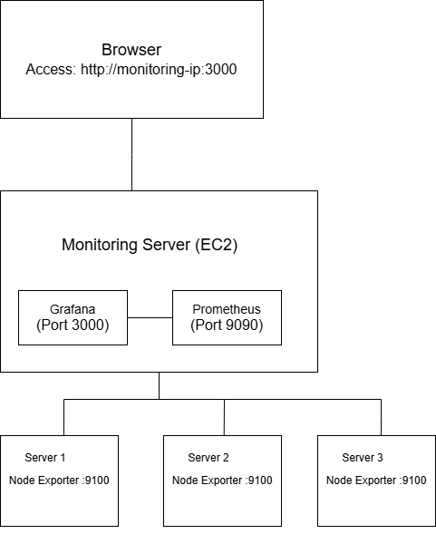

# 4.2 Project Structure


## Visual Structure plan




## Directory Structure

The directory structure should look as follows:
```
monitoring-project/
├── ansible.cfg
├── inventory.ini
├── playbook.yml
├── README.md
├── group_vars/
├── host_vars/
└── roles/
    ├── node-exporter/
    │   ├── tasks/
    │   ├── templates/
    │   ├── handlers/
    │   └── files/
    ├── prometheus/
    │   ├── tasks/
    │   ├── templates/
    │   ├── handlers/
    │   └── files/
    └── grafana/
        ├── tasks/
        ├── templates/
        ├── handlers/
        └── files/
```

**Creating project structure**
```
sudo mkdir SEM02
chown frost:frost SEM02
mkdir -p roles/{node-exporter,prometheus,grafana}/{tasks,templates,handlers,files}
mkdir group_vars host_vars
touch ansible.cfg
touch inventory.yml
touch main.yml
touch README.md
```

```
frost@Hitman:~/SEM02$ ls -ltrh
total 24K
drwxr-xr-x 5 frost frost 4.0K Nov 12 10:46 roles
drwxr-xr-x 2 frost frost 4.0K Nov 12 10:46 host_vars
drwxr-xr-x 2 frost frost 4.0K Nov 12 10:46 group_vars
-rw-r--r-- 1 frost frost    0 Nov 12 10:48 main.yml
-rw-r--r-- 1 frost frost    0 Nov 12 10:49 README.md
-rw-r--r-- 1 frost frost  508 Nov 12 10:58 inventory.yml
-rw-r--r-- 1 frost frost  335 Nov 12 11:09 ansible.cfg
```

## AWS Configuration

### Security Groups

**Security Group 1:** monitoring-sg
Controls access to the monitoring server (Prometheus + Grafana)

Inbound Rules:

- SSH (Port 22) - TCP
- Grafana (Port 3000) - TCP
- Prometheus Web UI (Port 9090) - TCP
- Node Exporter (Port 9100) - TCP

Outbound Rules:

- Allow all traffic (default)

**Security Group 2:** target-sg
Purpose: Controls access to target servers (run Node Exporter only)
Inbound Rules:

- SSH (Port 22) - TCP
- Node Exporter (Port 9100) - TCP

Outbound Rules:

- Allow all traffic (default)


### EC2 Instances

**Instance 1:** monitoring-server
```
Name Tag: monitoring-server
AMI: Ubuntu Server 22.04 LTS
Instance Type: t2.micro
Security Group: monitoring-sg
Key Pair: aws-key
```

**Instances 2 & 3:** target-server-1 & target-server-2
```
Name Tags: target-server-1, target-server-2
AMI: Ubuntu Server 22.04 LTS
Instance Type: t2.micro
Security Group: target-sg
Key Pair: aws-key
```


