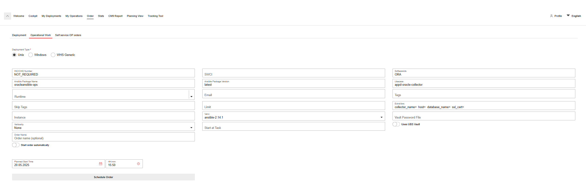
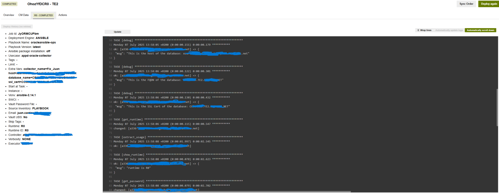
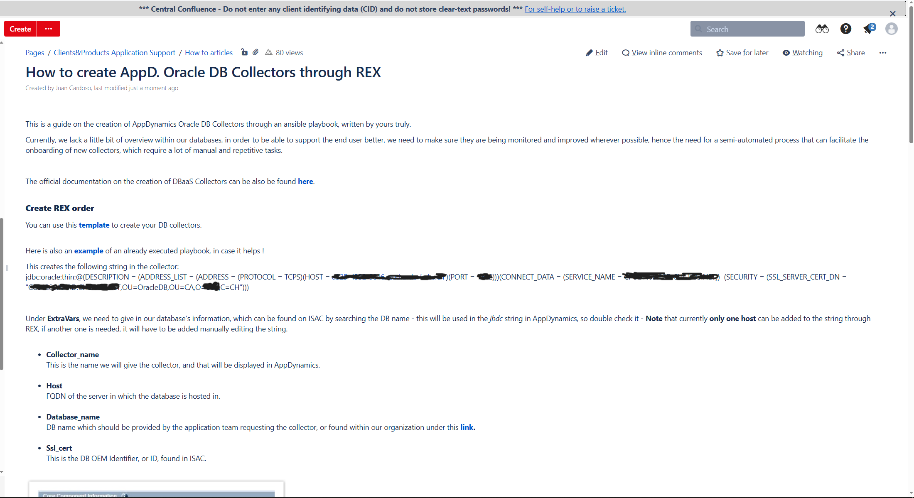

# 4.3 Ansible Playbook

## Introduction

In this part of the project, I will show some of the code from the playbook and explain how each part works. This playbook is executed by REX deployer, an app built by my company to facilitate the execution of ansible playbooks through ansible controllers.
The playbook is saved across all environments and able to be deployed in any of them by selecting it from a scrolldown menu within REX.

This is an example order of how my playbook would be executed and how the overview of this tool looks like.

<p align="center">
  
</p>

## Requirements

In order for a database collector to be created, I will need a few different pieces of information that will be added by the person executing the playbook in the form of extra vars. This information can be found in a tool called ISAC, which keeps inventory of everything in our network.

- **Collector Name**: This is the name the collector will have in our monitoring tool. The user will fill this following our current naming convention.
- **Hostname**:       This is the FQDN (Fully Qualified Name) of the server hosting the database.
- **Database Name**:  This is the FQDN of the database. 
- **SSL Cert**:       This is the database identifier or also known as SSL Certificate in the string, it is another FQDN similar to the database's.


## Code

As I have made this project for my company, I am not allowed to share the entirety of the code, as to not breach any security of privacy policies, but I will share bits and pieces and explain every part of it within this documentation.

- The name of the playbook is defined within the first line, "oracleansible-ops" as per company guidelines.
- It will run locally in the ansible controller as specified within the hosts section with "localhost" as root.
- Gather facts is a default in every playbook within our company, as this is not needed for mine, I set it to no.
- tasks defines the start of the playbook and the actions it will take.

```yaml
- name: oracleansible-ops
  hosts: all
  become: yes
  gather_facts: no
  vars:
    port: 1522 # Default port value
```

### Extra Vars & Variables

Extra Var 01: Requestor gives in desired name as per company guidelines and is saved and displayed in the below debugging message for verification purposes.

```yaml
  - name:
    debug:
     msg: "This is the collector name: {{ collector_name }}"
```



Extra Var 02: Host of the database & verification.

```yaml
  - name:
    debug:
     msg: "This is the host {{ host }}"
```


Extra Var 03: Database FQDN & verification.

```yaml
  - name:
    debug:
     msg: "This is the Database FQDN {{ database_name }}"
```


Extra Var 04: OUM Identifier for the database or SLL Certificate of the database.

```yaml
  - name:
    debug:
     msg: "This is the SSL Cert {{ ssl_cert }}"
```


Extra Var 05 (Optional): Port Number, in case the database has a non default port open.

```yaml
  - name:
    debug:
     msg: "This is the port {{ port }}"
```


This will part of the code is in charge of noticing in which environment this playbook is being ran in, and execute the part of the code that belongs to said environment.
It also displays the value saved in the variable for verification purposes.

```yaml
  - name: get_runtime
    shell: |
     mc_isac | grep RUNTIME | awk '{print $2}'
    register: runtime_output

  - name: extract_usage
    set_fact:
     runtime: "{{ runtime_output.stdout }}"

  - name: show_runtime
    debug:
     msg: "runtime is {{ runtime }}"
```


The password for the database collector is stored within a certificate created in one server of each environment, since the ansible controller can only access as root in a server in the same runtime.
For example, an R0 (Swiss Test 2) ansible controller can only gain root in an R0 server.
The below "if" condition was added because some of these servers are still on red hat 7, while others are in red hat 8, and others got their certificate created by a different team after the addition of the dedicated on-prem DB Agent servers, so the password output gets printed in different lines when executing the same command.

After printing the password, it gets saved in the variable "passwort".

```yaml
  - name: get_password
    shell: |
      if [[ "{{ runtime }}" =~ ^(R0|R7|P0|P7)$ ]]; then
        op pisashowpw|grep -i /certificate/path.jks | awk '{print $9}'
      elif [[ "{{ runtime }}" == "P2" ]]; then
        op pisashowpw|grep -i /certificate/path.jks | awk '{print $8}'
      else
        op pisashowpw|grep -i /certificate/path.jks | awk '{print $7}'
      fi
    register: passwort
```


During the testing phase I used the debugging option to make sure the password was being saved correctly, but when removing this password log, I noticed the password was not being stored at all.
To solve this I left the debugging within the code, but set the "no_log" to true.

```yaml
  - name: Debug password
    debug:
     var: passwort
    no_log: true
```


### Collector creation

For the creation of the DB Collectors, all environments are sepparated in sections within the code, the below example is for CX and I4 (dev and te1), which have their databases hosted within the same AppDynamics instance.
The ansible controller executes the curl command generating a password token and sending out the json configuration file to be added as a new DB Collector. 
For security reasons I have censored some of the values.


```yaml
  - name: create_collector_dev_te1
    shell: |
     password=''
     json_output_access_token=$(curl -v -X POST -H "Content-Type: application/x-www-form-urlencoded" "https://appdynamics-xxx-te1-nch-a-azure.xxx.net/controller/api/oauth/access_token" -d 'grant_type=client_credentials&client_id=db_client@customer1&client_secret=xxx')
     filtered_output_access_token=$(echo $json_output_access_token | grep -o '"access_token": *"[^"]*"' | sed 's/"acces_token": *"//;s/"//g' | awk -F ":" '{print $2}' )
     echo $filtered_output_access_token
     curl -v -X POST 'http://appdynamics-xxx-te1-nch-a-azure.xxx.net:XXXX/controller/rest/databases/collectors/create' \
     -H 'Content-type: application/json' \
     -H 'Accept: application/json' \
     -H 'Authorization: Bearer '"$filtered_output_access_token"'' \
     -d '{
     "id":"",
     "version":0,
     "name":"{{ collector_name }}",
     "nameUnique":true,
     "builtIn":false,
     "createdBy":null,
     "createdOn":"",
     "modifiedBy":null,
     "modifiedOn":"",
     "type":"ORACLE",
     "hostname":"",
     "useWindowsAuth":false,
     "username":"",
     "password":"",
     "port":0,
     "loggingEnabled":true,
     "enabled":true,
     "excludedSchemas":null,
     "jdbcConnectionProperties":[
     {
        "key":"oracle.net.ssl_server_dn_match",
        "value":"false",
        "redact":false
     },
     {
        "key":"oracle.net.crypto_checksum_client",
        "value":"REJECTED",
        "redact":false
     },
     {
        "key":"oracle.net.crypto_checksum_types_client",
        "value":"SHA1,MD5",
        "redact":false
     },
     {
        "key":"oracle.net.encryption_client",
        "value":"REJECTED",
        "redact":false
     },
     {
        "key":"oracle.net.ssl_client_authentication",
        "value":"true",
        "redact":false
     },
     {
        "key":"oracle.net.authentication_services",
        "value":"TCPS",
        "redact":false
      }
     ],
     "databaseName":"",
     "failoverPartner":"",
     "connectAsSysdba":false,
     "useServiceName":false,
     "sid":"",
     "customConnectionString":"jdbc:oracle:thin:@(DESCRIPTION = (ADDRESS_LIST = (ADDRESS = (PROTOCOL = TCPS)(HOST = {{ host }} )(PORT = {{ port }})))(CONNECT_DATA = (SERVICE_NAME = {{ database_name }}))  (SECURITY = (SSL_SERVER_CERT_DN = \"{{ ssl_cert }},OU=OracleDB,OU=CA,O=XXX,C=CH\")))",
     "enterpriseDB":false,
     "useSSL":false,
     "enableOSMonitor":false,
     "hostOS":null,
     "useLocalWMI":false,
     "hostDomain":null,
     "hostUsername":null,
     "hostPassword":"",
     "dbInstanceIdentifier":null,
     "region":null,
     "certificateAuth":false,
     "removeLiterals":true,
     "sshPort":0,
     "agentName":"Default Database Agent",
     "dbCyberArkEnabled":false,
     "dbCyberArkApplication":null,
     "dbCyberArkSafe":null,
     "dbCyberArkFolder":null,
     "dbCyberArkObject":null,
     "hwCyberArkEnabled":false,
     "hwCyberArkApplication":null,
     "hwCyberArkSafe":null,
     "hwCyberArkFolder":null,
     "hwCyberArkObject":null,
     "orapkiSslEnabled":true,
     "orasslClientAuthEnabled":true,
     "orasslTruststoreLoc":"/certificate/path.jks",
     "orasslTruststoreType":"JKS",
     "orasslTruststorePassword":"{{ passwort.stdout }}",
     "orasslKeystoreLoc":"/certificate/path.jks",
     "orasslKeystoreType":"JKS",
     "orasslKeystorePassword":"{{ passwort.stdout }}",
     "ldapEnabled":true,
     "customMetrics":null,
     "subConfigs":[

     ],
     "jmxPort":0,
     "backendIds":[

     ],
     "extraProperties":[

     ]
     }'
```


At the end of the json file this condition is applied right after, so that the correct AppDynamics link can be used to connect and create the collector.
For the rest of environments it works the same, curl command with the json file gets added with a different AppDynamics link for the specific environment and a when condition at the end so the correct runtime gets selected.

```yaml
    when: runtime in ['CX', 'I4']
 ```



### JBDC String

A JDBC string for an Oracle database in AppDynamics is a URL that tells the AppDynamics agent how to connect to the Oracle database. It includes the protocol, driver type, host, port, and database identifier.
This string is coded into my playbook with help of the extra vars above as follows:


```
jdbc:oracle:thin:@(DESCRIPTION = (ADDRESS_LIST = (ADDRESS = (PROTOCOL = TCPS)(HOST = {{ host }} )(PORT = XXXX)))(CONNECT_DATA = (SERVICE_NAME = {{ database_name }}))  (SECURITY = (SSL_SERVER_CERT_DN = \"{{ ssl_cert }},OU=OracleDB,OU=CA,O=XXX,C=CH\")))
```


### Testing and executing the playbook

The testing was done via our release executor REX. Thanks to counting with full admin rights for the ansible controllers, testing and fixing things was easy, since I could always just change a few lines and run again at anytime without the need of any approvals or anybody changing the code for me. Below is a screenshot of a portion of the output after a successful run of the playbook.



### Internal doucumentation

An internal documentation was written with the purpose of guiding my colleagues on how to use this playbook to onboard the databases assigned to their respective applications.The guide includes a description of the different values that the JCBD string is made of and where to find these within our internal tools.

The playbook with extra vars and other required information like the playbook name are saved within a link in the guide that I provided to speed up the process for my peers. I also added an example of a playbook I had previously executed so that they can easily see and compare the information they need to give in and avoid unnecessary questions and double checking from my side.

