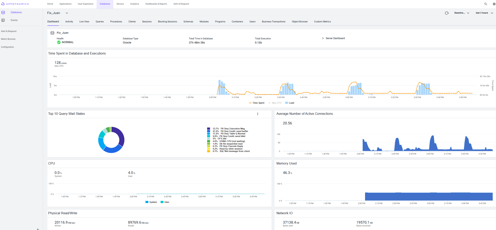
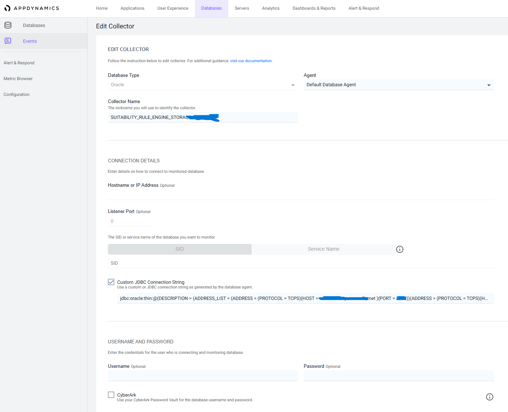
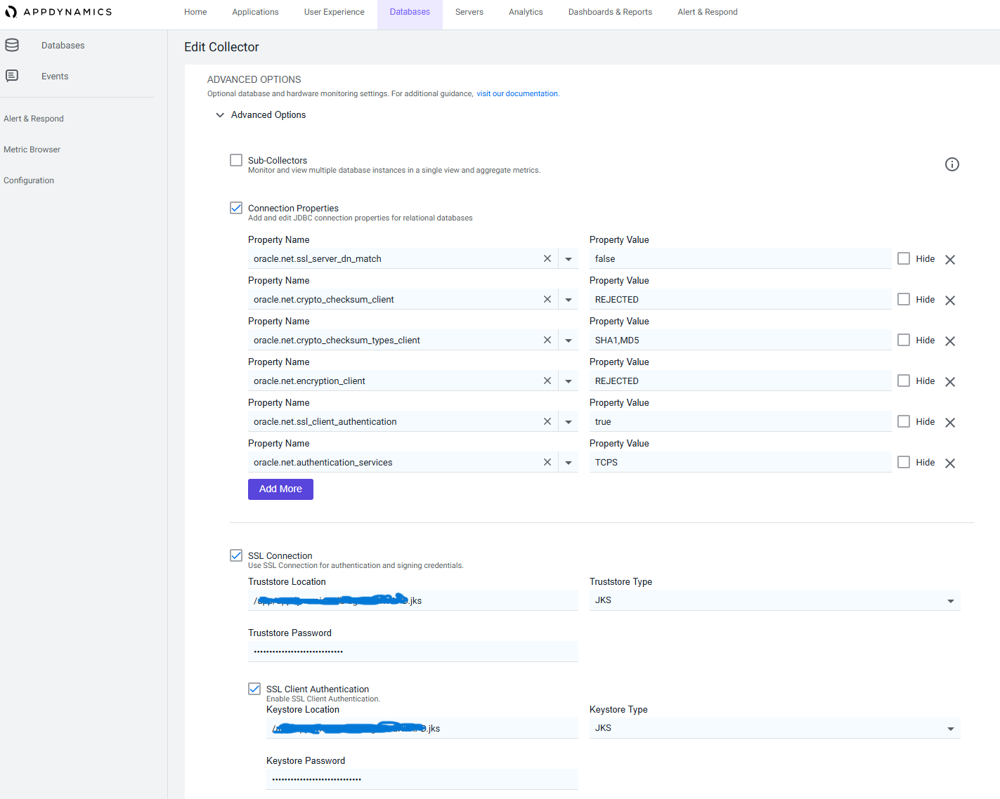

# 4.4 Monitoring

## Introduction

AppDynamics is used for the monitoring of applications, servers and databases within the company. There is currently a lack of monitoring over the oracle databases, which need to be created by the few teams that count with somebody with the knowledge and rights to do so. To facilitate anybody being able to create a database collector and being able to better support the application teams running their app-facing application data in them, the project's playbook is in charge of quickly deploying collectors to AppDynamics with a curl command.

## Database overview in AppDynamics

This is our monitoring overview for the databases. Within this overview we can see things such as network, resource usage and volume of traffic.We can also go deeper and check out the number of transactions and which type of transactions get used the most, how many resources they consume and how long they take to be implemented, which is exatly what we aim to check. Thanks to the addition of the overview to our databases, we have been able to detect slow running transactions and improved them by, for example, adding new indexes.



## Curl command

The way I communicate with AppDynamics to make it create a collector is through a curlc command, which thanks to the AppDynamics internal team within my company I was able to configure it to work within my playbook.
This command is quite complex, so I am thankful for having peers ready to help within my organization.
It creates an access token through giving in the correct secret and then shares the json configuration file containing the database collector information, indicating AppDynamics what to create and how.


```yaml
  - name: create_collector_dev_te1
    shell: |
     password=''
     json_output_access_token=$(curl -v -X POST -H "Content-Type: application/x-www-form-urlencoded" "https://appdynamics-xxx-te1-nch-a-azure.xxx.net/controller/api/oauth/access_token" -d 'grant_type=client_credentials&client_id=db_client@customer1&client_secret=xxx')
     filtered_output_access_token=$(echo $json_output_access_token | grep -o '"access_token": *"[^"]*"' | sed 's/"acces_token": *"//;s/"//g' | awk -F ":" '{print $2}' )
     echo $filtered_output_access_token
     curl -v -X POST 'http://appdynamics-xxx-te1-nch-a-azure.xxx.net:XXXX/controller/rest/databases/collectors/create' \
     -H 'Content-type: application/json' \
     -H 'Accept: application/json' \
     -H 'Authorization: Bearer '"$filtered_output_access_token"'' \
     -d '{ 
# start of the json file
 ```

```
## Values that used to be given by hand

Before the creation of the playbook, the databases needed to be created by hand.
As the very first values, the name of the collector had to be specified, along the JBDC String.



All of the values below within properties had to be copied over from a documentation, since they do not show up in the dropdown list, as well as the values they are set to, which are always the same.
A few other options along the keystore path with the password also had to be enabled and added by hand.


