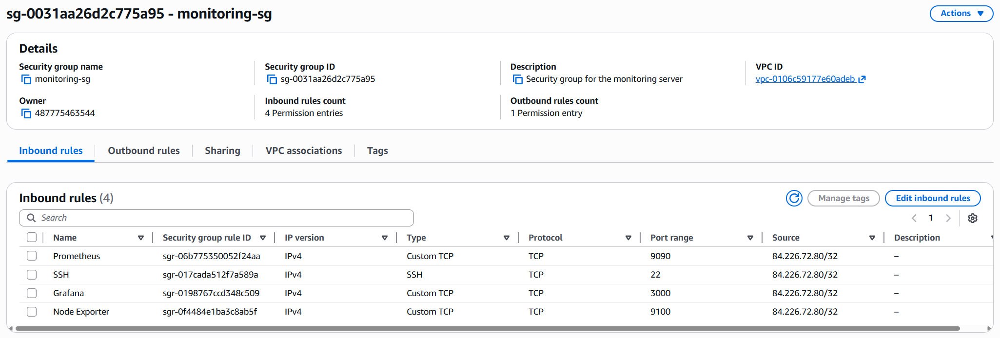
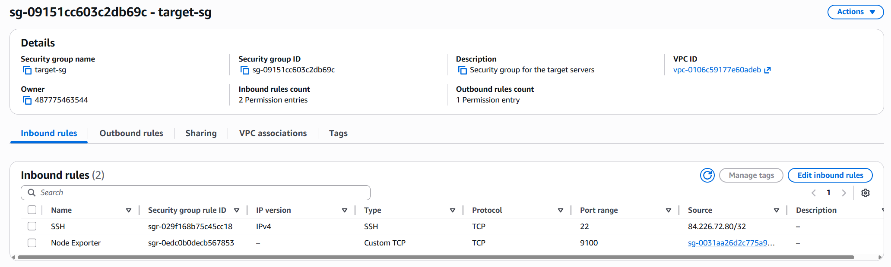
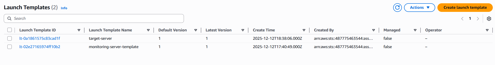

# 4.5 EC2 Instances

## Introduction


# Configuration and Creation

## Key pair

AWS key pair created and downloaded following the plan and structure.

- Name: aws-key
- Key pair type: RSA

Directory created within the WSL ubuntu machine, so it can be moved from the Windows machine.
Security permissions also set correctly.

```bash
mkdir -p ~/.ssh
mv /mnt/c/Users/juanc/Downloads/aws-key.pem ~/.ssh/
chmod 400 ~/.ssh/aws-key.pem
```

How it looks in the console:

```bash
frost@Hitman:~$ ls -ltrh ~/.ssh
total 4.0K
-r-------- 1 frost frost 1.7K Dec 12 17:03 aws-key.pem
```

## Security Groups

As planned earlier in the project, the security groups have been created.\

My public IP has been selected as source for all security groups with the exception of the Node Exporter target-sg, which uses the monitoring-sg.
This makes it so only the monitoring server can scrape metrics.

### monitoring-sg

Monitoring security group and its settings can be seen below:


### target-sg

Target security group and its settings below:



## Launching instances

### Template 1: monitoring-server-template

The EC2 instances created will have to be deleted after every single session in order to preserve budget.
Due to this, I have created templates for the two different type of instances, the monitoring, and the target servers.



**Template name:** monitoring-server-template
**Description:** Template for monitoring server with Prometheus and Grafana

**AMI:** Ubuntu Server 22.04 LTS
**Instance type:** t2.micro
**Key pair:** aws-key

**Network settings:**
- Security groups: monitoring-sg

**Storage:**
- Size: 8 GiB
- Volume type: gp3

**Resource tags:**
- Project: monitoring-dashboard
- Role: monitoring

---

### Template 2: target-server-template

**Template name:** target-server-template
**Description:** Template for target servers running Node Exporter

**AMI:** Ubuntu Server 22.04 LTS
**Instance type:** t2.micro
**Key pair:** aws-key

**Network settings:**
- Security groups: target-sg

**Storage:**
- Size: 8 GiB
- Volume type: gp3

**Resource tags:**
- Project: monitoring-dashboard
- Role: target

