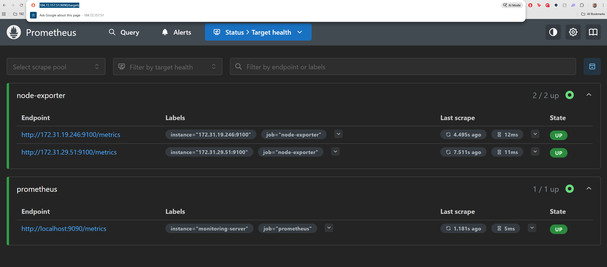
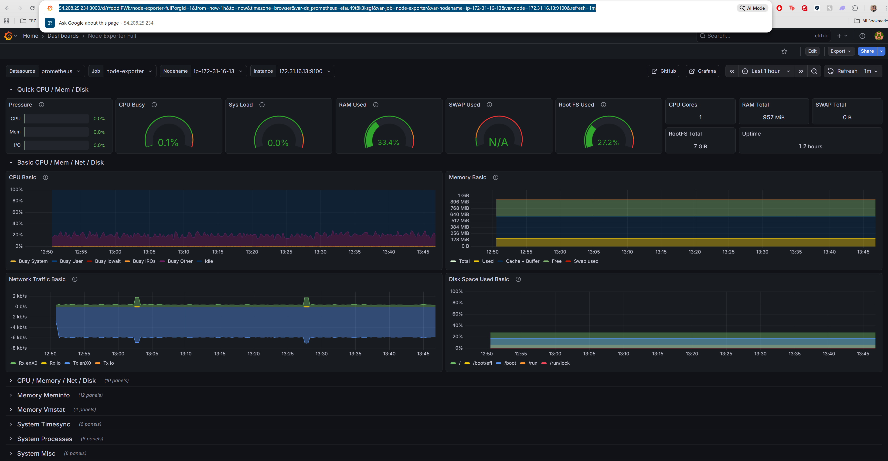

# 4.8 Testing


## Successful Ansible run log

frost@Hitman:~/SEM02$ ansible-playbook main.yml -v

```yaml
Using /home/frost/SEM02/ansible.cfg as config file

PLAY [Deploy Node Exporter to target servers] **************************************************************************

TASK [Gathering Facts] *************************************************************************************************
ok: [target-server-2]
ok: [target-server-1]

TASK [node-exporter : Download Node Exporter] **************************************************************************
changed: [target-server-2] => {"changed": true, "checksum_dest": null, "checksum_src": "b79220ff67860508c8e4a541a095dffedec0e79e", "dest": "/tmp/node_exporter.tar.gz", "elapsed": 0, "gid": 0, "group": "root", "md5sum": "55dc7ffc086dda18bac8b1c59074f67b", "mode": "0755", "msg": "OK (11686705 bytes)", "owner": "root", "size": 11686705, "src": "/home/ubuntu/.ansible/tmp/ansible-tmp-1766161204.2182708-2068-34888900346318/tmpbduw1ndx", "state": "file", "status_code": 200, "uid": 0, "url": "https://github.com/prometheus/node_exporter/releases/download/v1.10.2/node_exporter-1.10.2.linux-amd64.tar.gz"}
changed: [target-server-1] => {"changed": true, "checksum_dest": null, "checksum_src": "b79220ff67860508c8e4a541a095dffedec0e79e", "dest": "/tmp/node_exporter.tar.gz", "elapsed": 0, "gid": 0, "group": "root", "md5sum": "55dc7ffc086dda18bac8b1c59074f67b", "mode": "0755", "msg": "OK (11686705 bytes)", "owner": "root", "size": 11686705, "src": "/home/ubuntu/.ansible/tmp/ansible-tmp-1766161204.2126167-2066-273912766739916/tmp22llaejs", "state": "file", "status_code": 200, "uid": 0, "url": "https://github.com/prometheus/node_exporter/releases/download/v1.10.2/node_exporter-1.10.2.linux-amd64.tar.gz"}

TASK [node-exporter : Extract Node Exporter] ***************************************************************************
changed: [target-server-2] => {"changed": true, "dest": "/tmp/", "extract_results": {"cmd": ["/usr/bin/tar", "--extract", "-C", "/tmp", "-z", "-f", "/tmp/node_exporter.tar.gz"], "err": "", "out": "", "rc": 0}, "gid": 0, "group": "root", "handler": "TgzArchive", "mode": "01777", "owner": "root", "size": 4096, "src": "/tmp/node_exporter.tar.gz", "state": "directory", "uid": 0}
changed: [target-server-1] => {"changed": true, "dest": "/tmp/", "extract_results": {"cmd": ["/usr/bin/tar", "--extract", "-C", "/tmp", "-z", "-f", "/tmp/node_exporter.tar.gz"], "err": "", "out": "", "rc": 0}, "gid": 0, "group": "root", "handler": "TgzArchive", "mode": "01777", "owner": "root", "size": 4096, "src": "/tmp/node_exporter.tar.gz", "state": "directory", "uid": 0}

TASK [node-exporter : Copy Node Exporter binary] ***********************************************************************
changed: [target-server-1] => {"changed": true, "checksum": "f86fd7994dce53eccaa8857f7fa96e1d46657c1f", "dest": "/usr/local/bin/node_exporter", "gid": 0, "group": "root", "md5sum": "cd2b3c66478431d0d1caa6b4dca067de", "mode": "0755", "owner": "root", "size": 22919216, "src": "/tmp/node_exporter-1.10.2.linux-amd64/node_exporter", "state": "file", "uid": 0}
changed: [target-server-2] => {"changed": true, "checksum": "f86fd7994dce53eccaa8857f7fa96e1d46657c1f", "dest": "/usr/local/bin/node_exporter", "gid": 0, "group": "root", "md5sum": "cd2b3c66478431d0d1caa6b4dca067de", "mode": "0755", "owner": "root", "size": 22919216, "src": "/tmp/node_exporter-1.10.2.linux-amd64/node_exporter", "state": "file", "uid": 0}

TASK [node-exporter : Create node_exporter user] ***********************************************************************
changed: [target-server-2] => {"changed": true, "comment": "", "create_home": false, "group": 988, "home": "/home/node_exporter", "name": "node_exporter", "shell": "/bin/false", "state": "present", "system": true, "uid": 999}
changed: [target-server-1] => {"changed": true, "comment": "", "create_home": false, "group": 988, "home": "/home/node_exporter", "name": "node_exporter", "shell": "/bin/false", "state": "present", "system": true, "uid": 999}

TASK [node-exporter : Create systemd service file] *********************************************************************
changed: [target-server-1] => {"changed": true, "checksum": "a10abd5abed00e6adc795ae09b05b7b54ec2c90c", "dest": "/etc/systemd/system/node_exporter.service", "gid": 0, "group": "root", "md5sum": "b17c5a7a64b08e05eeb3497b1cc5ae2d", "mode": "0644", "owner": "root", "size": 193, "src": "/home/ubuntu/.ansible/tmp/ansible-tmp-1766161223.4549873-2138-179297380866287/source", "state": "file", "uid": 0}
changed: [target-server-2] => {"changed": true, "checksum": "a10abd5abed00e6adc795ae09b05b7b54ec2c90c", "dest": "/etc/systemd/system/node_exporter.service", "gid": 0, "group": "root", "md5sum": "b17c5a7a64b08e05eeb3497b1cc5ae2d", "mode": "0644", "owner": "root", "size": 193, "src": "/home/ubuntu/.ansible/tmp/ansible-tmp-1766161223.4641788-2139-138793730793698/source", "state": "file", "uid": 0}

TASK [node-exporter : Start and enable Node Exporter] ******************************************************************
changed: [target-server-1] => {"changed": true, "enabled": true, "name": "node_exporter", "state": "started", "status": {"ActiveEnterTimestampMonotonic": "0", "ActiveExitTimestampMonotonic": "0", "ActiveState": "inactive", "After": "system.slice basic.target systemd-journald.socket sysinit.target network.target", "AllowIsolate": "no", "AssertResult": "no", "AssertTimestampMonotonic": "0", "Before": "shutdown.target", "BlockIOAccounting": "no", "BlockIOWeight": "[not set]", "CPUAccounting": "yes", "CPUAffinityFromNUMA": "no", "CPUQuotaPerSecUSec": "infinity", "CPUQuotaPeriodUSec": "infinity", "CPUSchedulingPolicy": "0", "CPUSchedulingPriority": "0", "CPUSchedulingResetOnFork": "no", "CPUShares": "[not set]", "CPUUsageNSec": "[not set]", "CPUWeight": "[not set]", "CacheDirectoryMode": "0755", "CanFreeze": "yes", "CanIsolate": "no", "CanReload": "no", "CanStart": "yes", "CanStop": "yes", "CapabilityBoundingSet": "cap_chown cap_dac_override cap_dac_read_search cap_fowner cap_fsetid cap_kill cap_setgid cap_setuid cap_setpcap cap_linux_immutable cap_net_bind_service cap_net_broadcast cap_net_admin cap_net_raw cap_ipc_lock cap_ipc_owner cap_sys_module cap_sys_rawio cap_sys_chroot cap_sys_ptrace cap_sys_pacct cap_sys_admin cap_sys_boot cap_sys_nice cap_sys_resource cap_sys_time cap_sys_tty_config cap_mknod cap_lease cap_audit_write cap_audit_control cap_setfcap cap_mac_override cap_mac_admin cap_syslog cap_wake_alarm cap_block_suspend cap_audit_read cap_perfmon cap_bpf cap_checkpoint_restore", "CleanResult": "success", "CollectMode": "inactive", "ConditionResult": "no", "ConditionTimestampMonotonic": "0", "ConfigurationDirectoryMode": "0755", "Conflicts": "shutdown.target", "ControlGroupId": "0", "ControlPID": "0", "CoredumpFilter": "0x33", "CoredumpReceive": "no", "DefaultDependencies": "yes", "DefaultMemoryLow": "0", "DefaultMemoryMin": "0", "DefaultStartupMemoryLow": "0", "Delegate": "no", "Description": "Node Exporter", "DevicePolicy": "auto", "DynamicUser": "no", "ExecMainCode": "0", "ExecMainExitTimestampMonotonic": "0", "ExecMainPID": "0", "ExecMainStartTimestampMonotonic": "0", "ExecMainStatus": "0", "ExecStart": "{ path=/usr/local/bin/node_exporter ; argv[]=/usr/local/bin/node_exporter ; ignore_errors=no ; start_time=[n/a] ; stop_time=[n/a] ; pid=0 ; code=(null) ; status=0/0 }", "ExecStartEx": "{ path=/usr/local/bin/node_exporter ; argv[]=/usr/local/bin/node_exporter ; flags= ; start_time=[n/a] ; stop_time=[n/a] ; pid=0 ; code=(null) ; status=0/0 }", "ExitType": "main", "ExtensionImagePolicy": "root=verity+signed+encrypted+unprotected+absent:usr=verity+signed+encrypted+unprotected+absent:home=encrypted+unprotected+absent:srv=encrypted+unprotected+absent:tmp=encrypted+unprotected+absent:var=encrypted+unprotected+absent", "FailureAction": "none", "FileDescriptorStoreMax": "0", "FileDescriptorStorePreserve": "restart", "FinalKillSignal": "9", "FragmentPath": "/etc/systemd/system/node_exporter.service", "FreezerState": "running", "GID": "[not set]", "Group": "node_exporter", "GuessMainPID": "yes", "IOAccounting": "no", "IOReadBytes": "[not set]", "IOReadOperations": "[not set]", "IOSchedulingClass": "2", "IOSchedulingPriority": "4", "IOWeight": "[not set]", "IOWriteBytes": "[not set]", "IOWriteOperations": "[not set]", "IPAccounting": "no", "IPEgressBytes": "[no data]", "IPEgressPackets": "[no data]", "IPIngressBytes": "[no data]", "IPIngressPackets": "[no data]", "Id": "node_exporter.service", "IgnoreOnIsolate": "no", "IgnoreSIGPIPE": "yes", "InactiveEnterTimestampMonotonic": "0", "InactiveExitTimestampMonotonic": "0", "JobRunningTimeoutUSec": "infinity", "JobTimeoutAction": "none", "JobTimeoutUSec": "infinity", "KeyringMode": "private", "KillMode": "control-group", "KillSignal": "15", "LimitAS": "infinity", "LimitASSoft": "infinity", "LimitCORE": "infinity", "LimitCORESoft": "0", "LimitCPU": "infinity", "LimitCPUSoft": "infinity", "LimitDATA": "infinity", "LimitDATASoft": "infinity", "LimitFSIZE": "infinity", "LimitFSIZESoft": "infinity", "LimitLOCKS": "infinity", "LimitLOCKSSoft": "infinity", "LimitMEMLOCK": "8388608", "LimitMEMLOCKSoft": "8388608", "LimitMSGQUEUE": "819200", "LimitMSGQUEUESoft": "819200", "LimitNICE": "0", "LimitNICESoft": "0", "LimitNOFILE": "524288", "LimitNOFILESoft": "1024", "LimitNPROC": "3739", "LimitNPROCSoft": "3739", "LimitRSS": "infinity", "LimitRSSSoft": "infinity", "LimitRTPRIO": "0", "LimitRTPRIOSoft": "0", "LimitRTTIME": "infinity", "LimitRTTIMESoft": "infinity", "LimitSIGPENDING": "3739", "LimitSIGPENDINGSoft": "3739", "LimitSTACK": "infinity", "LimitSTACKSoft": "8388608", "LoadState": "loaded", "LockPersonality": "no", "LogLevelMax": "-1", "LogRateLimitBurst": "0", "LogRateLimitIntervalUSec": "0", "LogsDirectoryMode": "0755", "MainPID": "0", "ManagedOOMMemoryPressure": "auto", "ManagedOOMMemoryPressureLimit": "0", "ManagedOOMPreference": "none", "ManagedOOMSwap": "auto", "MemoryAccounting": "yes", "MemoryAvailable": "658554880", "MemoryCurrent": "[not set]", "MemoryDenyWriteExecute": "no", "MemoryHigh": "infinity", "MemoryKSM": "no", "MemoryLimit": "infinity", "MemoryLow": "0", "MemoryMax": "infinity", "MemoryMin": "0", "MemoryPeak": "[not set]", "MemoryPressureThresholdUSec": "200ms", "MemoryPressureWatch": "auto", "MemorySwapCurrent": "[not set]", "MemorySwapMax": "infinity", "MemorySwapPeak": "[not set]", "MemoryZSwapCurrent": "[not set]", "MemoryZSwapMax": "infinity", "MountAPIVFS": "no", "MountImagePolicy": "root=verity+signed+encrypted+unprotected+absent:usr=verity+signed+encrypted+unprotected+absent:home=encrypted+unprotected+absent:srv=encrypted+unprotected+absent:tmp=encrypted+unprotected+absent:var=encrypted+unprotected+absent", "NFileDescriptorStore": "0", "NRestarts": "0", "NUMAPolicy": "n/a", "Names": "node_exporter.service", "NeedDaemonReload": "no", "Nice": "0", "NoNewPrivileges": "no", "NonBlocking": "no", "NotifyAccess": "none", "OOMPolicy": "stop", "OOMScoreAdjust": "0", "OnFailureJobMode": "replace", "OnSuccessJobMode": "fail", "Perpetual": "no", "PrivateDevices": "no", "PrivateIPC": "no", "PrivateMounts": "no", "PrivateNetwork": "no", "PrivateTmp": "no", "PrivateUsers": "no", "ProcSubset": "all", "ProtectClock": "no", "ProtectControlGroups": "no", "ProtectHome": "no", "ProtectHostname": "no", "ProtectKernelLogs": "no", "ProtectKernelModules": "no", "ProtectKernelTunables": "no", "ProtectProc": "default", "ProtectSystem": "no", "RefuseManualStart": "no", "RefuseManualStop": "no", "ReloadResult": "success", "ReloadSignal": "1", "RemainAfterExit": "no", "RemoveIPC": "no", "Requires": "system.slice sysinit.target", "Restart": "no", "RestartKillSignal": "15", "RestartMaxDelayUSec": "infinity", "RestartMode": "normal", "RestartSteps": "0", "RestartUSec": "100ms", "RestartUSecNext": "100ms", "RestrictNamespaces": "no", "RestrictRealtime": "no", "RestrictSUIDSGID": "no", "Result": "success", "RootDirectoryStartOnly": "no", "RootEphemeral": "no", "RootImagePolicy": "root=verity+signed+encrypted+unprotected+absent:usr=verity+signed+encrypted+unprotected+absent:home=encrypted+unprotected+absent:srv=encrypted+unprotected+absent:tmp=encrypted+unprotected+absent:var=encrypted+unprotected+absent", "RuntimeDirectoryMode": "0755", "RuntimeDirectoryPreserve": "no", "RuntimeMaxUSec": "infinity", "RuntimeRandomizedExtraUSec": "0", "SameProcessGroup": "no", "SecureBits": "0", "SendSIGHUP": "no", "SendSIGKILL": "yes", "SetLoginEnvironment": "no", "Slice": "system.slice", "StandardError": "inherit", "StandardInput": "null", "StandardOutput": "journal", "StartLimitAction": "none", "StartLimitBurst": "5", "StartLimitIntervalUSec": "10s", "StartupBlockIOWeight": "[not set]", "StartupCPUShares": "[not set]", "StartupCPUWeight": "[not set]", "StartupIOWeight": "[not set]", "StartupMemoryHigh": "infinity", "StartupMemoryLow": "0", "StartupMemoryMax": "infinity", "StartupMemorySwapMax": "infinity", "StartupMemoryZSwapMax": "infinity", "StateChangeTimestampMonotonic": "0", "StateDirectoryMode": "0755", "StatusErrno": "0", "StopWhenUnneeded": "no", "SubState": "dead", "SuccessAction": "none", "SurviveFinalKillSignal": "no", "SyslogFacility": "3", "SyslogLevel": "6", "SyslogLevelPrefix": "yes", "SyslogPriority": "30", "SystemCallErrorNumber": "2147483646", "TTYReset": "no", "TTYVHangup": "no", "TTYVTDisallocate": "no", "TasksAccounting": "yes", "TasksCurrent": "[not set]", "TasksMax": "1121", "TimeoutAbortUSec": "1min 30s", "TimeoutCleanUSec": "infinity", "TimeoutStartFailureMode": "terminate", "TimeoutStartUSec": "1min 30s", "TimeoutStopFailureMode": "terminate", "TimeoutStopUSec": "1min 30s", "TimerSlackNSec": "50000", "Transient": "no", "Type": "simple", "UID": "[not set]", "UMask": "0022", "UnitFilePreset": "enabled", "UnitFileState": "disabled", "User": "node_exporter", "UtmpMode": "init", "WatchdogSignal": "6", "WatchdogTimestampMonotonic": "0", "WatchdogUSec": "infinity"}}
changed: [target-server-2] => {"changed": true, "enabled": true, "name": "node_exporter", "state": "started", "status": {"ActiveEnterTimestampMonotonic": "0", "ActiveExitTimestampMonotonic": "0", "ActiveState": "inactive", "After": "basic.target sysinit.target system.slice network.target systemd-journald.socket", "AllowIsolate": "no", "AssertResult": "no", "AssertTimestampMonotonic": "0", "Before": "shutdown.target", "BlockIOAccounting": "no", "BlockIOWeight": "[not set]", "CPUAccounting": "yes", "CPUAffinityFromNUMA": "no", "CPUQuotaPerSecUSec": "infinity", "CPUQuotaPeriodUSec": "infinity", "CPUSchedulingPolicy": "0", "CPUSchedulingPriority": "0", "CPUSchedulingResetOnFork": "no", "CPUShares": "[not set]", "CPUUsageNSec": "[not set]", "CPUWeight": "[not set]", "CacheDirectoryMode": "0755", "CanFreeze": "yes", "CanIsolate": "no", "CanReload": "no", "CanStart": "yes", "CanStop": "yes", "CapabilityBoundingSet": "cap_chown cap_dac_override cap_dac_read_search cap_fowner cap_fsetid cap_kill cap_setgid cap_setuid cap_setpcap cap_linux_immutable cap_net_bind_service cap_net_broadcast cap_net_admin cap_net_raw cap_ipc_lock cap_ipc_owner cap_sys_module cap_sys_rawio cap_sys_chroot cap_sys_ptrace cap_sys_pacct cap_sys_admin cap_sys_boot cap_sys_nice cap_sys_resource cap_sys_time cap_sys_tty_config cap_mknod cap_lease cap_audit_write cap_audit_control cap_setfcap cap_mac_override cap_mac_admin cap_syslog cap_wake_alarm cap_block_suspend cap_audit_read cap_perfmon cap_bpf cap_checkpoint_restore", "CleanResult": "success", "CollectMode": "inactive", "ConditionResult": "no", "ConditionTimestampMonotonic": "0", "ConfigurationDirectoryMode": "0755", "Conflicts": "shutdown.target", "ControlGroupId": "0", "ControlPID": "0", "CoredumpFilter": "0x33", "CoredumpReceive": "no", "DefaultDependencies": "yes", "DefaultMemoryLow": "0", "DefaultMemoryMin": "0", "DefaultStartupMemoryLow": "0", "Delegate": "no", "Description": "Node Exporter", "DevicePolicy": "auto", "DynamicUser": "no", "ExecMainCode": "0", "ExecMainExitTimestampMonotonic": "0", "ExecMainPID": "0", "ExecMainStartTimestampMonotonic": "0", "ExecMainStatus": "0", "ExecStart": "{ path=/usr/local/bin/node_exporter ; argv[]=/usr/local/bin/node_exporter ; ignore_errors=no ; start_time=[n/a] ; stop_time=[n/a] ; pid=0 ; code=(null) ; status=0/0 }", "ExecStartEx": "{ path=/usr/local/bin/node_exporter ; argv[]=/usr/local/bin/node_exporter ; flags= ; start_time=[n/a] ; stop_time=[n/a] ; pid=0 ; code=(null) ; status=0/0 }", "ExitType": "main", "ExtensionImagePolicy": "root=verity+signed+encrypted+unprotected+absent:usr=verity+signed+encrypted+unprotected+absent:home=encrypted+unprotected+absent:srv=encrypted+unprotected+absent:tmp=encrypted+unprotected+absent:var=encrypted+unprotected+absent", "FailureAction": "none", "FileDescriptorStoreMax": "0", "FileDescriptorStorePreserve": "restart", "FinalKillSignal": "9", "FragmentPath": "/etc/systemd/system/node_exporter.service", "FreezerState": "running", "GID": "[not set]", "Group": "node_exporter", "GuessMainPID": "yes", "IOAccounting": "no", "IOReadBytes": "[not set]", "IOReadOperations": "[not set]", "IOSchedulingClass": "2", "IOSchedulingPriority": "4", "IOWeight": "[not set]", "IOWriteBytes": "[not set]", "IOWriteOperations": "[not set]", "IPAccounting": "no", "IPEgressBytes": "[no data]", "IPEgressPackets": "[no data]", "IPIngressBytes": "[no data]", "IPIngressPackets": "[no data]", "Id": "node_exporter.service", "IgnoreOnIsolate": "no", "IgnoreSIGPIPE": "yes", "InactiveEnterTimestampMonotonic": "0", "InactiveExitTimestampMonotonic": "0", "JobRunningTimeoutUSec": "infinity", "JobTimeoutAction": "none", "JobTimeoutUSec": "infinity", "KeyringMode": "private", "KillMode": "control-group", "KillSignal": "15", "LimitAS": "infinity", "LimitASSoft": "infinity", "LimitCORE": "infinity", "LimitCORESoft": "0", "LimitCPU": "infinity", "LimitCPUSoft": "infinity", "LimitDATA": "infinity", "LimitDATASoft": "infinity", "LimitFSIZE": "infinity", "LimitFSIZESoft": "infinity", "LimitLOCKS": "infinity", "LimitLOCKSSoft": "infinity", "LimitMEMLOCK": "8388608", "LimitMEMLOCKSoft": "8388608", "LimitMSGQUEUE": "819200", "LimitMSGQUEUESoft": "819200", "LimitNICE": "0", "LimitNICESoft": "0", "LimitNOFILE": "524288", "LimitNOFILESoft": "1024", "LimitNPROC": "3739", "LimitNPROCSoft": "3739", "LimitRSS": "infinity", "LimitRSSSoft": "infinity", "LimitRTPRIO": "0", "LimitRTPRIOSoft": "0", "LimitRTTIME": "infinity", "LimitRTTIMESoft": "infinity", "LimitSIGPENDING": "3739", "LimitSIGPENDINGSoft": "3739", "LimitSTACK": "infinity", "LimitSTACKSoft": "8388608", "LoadState": "loaded", "LockPersonality": "no", "LogLevelMax": "-1", "LogRateLimitBurst": "0", "LogRateLimitIntervalUSec": "0", "LogsDirectoryMode": "0755", "MainPID": "0", "ManagedOOMMemoryPressure": "auto", "ManagedOOMMemoryPressureLimit": "0", "ManagedOOMPreference": "none", "ManagedOOMSwap": "auto", "MemoryAccounting": "yes", "MemoryAvailable": "647098368", "MemoryCurrent": "[not set]", "MemoryDenyWriteExecute": "no", "MemoryHigh": "infinity", "MemoryKSM": "no", "MemoryLimit": "infinity", "MemoryLow": "0", "MemoryMax": "infinity", "MemoryMin": "0", "MemoryPeak": "[not set]", "MemoryPressureThresholdUSec": "200ms", "MemoryPressureWatch": "auto", "MemorySwapCurrent": "[not set]", "MemorySwapMax": "infinity", "MemorySwapPeak": "[not set]", "MemoryZSwapCurrent": "[not set]", "MemoryZSwapMax": "infinity", "MountAPIVFS": "no", "MountImagePolicy": "root=verity+signed+encrypted+unprotected+absent:usr=verity+signed+encrypted+unprotected+absent:home=encrypted+unprotected+absent:srv=encrypted+unprotected+absent:tmp=encrypted+unprotected+absent:var=encrypted+unprotected+absent", "NFileDescriptorStore": "0", "NRestarts": "0", "NUMAPolicy": "n/a", "Names": "node_exporter.service", "NeedDaemonReload": "no", "Nice": "0", "NoNewPrivileges": "no", "NonBlocking": "no", "NotifyAccess": "none", "OOMPolicy": "stop", "OOMScoreAdjust": "0", "OnFailureJobMode": "replace", "OnSuccessJobMode": "fail", "Perpetual": "no", "PrivateDevices": "no", "PrivateIPC": "no", "PrivateMounts": "no", "PrivateNetwork": "no", "PrivateTmp": "no", "PrivateUsers": "no", "ProcSubset": "all", "ProtectClock": "no", "ProtectControlGroups": "no", "ProtectHome": "no", "ProtectHostname": "no", "ProtectKernelLogs": "no", "ProtectKernelModules": "no", "ProtectKernelTunables": "no", "ProtectProc": "default", "ProtectSystem": "no", "RefuseManualStart": "no", "RefuseManualStop": "no", "ReloadResult": "success", "ReloadSignal": "1", "RemainAfterExit": "no", "RemoveIPC": "no", "Requires": "system.slice sysinit.target", "Restart": "no", "RestartKillSignal": "15", "RestartMaxDelayUSec": "infinity", "RestartMode": "normal", "RestartSteps": "0", "RestartUSec": "100ms", "RestartUSecNext": "100ms", "RestrictNamespaces": "no", "RestrictRealtime": "no", "RestrictSUIDSGID": "no", "Result": "success", "RootDirectoryStartOnly": "no", "RootEphemeral": "no", "RootImagePolicy": "root=verity+signed+encrypted+unprotected+absent:usr=verity+signed+encrypted+unprotected+absent:home=encrypted+unprotected+absent:srv=encrypted+unprotected+absent:tmp=encrypted+unprotected+absent:var=encrypted+unprotected+absent", "RuntimeDirectoryMode": "0755", "RuntimeDirectoryPreserve": "no", "RuntimeMaxUSec": "infinity", "RuntimeRandomizedExtraUSec": "0", "SameProcessGroup": "no", "SecureBits": "0", "SendSIGHUP": "no", "SendSIGKILL": "yes", "SetLoginEnvironment": "no", "Slice": "system.slice", "StandardError": "inherit", "StandardInput": "null", "StandardOutput": "journal", "StartLimitAction": "none", "StartLimitBurst": "5", "StartLimitIntervalUSec": "10s", "StartupBlockIOWeight": "[not set]", "StartupCPUShares": "[not set]", "StartupCPUWeight": "[not set]", "StartupIOWeight": "[not set]", "StartupMemoryHigh": "infinity", "StartupMemoryLow": "0", "StartupMemoryMax": "infinity", "StartupMemorySwapMax": "infinity", "StartupMemoryZSwapMax": "infinity", "StateChangeTimestampMonotonic": "0", "StateDirectoryMode": "0755", "StatusErrno": "0", "StopWhenUnneeded": "no", "SubState": "dead", "SuccessAction": "none", "SurviveFinalKillSignal": "no", "SyslogFacility": "3", "SyslogLevel": "6", "SyslogLevelPrefix": "yes", "SyslogPriority": "30", "SystemCallErrorNumber": "2147483646", "TTYReset": "no", "TTYVHangup": "no", "TTYVTDisallocate": "no", "TasksAccounting": "yes", "TasksCurrent": "[not set]", "TasksMax": "1121", "TimeoutAbortUSec": "1min 30s", "TimeoutCleanUSec": "infinity", "TimeoutStartFailureMode": "terminate", "TimeoutStartUSec": "1min 30s", "TimeoutStopFailureMode": "terminate", "TimeoutStopUSec": "1min 30s", "TimerSlackNSec": "50000", "Transient": "no", "Type": "simple", "UID": "[not set]", "UMask": "0022", "UnitFilePreset": "enabled", "UnitFileState": "disabled", "User": "node_exporter", "UtmpMode": "init", "WatchdogSignal": "6", "WatchdogTimestampMonotonic": "0", "WatchdogUSec": "infinity"}}

RUNNING HANDLER [node-exporter : restart node_exporter] ****************************************************************
changed: [target-server-2] => {"changed": true, "name": "node_exporter", "state": "started", "status": {"ActiveEnterTimestamp": "Fri 2025-12-19 16:20:35 UTC", "ActiveEnterTimestampMonotonic": "2134984397", "ActiveExitTimestampMonotonic": "0", "ActiveState": "active", "After": "systemd-journald.socket system.slice network.target sysinit.target basic.target", "AllowIsolate": "no", "AssertResult": "yes", "AssertTimestamp": "Fri 2025-12-19 16:20:35 UTC", "AssertTimestampMonotonic": "2134980075", "Before": "multi-user.target shutdown.target", "BlockIOAccounting": "no", "BlockIOWeight": "[not set]", "CPUAccounting": "yes", "CPUAffinityFromNUMA": "no", "CPUQuotaPerSecUSec": "infinity", "CPUQuotaPeriodUSec": "infinity", "CPUSchedulingPolicy": "0", "CPUSchedulingPriority": "0", "CPUSchedulingResetOnFork": "no", "CPUShares": "[not set]", "CPUUsageNSec": "10574000", "CPUWeight": "[not set]", "CacheDirectoryMode": "0755", "CanFreeze": "yes", "CanIsolate": "no", "CanReload": "no", "CanStart": "yes", "CanStop": "yes", "CapabilityBoundingSet": "cap_chown cap_dac_override cap_dac_read_search cap_fowner cap_fsetid cap_kill cap_setgid cap_setuid cap_setpcap cap_linux_immutable cap_net_bind_service cap_net_broadcast cap_net_admin cap_net_raw cap_ipc_lock cap_ipc_owner cap_sys_module cap_sys_rawio cap_sys_chroot cap_sys_ptrace cap_sys_pacct cap_sys_admin cap_sys_boot cap_sys_nice cap_sys_resource cap_sys_time cap_sys_tty_config cap_mknod cap_lease cap_audit_write cap_audit_control cap_setfcap cap_mac_override cap_mac_admin cap_syslog cap_wake_alarm cap_block_suspend cap_audit_read cap_perfmon cap_bpf cap_checkpoint_restore", "CleanResult": "success", "CollectMode": "inactive", "ConditionResult": "yes", "ConditionTimestamp": "Fri 2025-12-19 16:20:35 UTC", "ConditionTimestampMonotonic": "2134980073", "ConfigurationDirectoryMode": "0755", "Conflicts": "shutdown.target", "ControlGroup": "/system.slice/node_exporter.service", "ControlGroupId": "7601", "ControlPID": "0", "CoredumpFilter": "0x33", "CoredumpReceive": "no", "DefaultDependencies": "yes", "DefaultMemoryLow": "0", "DefaultMemoryMin": "0", "DefaultStartupMemoryLow": "0", "Delegate": "no", "Description": "Node Exporter", "DevicePolicy": "auto", "DynamicUser": "no", "ExecMainCode": "0", "ExecMainExitTimestampMonotonic": "0", "ExecMainPID": "2227", "ExecMainStartTimestamp": "Fri 2025-12-19 16:20:35 UTC", "ExecMainStartTimestampMonotonic": "2134984227", "ExecMainStatus": "0", "ExecStart": "{ path=/usr/local/bin/node_exporter ; argv[]=/usr/local/bin/node_exporter ; ignore_errors=no ; start_time=[n/a] ; stop_time=[n/a] ; pid=0 ; code=(null) ; status=0/0 }", "ExecStartEx": "{ path=/usr/local/bin/node_exporter ; argv[]=/usr/local/bin/node_exporter ; flags= ; start_time=[n/a] ; stop_time=[n/a] ; pid=0 ; code=(null) ; status=0/0 }", "ExitType": "main", "ExtensionImagePolicy": "root=verity+signed+encrypted+unprotected+absent:usr=verity+signed+encrypted+unprotected+absent:home=encrypted+unprotected+absent:srv=encrypted+unprotected+absent:tmp=encrypted+unprotected+absent:var=encrypted+unprotected+absent", "FailureAction": "none", "FileDescriptorStoreMax": "0", "FileDescriptorStorePreserve": "restart", "FinalKillSignal": "9", "FragmentPath": "/etc/systemd/system/node_exporter.service", "FreezerState": "running", "GID": "988", "Group": "node_exporter", "GuessMainPID": "yes", "IOAccounting": "no", "IOReadBytes": "[not set]", "IOReadOperations": "[not set]", "IOSchedulingClass": "2", "IOSchedulingPriority": "4", "IOWeight": "[not set]", "IOWriteBytes": "[not set]", "IOWriteOperations": "[not set]", "IPAccounting": "no", "IPEgressBytes": "[no data]", "IPEgressPackets": "[no data]", "IPIngressBytes": "[no data]", "IPIngressPackets": "[no data]", "Id": "node_exporter.service", "IgnoreOnIsolate": "no", "IgnoreSIGPIPE": "yes", "InactiveEnterTimestampMonotonic": "0", "InactiveExitTimestamp": "Fri 2025-12-19 16:20:35 UTC", "InactiveExitTimestampMonotonic": "2134984397", "InvocationID": "92aa8d707ab341b88bd60c81c0c3dabd", "JobRunningTimeoutUSec": "infinity", "JobTimeoutAction": "none", "JobTimeoutUSec": "infinity", "KeyringMode": "private", "KillMode": "control-group", "KillSignal": "15", "LimitAS": "infinity", "LimitASSoft": "infinity", "LimitCORE": "infinity", "LimitCORESoft": "0", "LimitCPU": "infinity", "LimitCPUSoft": "infinity", "LimitDATA": "infinity", "LimitDATASoft": "infinity", "LimitFSIZE": "infinity", "LimitFSIZESoft": "infinity", "LimitLOCKS": "infinity", "LimitLOCKSSoft": "infinity", "LimitMEMLOCK": "8388608", "LimitMEMLOCKSoft": "8388608", "LimitMSGQUEUE": "819200", "LimitMSGQUEUESoft": "819200", "LimitNICE": "0", "LimitNICESoft": "0", "LimitNOFILE": "524288", "LimitNOFILESoft": "1024", "LimitNPROC": "3739", "LimitNPROCSoft": "3739", "LimitRSS": "infinity", "LimitRSSSoft": "infinity", "LimitRTPRIO": "0", "LimitRTPRIOSoft": "0", "LimitRTTIME": "infinity", "LimitRTTIMESoft": "infinity", "LimitSIGPENDING": "3739", "LimitSIGPENDINGSoft": "3739", "LimitSTACK": "infinity", "LimitSTACKSoft": "8388608", "LoadState": "loaded", "LockPersonality": "no", "LogLevelMax": "-1", "LogRateLimitBurst": "0", "LogRateLimitIntervalUSec": "0", "LogsDirectoryMode": "0755", "MainPID": "2227", "ManagedOOMMemoryPressure": "auto", "ManagedOOMMemoryPressureLimit": "0", "ManagedOOMPreference": "none", "ManagedOOMSwap": "auto", "MemoryAccounting": "yes", "MemoryAvailable": "654819328", "MemoryCurrent": "2240512", "MemoryDenyWriteExecute": "no", "MemoryHigh": "infinity", "MemoryKSM": "no", "MemoryLimit": "infinity", "MemoryLow": "0", "MemoryMax": "infinity", "MemoryMin": "0", "MemoryPeak": "2482176", "MemoryPressureThresholdUSec": "200ms", "MemoryPressureWatch": "auto", "MemorySwapCurrent": "0", "MemorySwapMax": "infinity", "MemorySwapPeak": "0", "MemoryZSwapCurrent": "0", "MemoryZSwapMax": "infinity", "MountAPIVFS": "no", "MountImagePolicy": "root=verity+signed+encrypted+unprotected+absent:usr=verity+signed+encrypted+unprotected+absent:home=encrypted+unprotected+absent:srv=encrypted+unprotected+absent:tmp=encrypted+unprotected+absent:var=encrypted+unprotected+absent", "NFileDescriptorStore": "0", "NRestarts": "0", "NUMAPolicy": "n/a", "Names": "node_exporter.service", "NeedDaemonReload": "no", "Nice": "0", "NoNewPrivileges": "no", "NonBlocking": "no", "NotifyAccess": "none", "OOMPolicy": "stop", "OOMScoreAdjust": "0", "OnFailureJobMode": "replace", "OnSuccessJobMode": "fail", "Perpetual": "no", "PrivateDevices": "no", "PrivateIPC": "no", "PrivateMounts": "no", "PrivateNetwork": "no", "PrivateTmp": "no", "PrivateUsers": "no", "ProcSubset": "all", "ProtectClock": "no", "ProtectControlGroups": "no", "ProtectHome": "no", "ProtectHostname": "no", "ProtectKernelLogs": "no", "ProtectKernelModules": "no", "ProtectKernelTunables": "no", "ProtectProc": "default", "ProtectSystem": "no", "RefuseManualStart": "no", "RefuseManualStop": "no", "ReloadResult": "success", "ReloadSignal": "1", "RemainAfterExit": "no", "RemoveIPC": "no", "Requires": "system.slice sysinit.target", "Restart": "no", "RestartKillSignal": "15", "RestartMaxDelayUSec": "infinity", "RestartMode": "normal", "RestartSteps": "0", "RestartUSec": "100ms", "RestartUSecNext": "100ms", "RestrictNamespaces": "no", "RestrictRealtime": "no", "RestrictSUIDSGID": "no", "Result": "success", "RootDirectoryStartOnly": "no", "RootEphemeral": "no", "RootImagePolicy": "root=verity+signed+encrypted+unprotected+absent:usr=verity+signed+encrypted+unprotected+absent:home=encrypted+unprotected+absent:srv=encrypted+unprotected+absent:tmp=encrypted+unprotected+absent:var=encrypted+unprotected+absent", "RuntimeDirectoryMode": "0755", "RuntimeDirectoryPreserve": "no", "RuntimeMaxUSec": "infinity", "RuntimeRandomizedExtraUSec": "0", "SameProcessGroup": "no", "SecureBits": "0", "SendSIGHUP": "no", "SendSIGKILL": "yes", "SetLoginEnvironment": "no", "Slice": "system.slice", "StandardError": "inherit", "StandardInput": "null", "StandardOutput": "journal", "StartLimitAction": "none", "StartLimitBurst": "5", "StartLimitIntervalUSec": "10s", "StartupBlockIOWeight": "[not set]", "StartupCPUShares": "[not set]", "StartupCPUWeight": "[not set]", "StartupIOWeight": "[not set]", "StartupMemoryHigh": "infinity", "StartupMemoryLow": "0", "StartupMemoryMax": "infinity", "StartupMemorySwapMax": "infinity", "StartupMemoryZSwapMax": "infinity", "StateChangeTimestamp": "Fri 2025-12-19 16:20:35 UTC", "StateChangeTimestampMonotonic": "2134984397", "StateDirectoryMode": "0755", "StatusErrno": "0", "StopWhenUnneeded": "no", "SubState": "running", "SuccessAction": "none", "SurviveFinalKillSignal": "no", "SyslogFacility": "3", "SyslogLevel": "6", "SyslogLevelPrefix": "yes", "SyslogPriority": "30", "SystemCallErrorNumber": "2147483646", "TTYReset": "no", "TTYVHangup": "no", "TTYVTDisallocate": "no", "TasksAccounting": "yes", "TasksCurrent": "4", "TasksMax": "1121", "TimeoutAbortUSec": "1min 30s", "TimeoutCleanUSec": "infinity", "TimeoutStartFailureMode": "terminate", "TimeoutStartUSec": "1min 30s", "TimeoutStopFailureMode": "terminate", "TimeoutStopUSec": "1min 30s", "TimerSlackNSec": "50000", "Transient": "no", "Type": "simple", "UID": "999", "UMask": "0022", "UnitFilePreset": "enabled", "UnitFileState": "enabled", "User": "node_exporter", "UtmpMode": "init", "WantedBy": "multi-user.target", "WatchdogSignal": "6", "WatchdogTimestampMonotonic": "0", "WatchdogUSec": "0"}}
changed: [target-server-1] => {"changed": true, "name": "node_exporter", "state": "started", "status": {"ActiveEnterTimestamp": "Fri 2025-12-19 16:20:35 UTC", "ActiveEnterTimestampMonotonic": "2104089241", "ActiveExitTimestampMonotonic": "0", "ActiveState": "active", "After": "systemd-journald.socket network.target basic.target system.slice sysinit.target", "AllowIsolate": "no", "AssertResult": "yes", "AssertTimestamp": "Fri 2025-12-19 16:20:35 UTC", "AssertTimestampMonotonic": "2104084790", "Before": "multi-user.target shutdown.target", "BlockIOAccounting": "no", "BlockIOWeight": "[not set]", "CPUAccounting": "yes", "CPUAffinityFromNUMA": "no", "CPUQuotaPerSecUSec": "infinity", "CPUQuotaPeriodUSec": "infinity", "CPUSchedulingPolicy": "0", "CPUSchedulingPriority": "0", "CPUSchedulingResetOnFork": "no", "CPUShares": "[not set]", "CPUUsageNSec": "11391000", "CPUWeight": "[not set]", "CacheDirectoryMode": "0755", "CanFreeze": "yes", "CanIsolate": "no", "CanReload": "no", "CanStart": "yes", "CanStop": "yes", "CapabilityBoundingSet": "cap_chown cap_dac_override cap_dac_read_search cap_fowner cap_fsetid cap_kill cap_setgid cap_setuid cap_setpcap cap_linux_immutable cap_net_bind_service cap_net_broadcast cap_net_admin cap_net_raw cap_ipc_lock cap_ipc_owner cap_sys_module cap_sys_rawio cap_sys_chroot cap_sys_ptrace cap_sys_pacct cap_sys_admin cap_sys_boot cap_sys_nice cap_sys_resource cap_sys_time cap_sys_tty_config cap_mknod cap_lease cap_audit_write cap_audit_control cap_setfcap cap_mac_override cap_mac_admin cap_syslog cap_wake_alarm cap_block_suspend cap_audit_read cap_perfmon cap_bpf cap_checkpoint_restore", "CleanResult": "success", "CollectMode": "inactive", "ConditionResult": "yes", "ConditionTimestamp": "Fri 2025-12-19 16:20:35 UTC", "ConditionTimestampMonotonic": "2104084787", "ConfigurationDirectoryMode": "0755", "Conflicts": "shutdown.target", "ControlGroup": "/system.slice/node_exporter.service", "ControlGroupId": "7601", "ControlPID": "0", "CoredumpFilter": "0x33", "CoredumpReceive": "no", "DefaultDependencies": "yes", "DefaultMemoryLow": "0", "DefaultMemoryMin": "0", "DefaultStartupMemoryLow": "0", "Delegate": "no", "Description": "Node Exporter", "DevicePolicy": "auto", "DynamicUser": "no", "ExecMainCode": "0", "ExecMainExitTimestampMonotonic": "0", "ExecMainPID": "2251", "ExecMainStartTimestamp": "Fri 2025-12-19 16:20:35 UTC", "ExecMainStartTimestampMonotonic": "2104089056", "ExecMainStatus": "0", "ExecStart": "{ path=/usr/local/bin/node_exporter ; argv[]=/usr/local/bin/node_exporter ; ignore_errors=no ; start_time=[n/a] ; stop_time=[n/a] ; pid=0 ; code=(null) ; status=0/0 }", "ExecStartEx": "{ path=/usr/local/bin/node_exporter ; argv[]=/usr/local/bin/node_exporter ; flags= ; start_time=[n/a] ; stop_time=[n/a] ; pid=0 ; code=(null) ; status=0/0 }", "ExitType": "main", "ExtensionImagePolicy": "root=verity+signed+encrypted+unprotected+absent:usr=verity+signed+encrypted+unprotected+absent:home=encrypted+unprotected+absent:srv=encrypted+unprotected+absent:tmp=encrypted+unprotected+absent:var=encrypted+unprotected+absent", "FailureAction": "none", "FileDescriptorStoreMax": "0", "FileDescriptorStorePreserve": "restart", "FinalKillSignal": "9", "FragmentPath": "/etc/systemd/system/node_exporter.service", "FreezerState": "running", "GID": "988", "Group": "node_exporter", "GuessMainPID": "yes", "IOAccounting": "no", "IOReadBytes": "[not set]", "IOReadOperations": "[not set]", "IOSchedulingClass": "2", "IOSchedulingPriority": "4", "IOWeight": "[not set]", "IOWriteBytes": "[not set]", "IOWriteOperations": "[not set]", "IPAccounting": "no", "IPEgressBytes": "[no data]", "IPEgressPackets": "[no data]", "IPIngressBytes": "[no data]", "IPIngressPackets": "[no data]", "Id": "node_exporter.service", "IgnoreOnIsolate": "no", "IgnoreSIGPIPE": "yes", "InactiveEnterTimestampMonotonic": "0", "InactiveExitTimestamp": "Fri 2025-12-19 16:20:35 UTC", "InactiveExitTimestampMonotonic": "2104089241", "InvocationID": "bb00f2c4bd8243709f2682b99d52a34e", "JobRunningTimeoutUSec": "infinity", "JobTimeoutAction": "none", "JobTimeoutUSec": "infinity", "KeyringMode": "private", "KillMode": "control-group", "KillSignal": "15", "LimitAS": "infinity", "LimitASSoft": "infinity", "LimitCORE": "infinity", "LimitCORESoft": "0", "LimitCPU": "infinity", "LimitCPUSoft": "infinity", "LimitDATA": "infinity", "LimitDATASoft": "infinity", "LimitFSIZE": "infinity", "LimitFSIZESoft": "infinity", "LimitLOCKS": "infinity", "LimitLOCKSSoft": "infinity", "LimitMEMLOCK": "8388608", "LimitMEMLOCKSoft": "8388608", "LimitMSGQUEUE": "819200", "LimitMSGQUEUESoft": "819200", "LimitNICE": "0", "LimitNICESoft": "0", "LimitNOFILE": "524288", "LimitNOFILESoft": "1024", "LimitNPROC": "3739", "LimitNPROCSoft": "3739", "LimitRSS": "infinity", "LimitRSSSoft": "infinity", "LimitRTPRIO": "0", "LimitRTPRIOSoft": "0", "LimitRTTIME": "infinity", "LimitRTTIMESoft": "infinity", "LimitSIGPENDING": "3739", "LimitSIGPENDINGSoft": "3739", "LimitSTACK": "infinity", "LimitSTACKSoft": "8388608", "LoadState": "loaded", "LockPersonality": "no", "LogLevelMax": "-1", "LogRateLimitBurst": "0", "LogRateLimitIntervalUSec": "0", "LogsDirectoryMode": "0755", "MainPID": "2251", "ManagedOOMMemoryPressure": "auto", "ManagedOOMMemoryPressureLimit": "0", "ManagedOOMPreference": "none", "ManagedOOMSwap": "auto", "MemoryAccounting": "yes", "MemoryAvailable": "641507328", "MemoryCurrent": "2195456", "MemoryDenyWriteExecute": "no", "MemoryHigh": "infinity", "MemoryKSM": "no", "MemoryLimit": "infinity", "MemoryLow": "0", "MemoryMax": "infinity", "MemoryMin": "0", "MemoryPeak": "2428928", "MemoryPressureThresholdUSec": "200ms", "MemoryPressureWatch": "auto", "MemorySwapCurrent": "0", "MemorySwapMax": "infinity", "MemorySwapPeak": "0", "MemoryZSwapCurrent": "0", "MemoryZSwapMax": "infinity", "MountAPIVFS": "no", "MountImagePolicy": "root=verity+signed+encrypted+unprotected+absent:usr=verity+signed+encrypted+unprotected+absent:home=encrypted+unprotected+absent:srv=encrypted+unprotected+absent:tmp=encrypted+unprotected+absent:var=encrypted+unprotected+absent", "NFileDescriptorStore": "0", "NRestarts": "0", "NUMAPolicy": "n/a", "Names": "node_exporter.service", "NeedDaemonReload": "no", "Nice": "0", "NoNewPrivileges": "no", "NonBlocking": "no", "NotifyAccess": "none", "OOMPolicy": "stop", "OOMScoreAdjust": "0", "OnFailureJobMode": "replace", "OnSuccessJobMode": "fail", "Perpetual": "no", "PrivateDevices": "no", "PrivateIPC": "no", "PrivateMounts": "no", "PrivateNetwork": "no", "PrivateTmp": "no", "PrivateUsers": "no", "ProcSubset": "all", "ProtectClock": "no", "ProtectControlGroups": "no", "ProtectHome": "no", "ProtectHostname": "no", "ProtectKernelLogs": "no", "ProtectKernelModules": "no", "ProtectKernelTunables": "no", "ProtectProc": "default", "ProtectSystem": "no", "RefuseManualStart": "no", "RefuseManualStop": "no", "ReloadResult": "success", "ReloadSignal": "1", "RemainAfterExit": "no", "RemoveIPC": "no", "Requires": "sysinit.target system.slice", "Restart": "no", "RestartKillSignal": "15", "RestartMaxDelayUSec": "infinity", "RestartMode": "normal", "RestartSteps": "0", "RestartUSec": "100ms", "RestartUSecNext": "100ms", "RestrictNamespaces": "no", "RestrictRealtime": "no", "RestrictSUIDSGID": "no", "Result": "success", "RootDirectoryStartOnly": "no", "RootEphemeral": "no", "RootImagePolicy": "root=verity+signed+encrypted+unprotected+absent:usr=verity+signed+encrypted+unprotected+absent:home=encrypted+unprotected+absent:srv=encrypted+unprotected+absent:tmp=encrypted+unprotected+absent:var=encrypted+unprotected+absent", "RuntimeDirectoryMode": "0755", "RuntimeDirectoryPreserve": "no", "RuntimeMaxUSec": "infinity", "RuntimeRandomizedExtraUSec": "0", "SameProcessGroup": "no", "SecureBits": "0", "SendSIGHUP": "no", "SendSIGKILL": "yes", "SetLoginEnvironment": "no", "Slice": "system.slice", "StandardError": "inherit", "StandardInput": "null", "StandardOutput": "journal", "StartLimitAction": "none", "StartLimitBurst": "5", "StartLimitIntervalUSec": "10s", "StartupBlockIOWeight": "[not set]", "StartupCPUShares": "[not set]", "StartupCPUWeight": "[not set]", "StartupIOWeight": "[not set]", "StartupMemoryHigh": "infinity", "StartupMemoryLow": "0", "StartupMemoryMax": "infinity", "StartupMemorySwapMax": "infinity", "StartupMemoryZSwapMax": "infinity", "StateChangeTimestamp": "Fri 2025-12-19 16:20:35 UTC", "StateChangeTimestampMonotonic": "2104089241", "StateDirectoryMode": "0755", "StatusErrno": "0", "StopWhenUnneeded": "no", "SubState": "running", "SuccessAction": "none", "SurviveFinalKillSignal": "no", "SyslogFacility": "3", "SyslogLevel": "6", "SyslogLevelPrefix": "yes", "SyslogPriority": "30", "SystemCallErrorNumber": "2147483646", "TTYReset": "no", "TTYVHangup": "no", "TTYVTDisallocate": "no", "TasksAccounting": "yes", "TasksCurrent": "3", "TasksMax": "1121", "TimeoutAbortUSec": "1min 30s", "TimeoutCleanUSec": "infinity", "TimeoutStartFailureMode": "terminate", "TimeoutStartUSec": "1min 30s", "TimeoutStopFailureMode": "terminate", "TimeoutStopUSec": "1min 30s", "TimerSlackNSec": "50000", "Transient": "no", "Type": "simple", "UID": "999", "UMask": "0022", "UnitFilePreset": "enabled", "UnitFileState": "enabled", "User": "node_exporter", "UtmpMode": "init", "WantedBy": "multi-user.target", "WatchdogSignal": "6", "WatchdogTimestampMonotonic": "0", "WatchdogUSec": "0"}}

PLAY [Deploy Prometheus to monitoring server] **************************************************************************

TASK [Gathering Facts] *************************************************************************************************
ok: [monitoring-server]

TASK [prometheus : Create prometheus system user] **********************************************************************
changed: [monitoring-server] => {"changed": true, "comment": "", "create_home": false, "group": 988, "home": "/home/prometheus", "name": "prometheus", "shell": "/bin/false", "state": "present", "system": true, "uid": 999}

TASK [prometheus : Create /etc/prometheus directory] *******************************************************************
changed: [monitoring-server] => {"changed": true, "gid": 988, "group": "prometheus", "mode": "0755", "owner": "prometheus", "path": "/etc/prometheus", "size": 4096, "state": "directory", "uid": 999}

TASK [prometheus : Create /var/lib/prometheus directory] ***************************************************************
changed: [monitoring-server] => {"changed": true, "gid": 988, "group": "prometheus", "mode": "0755", "owner": "prometheus", "path": "/var/lib/prometheus", "size": 4096, "state": "directory", "uid": 999}

TASK [prometheus : Download prometheus binary] *************************************************************************
changed: [monitoring-server] => {"changed": true, "checksum_dest": null, "checksum_src": "a3dba1dc27e168a9f4768d6a498ccd16e2fb2614", "dest": "/tmp/prometheus.tar.gz", "elapsed": 1, "gid": 0, "group": "root", "md5sum": "61e5edb1178299517e2750cd35e83935", "mode": "0644", "msg": "OK (133878116 bytes)", "owner": "root", "size": 133878116, "src": "/home/ubuntu/.ansible/tmp/ansible-tmp-1766161258.123727-2236-90907441874218/tmpvzv6z12m", "state": "file", "status_code": 200, "uid": 0, "url": "https://github.com/prometheus/prometheus/releases/download/v3.8.0/prometheus-3.8.0.linux-amd64.tar.gz"}

TASK [prometheus : Extract prometheus binary] **************************************************************************
changed: [monitoring-server] => {"changed": true, "dest": "/tmp", "extract_results": {"cmd": ["/usr/bin/tar", "--extract", "-C", "/tmp", "-z", "-f", "/tmp/prometheus.tar.gz"], "err": "", "out": "", "rc": 0}, "gid": 0, "group": "root", "handler": "TgzArchive", "mode": "01777", "owner": "root", "size": 4096, "src": "/tmp/prometheus.tar.gz", "state": "directory", "uid": 0}

TASK [prometheus : Copy prometheus binary to /usr/local/bin] ***********************************************************
changed: [monitoring-server] => {"changed": true, "checksum": "63655644e3a6db94212e99415c47d88ee9d34339", "dest": "/usr/local/bin/prometheus", "gid": 988, "group": "prometheus", "md5sum": "9db77f1f3926fbee4fe715074486d58e", "mode": "0755", "owner": "prometheus", "size": 192610897, "src": "/tmp/prometheus-3.8.0.linux-amd64/prometheus", "state": "file", "uid": 999}

TASK [prometheus : Copy promtool binary to /usr/local/bin] *************************************************************
changed: [monitoring-server] => {"changed": true, "checksum": "366114a25f6228ba5f7f42d75185f87cb26b1b9b", "dest": "/usr/local/bin/promtool", "gid": 988, "group": "prometheus", "md5sum": "41e865a54b6a0329db1c6d762cd7c777", "mode": "0755", "owner": "prometheus", "size": 182741742, "src": "/tmp/prometheus-3.8.0.linux-amd64/promtool", "state": "file", "uid": 999}

TASK [prometheus : Copy prometheus config template] ********************************************************************
changed: [monitoring-server] => {"changed": true, "checksum": "0c904860af621e47ef06d644cd873e8c40c91d7e", "dest": "/etc/prometheus/prometheus.yml", "gid": 988, "group": "prometheus", "md5sum": "1bb2a2ffd902542a0c6b9f1fbd865d16", "mode": "0644", "owner": "prometheus", "size": 479, "src": "/home/ubuntu/.ansible/tmp/ansible-tmp-1766161289.8111167-2273-216737094850217/source", "state": "file", "uid": 999}

TASK [prometheus : Install prometheus systemd service] *****************************************************************
changed: [monitoring-server] => {"changed": true, "checksum": "fb94238373342d79a73c18ec633910e3312a8244", "dest": "/etc/systemd/system/prometheus.service", "gid": 0, "group": "root", "md5sum": "f9522a8d47464759035cc61856b01ac7", "mode": "0644", "owner": "root", "size": 484, "src": "/home/ubuntu/.ansible/tmp/ansible-tmp-1766161297.8834631-2288-224256484551681/source", "state": "file", "uid": 0}

TASK [prometheus : Start and enable prometheus service] ****************************************************************
changed: [monitoring-server] => {"changed": true, "enabled": true, "name": "prometheus", "state": "started", "status": {"ActiveEnterTimestampMonotonic": "0", "ActiveExitTimestampMonotonic": "0", "ActiveState": "inactive", "After": "sysinit.target network-online.target system.slice basic.target systemd-journald.socket", "AllowIsolate": "no", "AssertResult": "no", "AssertTimestampMonotonic": "0", "Before": "shutdown.target", "BlockIOAccounting": "no", "BlockIOWeight": "[not set]", "CPUAccounting": "yes", "CPUAffinityFromNUMA": "no", "CPUQuotaPerSecUSec": "infinity", "CPUQuotaPeriodUSec": "infinity", "CPUSchedulingPolicy": "0", "CPUSchedulingPriority": "0", "CPUSchedulingResetOnFork": "no", "CPUShares": "[not set]", "CPUUsageNSec": "[not set]", "CPUWeight": "[not set]", "CacheDirectoryMode": "0755", "CanFreeze": "yes", "CanIsolate": "no", "CanReload": "no", "CanStart": "yes", "CanStop": "yes", "CapabilityBoundingSet": "cap_chown cap_dac_override cap_dac_read_search cap_fowner cap_fsetid cap_kill cap_setgid cap_setuid cap_setpcap cap_linux_immutable cap_net_bind_service cap_net_broadcast cap_net_admin cap_net_raw cap_ipc_lock cap_ipc_owner cap_sys_module cap_sys_rawio cap_sys_chroot cap_sys_ptrace cap_sys_pacct cap_sys_admin cap_sys_boot cap_sys_nice cap_sys_resource cap_sys_time cap_sys_tty_config cap_mknod cap_lease cap_audit_write cap_audit_control cap_setfcap cap_mac_override cap_mac_admin cap_syslog cap_wake_alarm cap_block_suspend cap_audit_read cap_perfmon cap_bpf cap_checkpoint_restore", "CleanResult": "success", "CollectMode": "inactive", "ConditionResult": "no", "ConditionTimestampMonotonic": "0", "ConfigurationDirectoryMode": "0755", "Conflicts": "shutdown.target", "ControlGroupId": "0", "ControlPID": "0", "CoredumpFilter": "0x33", "CoredumpReceive": "no", "DefaultDependencies": "yes", "DefaultMemoryLow": "0", "DefaultMemoryMin": "0", "DefaultStartupMemoryLow": "0", "Delegate": "no", "Description": "Prometheus Monitoring System", "DevicePolicy": "auto", "DynamicUser": "no", "ExecMainCode": "0", "ExecMainExitTimestampMonotonic": "0", "ExecMainPID": "0", "ExecMainStartTimestampMonotonic": "0", "ExecMainStatus": "0", "ExecStart": "{ path=/usr/local/bin/prometheus ; argv[]=/usr/local/bin/prometheus --config.file=/etc/prometheus/prometheus.yml --storage.tsdb.path=/var/lib/prometheus/ --storage.tsdb.retention.time=24h --web.console.templates=/etc/prometheus/consoles --web.console.libraries=/etc/prometheus/console_libraries --web.listen-address=0.0.0.0:9090 ; ignore_errors=no ; start_time=[n/a] ; stop_time=[n/a] ; pid=0 ; code=(null) ; status=0/0 }", "ExecStartEx": "{ path=/usr/local/bin/prometheus ; argv[]=/usr/local/bin/prometheus --config.file=/etc/prometheus/prometheus.yml --storage.tsdb.path=/var/lib/prometheus/ --storage.tsdb.retention.time=24h --web.console.templates=/etc/prometheus/consoles --web.console.libraries=/etc/prometheus/console_libraries --web.listen-address=0.0.0.0:9090 ; flags= ; start_time=[n/a] ; stop_time=[n/a] ; pid=0 ; code=(null) ; status=0/0 }", "ExitType": "main", "ExtensionImagePolicy": "root=verity+signed+encrypted+unprotected+absent:usr=verity+signed+encrypted+unprotected+absent:home=encrypted+unprotected+absent:srv=encrypted+unprotected+absent:tmp=encrypted+unprotected+absent:var=encrypted+unprotected+absent", "FailureAction": "none", "FileDescriptorStoreMax": "0", "FileDescriptorStorePreserve": "restart", "FinalKillSignal": "9", "FragmentPath": "/etc/systemd/system/prometheus.service", "FreezerState": "running", "GID": "[not set]", "Group": "prometheus", "GuessMainPID": "yes", "IOAccounting": "no", "IOReadBytes": "[not set]", "IOReadOperations": "[not set]", "IOSchedulingClass": "2", "IOSchedulingPriority": "4", "IOWeight": "[not set]", "IOWriteBytes": "[not set]", "IOWriteOperations": "[not set]", "IPAccounting": "no", "IPEgressBytes": "[no data]", "IPEgressPackets": "[no data]", "IPIngressBytes": "[no data]", "IPIngressPackets": "[no data]", "Id": "prometheus.service", "IgnoreOnIsolate": "no", "IgnoreSIGPIPE": "yes", "InactiveEnterTimestampMonotonic": "0", "InactiveExitTimestampMonotonic": "0", "JobRunningTimeoutUSec": "infinity", "JobTimeoutAction": "none", "JobTimeoutUSec": "infinity", "KeyringMode": "private", "KillMode": "control-group", "KillSignal": "15", "LimitAS": "infinity", "LimitASSoft": "infinity", "LimitCORE": "infinity", "LimitCORESoft": "0", "LimitCPU": "infinity", "LimitCPUSoft": "infinity", "LimitDATA": "infinity", "LimitDATASoft": "infinity", "LimitFSIZE": "infinity", "LimitFSIZESoft": "infinity", "LimitLOCKS": "infinity", "LimitLOCKSSoft": "infinity", "LimitMEMLOCK": "8388608", "LimitMEMLOCKSoft": "8388608", "LimitMSGQUEUE": "819200", "LimitMSGQUEUESoft": "819200", "LimitNICE": "0", "LimitNICESoft": "0", "LimitNOFILE": "524288", "LimitNOFILESoft": "1024", "LimitNPROC": "3739", "LimitNPROCSoft": "3739", "LimitRSS": "infinity", "LimitRSSSoft": "infinity", "LimitRTPRIO": "0", "LimitRTPRIOSoft": "0", "LimitRTTIME": "infinity", "LimitRTTIMESoft": "infinity", "LimitSIGPENDING": "3739", "LimitSIGPENDINGSoft": "3739", "LimitSTACK": "infinity", "LimitSTACKSoft": "8388608", "LoadState": "loaded", "LockPersonality": "no", "LogLevelMax": "-1", "LogRateLimitBurst": "0", "LogRateLimitIntervalUSec": "0", "LogsDirectoryMode": "0755", "MainPID": "0", "ManagedOOMMemoryPressure": "auto", "ManagedOOMMemoryPressureLimit": "0", "ManagedOOMPreference": "none", "ManagedOOMSwap": "auto", "MemoryAccounting": "yes", "MemoryAvailable": "653594624", "MemoryCurrent": "[not set]", "MemoryDenyWriteExecute": "no", "MemoryHigh": "infinity", "MemoryKSM": "no", "MemoryLimit": "infinity", "MemoryLow": "0", "MemoryMax": "infinity", "MemoryMin": "0", "MemoryPeak": "[not set]", "MemoryPressureThresholdUSec": "200ms", "MemoryPressureWatch": "auto", "MemorySwapCurrent": "[not set]", "MemorySwapMax": "infinity", "MemorySwapPeak": "[not set]", "MemoryZSwapCurrent": "[not set]", "MemoryZSwapMax": "infinity", "MountAPIVFS": "no", "MountImagePolicy": "root=verity+signed+encrypted+unprotected+absent:usr=verity+signed+encrypted+unprotected+absent:home=encrypted+unprotected+absent:srv=encrypted+unprotected+absent:tmp=encrypted+unprotected+absent:var=encrypted+unprotected+absent", "NFileDescriptorStore": "0", "NRestarts": "0", "NUMAPolicy": "n/a", "Names": "prometheus.service", "NeedDaemonReload": "no", "Nice": "0", "NoNewPrivileges": "no", "NonBlocking": "no", "NotifyAccess": "none", "OOMPolicy": "stop", "OOMScoreAdjust": "0", "OnFailureJobMode": "replace", "OnSuccessJobMode": "fail", "Perpetual": "no", "PrivateDevices": "no", "PrivateIPC": "no", "PrivateMounts": "no", "PrivateNetwork": "no", "PrivateTmp": "no", "PrivateUsers": "no", "ProcSubset": "all", "ProtectClock": "no", "ProtectControlGroups": "no", "ProtectHome": "no", "ProtectHostname": "no", "ProtectKernelLogs": "no", "ProtectKernelModules": "no", "ProtectKernelTunables": "no", "ProtectProc": "default", "ProtectSystem": "no", "RefuseManualStart": "no", "RefuseManualStop": "no", "ReloadResult": "success", "ReloadSignal": "1", "RemainAfterExit": "no", "RemoveIPC": "no", "Requires": "system.slice sysinit.target", "Restart": "always", "RestartKillSignal": "15", "RestartMaxDelayUSec": "infinity", "RestartMode": "normal", "RestartSteps": "0", "RestartUSec": "5s", "RestartUSecNext": "5s", "RestrictNamespaces": "no", "RestrictRealtime": "no", "RestrictSUIDSGID": "no", "Result": "success", "RootDirectoryStartOnly": "no", "RootEphemeral": "no", "RootImagePolicy": "root=verity+signed+encrypted+unprotected+absent:usr=verity+signed+encrypted+unprotected+absent:home=encrypted+unprotected+absent:srv=encrypted+unprotected+absent:tmp=encrypted+unprotected+absent:var=encrypted+unprotected+absent", "RuntimeDirectoryMode": "0755", "RuntimeDirectoryPreserve": "no", "RuntimeMaxUSec": "infinity", "RuntimeRandomizedExtraUSec": "0", "SameProcessGroup": "no", "SecureBits": "0", "SendSIGHUP": "no", "SendSIGKILL": "yes", "SetLoginEnvironment": "no", "Slice": "system.slice", "StandardError": "inherit", "StandardInput": "null", "StandardOutput": "journal", "StartLimitAction": "none", "StartLimitBurst": "5", "StartLimitIntervalUSec": "10s", "StartupBlockIOWeight": "[not set]", "StartupCPUShares": "[not set]", "StartupCPUWeight": "[not set]", "StartupIOWeight": "[not set]", "StartupMemoryHigh": "infinity", "StartupMemoryLow": "0", "StartupMemoryMax": "infinity", "StartupMemorySwapMax": "infinity", "StartupMemoryZSwapMax": "infinity", "StateChangeTimestampMonotonic": "0", "StateDirectoryMode": "0755", "StatusErrno": "0", "StopWhenUnneeded": "no", "SubState": "dead", "SuccessAction": "none", "SurviveFinalKillSignal": "no", "SyslogFacility": "3", "SyslogLevel": "6", "SyslogLevelPrefix": "yes", "SyslogPriority": "30", "SystemCallErrorNumber": "2147483646", "TTYReset": "no", "TTYVHangup": "no", "TTYVTDisallocate": "no", "TasksAccounting": "yes", "TasksCurrent": "[not set]", "TasksMax": "1121", "TimeoutAbortUSec": "1min 30s", "TimeoutCleanUSec": "infinity", "TimeoutStartFailureMode": "terminate", "TimeoutStartUSec": "1min 30s", "TimeoutStopFailureMode": "terminate", "TimeoutStopUSec": "1min 30s", "TimerSlackNSec": "50000", "Transient": "no", "Type": "simple", "UID": "[not set]", "UMask": "0022", "UnitFilePreset": "enabled", "UnitFileState": "static", "User": "prometheus", "UtmpMode": "init", "WatchdogSignal": "6", "WatchdogTimestampMonotonic": "0", "WatchdogUSec": "infinity"}}

TASK [prometheus : Clean up prometheus tar file] ***********************************************************************
changed: [monitoring-server] => {"changed": true, "path": "/tmp/prometheus.tar.gz", "state": "absent"}

TASK [prometheus : Clean up extracted prometheus directory] ************************************************************
changed: [monitoring-server] => {"changed": true, "path": "/tmp/prometheus-3.8.0.linux-amd64", "state": "absent"}

RUNNING HANDLER [prometheus : restart prometheus] **********************************************************************
changed: [monitoring-server] => {"changed": true, "name": "prometheus", "state": "started", "status": {"ActiveEnterTimestamp": "Fri 2025-12-19 16:21:50 UTC", "ActiveEnterTimestampMonotonic": "2191180915", "ActiveExitTimestampMonotonic": "0", "ActiveState": "active", "After": "system.slice network-online.target systemd-journald.socket sysinit.target basic.target", "AllowIsolate": "no", "AssertResult": "yes", "AssertTimestamp": "Fri 2025-12-19 16:21:50 UTC", "AssertTimestampMonotonic": "2191172431", "Before": "shutdown.target", "BlockIOAccounting": "no", "BlockIOWeight": "[not set]", "CPUAccounting": "yes", "CPUAffinityFromNUMA": "no", "CPUQuotaPerSecUSec": "infinity", "CPUQuotaPeriodUSec": "infinity", "CPUSchedulingPolicy": "0", "CPUSchedulingPriority": "0", "CPUSchedulingResetOnFork": "no", "CPUShares": "[not set]", "CPUUsageNSec": "108542000", "CPUWeight": "[not set]", "CacheDirectoryMode": "0755", "CanFreeze": "yes", "CanIsolate": "no", "CanReload": "no", "CanStart": "yes", "CanStop": "yes", "CapabilityBoundingSet": "cap_chown cap_dac_override cap_dac_read_search cap_fowner cap_fsetid cap_kill cap_setgid cap_setuid cap_setpcap cap_linux_immutable cap_net_bind_service cap_net_broadcast cap_net_admin cap_net_raw cap_ipc_lock cap_ipc_owner cap_sys_module cap_sys_rawio cap_sys_chroot cap_sys_ptrace cap_sys_pacct cap_sys_admin cap_sys_boot cap_sys_nice cap_sys_resource cap_sys_time cap_sys_tty_config cap_mknod cap_lease cap_audit_write cap_audit_control cap_setfcap cap_mac_override cap_mac_admin cap_syslog cap_wake_alarm cap_block_suspend cap_audit_read cap_perfmon cap_bpf cap_checkpoint_restore", "CleanResult": "success", "CollectMode": "inactive", "ConditionResult": "yes", "ConditionTimestamp": "Fri 2025-12-19 16:21:50 UTC", "ConditionTimestampMonotonic": "2191172428", "ConfigurationDirectoryMode": "0755", "Conflicts": "shutdown.target", "ControlGroup": "/system.slice/prometheus.service", "ControlGroupId": "7145", "ControlPID": "0", "CoredumpFilter": "0x33", "CoredumpReceive": "no", "DefaultDependencies": "yes", "DefaultMemoryLow": "0", "DefaultMemoryMin": "0", "DefaultStartupMemoryLow": "0", "Delegate": "no", "Description": "Prometheus Monitoring System", "DevicePolicy": "auto", "DynamicUser": "no", "ExecMainCode": "0", "ExecMainExitTimestampMonotonic": "0", "ExecMainPID": "2105", "ExecMainStartTimestamp": "Fri 2025-12-19 16:21:50 UTC", "ExecMainStartTimestampMonotonic": "2191180661", "ExecMainStatus": "0", "ExecStart": "{ path=/usr/local/bin/prometheus ; argv[]=/usr/local/bin/prometheus --config.file=/etc/prometheus/prometheus.yml --storage.tsdb.path=/var/lib/prometheus/ --storage.tsdb.retention.time=24h --web.console.templates=/etc/prometheus/consoles --web.console.libraries=/etc/prometheus/console_libraries --web.listen-address=0.0.0.0:9090 ; ignore_errors=no ; start_time=[n/a] ; stop_time=[n/a] ; pid=0 ; code=(null) ; status=0/0 }", "ExecStartEx": "{ path=/usr/local/bin/prometheus ; argv[]=/usr/local/bin/prometheus --config.file=/etc/prometheus/prometheus.yml --storage.tsdb.path=/var/lib/prometheus/ --storage.tsdb.retention.time=24h --web.console.templates=/etc/prometheus/consoles --web.console.libraries=/etc/prometheus/console_libraries --web.listen-address=0.0.0.0:9090 ; flags= ; start_time=[n/a] ; stop_time=[n/a] ; pid=0 ; code=(null) ; status=0/0 }", "ExitType": "main", "ExtensionImagePolicy": "root=verity+signed+encrypted+unprotected+absent:usr=verity+signed+encrypted+unprotected+absent:home=encrypted+unprotected+absent:srv=encrypted+unprotected+absent:tmp=encrypted+unprotected+absent:var=encrypted+unprotected+absent", "FailureAction": "none", "FileDescriptorStoreMax": "0", "FileDescriptorStorePreserve": "restart", "FinalKillSignal": "9", "FragmentPath": "/etc/systemd/system/prometheus.service", "FreezerState": "running", "GID": "988", "Group": "prometheus", "GuessMainPID": "yes", "IOAccounting": "no", "IOReadBytes": "[not set]", "IOReadOperations": "[not set]", "IOSchedulingClass": "2", "IOSchedulingPriority": "4", "IOWeight": "[not set]", "IOWriteBytes": "[not set]", "IOWriteOperations": "[not set]", "IPAccounting": "no", "IPEgressBytes": "[no data]", "IPEgressPackets": "[no data]", "IPIngressBytes": "[no data]", "IPIngressPackets": "[no data]", "Id": "prometheus.service", "IgnoreOnIsolate": "no", "IgnoreSIGPIPE": "yes", "InactiveEnterTimestampMonotonic": "0", "InactiveExitTimestamp": "Fri 2025-12-19 16:21:50 UTC", "InactiveExitTimestampMonotonic": "2191180915", "InvocationID": "2c24e1955906459ba2f4d35af2584c2e", "JobRunningTimeoutUSec": "infinity", "JobTimeoutAction": "none", "JobTimeoutUSec": "infinity", "KeyringMode": "private", "KillMode": "control-group", "KillSignal": "15", "LimitAS": "infinity", "LimitASSoft": "infinity", "LimitCORE": "infinity", "LimitCORESoft": "0", "LimitCPU": "infinity", "LimitCPUSoft": "infinity", "LimitDATA": "infinity", "LimitDATASoft": "infinity", "LimitFSIZE": "infinity", "LimitFSIZESoft": "infinity", "LimitLOCKS": "infinity", "LimitLOCKSSoft": "infinity", "LimitMEMLOCK": "8388608", "LimitMEMLOCKSoft": "8388608", "LimitMSGQUEUE": "819200", "LimitMSGQUEUESoft": "819200", "LimitNICE": "0", "LimitNICESoft": "0", "LimitNOFILE": "524288", "LimitNOFILESoft": "1024", "LimitNPROC": "3739", "LimitNPROCSoft": "3739", "LimitRSS": "infinity", "LimitRSSSoft": "infinity", "LimitRTPRIO": "0", "LimitRTPRIOSoft": "0", "LimitRTTIME": "infinity", "LimitRTTIMESoft": "infinity", "LimitSIGPENDING": "3739", "LimitSIGPENDINGSoft": "3739", "LimitSTACK": "infinity", "LimitSTACKSoft": "8388608", "LoadState": "loaded", "LockPersonality": "no", "LogLevelMax": "-1", "LogRateLimitBurst": "0", "LogRateLimitIntervalUSec": "0", "LogsDirectoryMode": "0755", "MainPID": "2105", "ManagedOOMMemoryPressure": "auto", "ManagedOOMMemoryPressureLimit": "0", "ManagedOOMPreference": "none", "ManagedOOMSwap": "auto", "MemoryAccounting": "yes", "MemoryAvailable": "635654144", "MemoryCurrent": "86605824", "MemoryDenyWriteExecute": "no", "MemoryHigh": "infinity", "MemoryKSM": "no", "MemoryLimit": "infinity", "MemoryLow": "0", "MemoryMax": "infinity", "MemoryMin": "0", "MemoryPeak": "86626304", "MemoryPressureThresholdUSec": "200ms", "MemoryPressureWatch": "auto", "MemorySwapCurrent": "0", "MemorySwapMax": "infinity", "MemorySwapPeak": "0", "MemoryZSwapCurrent": "0", "MemoryZSwapMax": "infinity", "MountAPIVFS": "no", "MountImagePolicy": "root=verity+signed+encrypted+unprotected+absent:usr=verity+signed+encrypted+unprotected+absent:home=encrypted+unprotected+absent:srv=encrypted+unprotected+absent:tmp=encrypted+unprotected+absent:var=encrypted+unprotected+absent", "NFileDescriptorStore": "0", "NRestarts": "0", "NUMAPolicy": "n/a", "Names": "prometheus.service", "NeedDaemonReload": "no", "Nice": "0", "NoNewPrivileges": "no", "NonBlocking": "no", "NotifyAccess": "none", "OOMPolicy": "stop", "OOMScoreAdjust": "0", "OnFailureJobMode": "replace", "OnSuccessJobMode": "fail", "Perpetual": "no", "PrivateDevices": "no", "PrivateIPC": "no", "PrivateMounts": "no", "PrivateNetwork": "no", "PrivateTmp": "no", "PrivateUsers": "no", "ProcSubset": "all", "ProtectClock": "no", "ProtectControlGroups": "no", "ProtectHome": "no", "ProtectHostname": "no", "ProtectKernelLogs": "no", "ProtectKernelModules": "no", "ProtectKernelTunables": "no", "ProtectProc": "default", "ProtectSystem": "no", "RefuseManualStart": "no", "RefuseManualStop": "no", "ReloadResult": "success", "ReloadSignal": "1", "RemainAfterExit": "no", "RemoveIPC": "no", "Requires": "sysinit.target system.slice", "Restart": "always", "RestartKillSignal": "15", "RestartMaxDelayUSec": "infinity", "RestartMode": "normal", "RestartSteps": "0", "RestartUSec": "5s", "RestartUSecNext": "5s", "RestrictNamespaces": "no", "RestrictRealtime": "no", "RestrictSUIDSGID": "no", "Result": "success", "RootDirectoryStartOnly": "no", "RootEphemeral": "no", "RootImagePolicy": "root=verity+signed+encrypted+unprotected+absent:usr=verity+signed+encrypted+unprotected+absent:home=encrypted+unprotected+absent:srv=encrypted+unprotected+absent:tmp=encrypted+unprotected+absent:var=encrypted+unprotected+absent", "RuntimeDirectoryMode": "0755", "RuntimeDirectoryPreserve": "no", "RuntimeMaxUSec": "infinity", "RuntimeRandomizedExtraUSec": "0", "SameProcessGroup": "no", "SecureBits": "0", "SendSIGHUP": "no", "SendSIGKILL": "yes", "SetLoginEnvironment": "no", "Slice": "system.slice", "StandardError": "inherit", "StandardInput": "null", "StandardOutput": "journal", "StartLimitAction": "none", "StartLimitBurst": "5", "StartLimitIntervalUSec": "10s", "StartupBlockIOWeight": "[not set]", "StartupCPUShares": "[not set]", "StartupCPUWeight": "[not set]", "StartupIOWeight": "[not set]", "StartupMemoryHigh": "infinity", "StartupMemoryLow": "0", "StartupMemoryMax": "infinity", "StartupMemorySwapMax": "infinity", "StartupMemoryZSwapMax": "infinity", "StateChangeTimestamp": "Fri 2025-12-19 16:21:50 UTC", "StateChangeTimestampMonotonic": "2191180915", "StateDirectoryMode": "0755", "StatusErrno": "0", "StopWhenUnneeded": "no", "SubState": "running", "SuccessAction": "none", "SurviveFinalKillSignal": "no", "SyslogFacility": "3", "SyslogLevel": "6", "SyslogLevelPrefix": "yes", "SyslogPriority": "30", "SystemCallErrorNumber": "2147483646", "TTYReset": "no", "TTYVHangup": "no", "TTYVTDisallocate": "no", "TasksAccounting": "yes", "TasksCurrent": "6", "TasksMax": "1121", "TimeoutAbortUSec": "1min 30s", "TimeoutCleanUSec": "infinity", "TimeoutStartFailureMode": "terminate", "TimeoutStartUSec": "1min 30s", "TimeoutStopFailureMode": "terminate", "TimeoutStopUSec": "1min 30s", "TimerSlackNSec": "50000", "Transient": "no", "Type": "simple", "UID": "999", "UMask": "0022", "UnitFilePreset": "enabled", "UnitFileState": "static", "User": "prometheus", "UtmpMode": "init", "WatchdogSignal": "6", "WatchdogTimestampMonotonic": "0", "WatchdogUSec": "0"}}

PLAY [Deploy Grafana to monitoring server] *****************************************************************************

TASK [Gathering Facts] *************************************************************************************************
ok: [monitoring-server]

TASK [grafana : Install apt-transport-https] ***************************************************************************
changed: [monitoring-server] => {"cache_update_time": 1766161338, "cache_updated": true, "changed": true, "stderr": "", "stderr_lines": [], "stdout": "Reading package lists...\nBuilding dependency tree...\nReading state information...\nThe following NEW packages will be installed:\n  apt-transport-https\n0 upgraded, 1 newly installed, 0 to remove and 68 not upgraded.\nNeed to get 3970 B of archives.\nAfter this operation, 36.9 kB of additional disk space will be used.\nGet:1 http://us-east-1.ec2.archive.ubuntu.com/ubuntu noble-updates/universe amd64 apt-transport-https all 2.8.3 [3970 B]\nFetched 3970 B in 0s (220 kB/s)\nSelecting previously unselected package apt-transport-https.\r\n(Reading database ... \r(Reading database ... 5%\r(Reading database ... 10%\r(Reading database ... 15%\r(Reading database ... 20%\r(Reading database ... 25%\r(Reading database ... 30%\r(Reading database ... 35%\r(Reading database ... 40%\r(Reading database ... 45%\r(Reading database ... 50%\r(Reading database ... 55%\r(Reading database ... 60%\r(Reading database ... 65%\r(Reading database ... 70%\r(Reading database ... 75%\r(Reading database ... 80%\r(Reading database ... 85%\r(Reading database ... 90%\r(Reading database ... 95%\r(Reading database ... 100%\r(Reading database ... 71735 files and directories currently installed.)\r\nPreparing to unpack .../apt-transport-https_2.8.3_all.deb ...\r\nUnpacking apt-transport-https (2.8.3) ...\r\nSetting up apt-transport-https (2.8.3) ...\r\n\nRunning kernel seems to be up-to-date.\n\nNo services need to be restarted.\n\nNo containers need to be restarted.\n\nNo user sessions are running outdated binaries.\n\nNo VM guests are running outdated hypervisor (qemu) binaries on this host.\n", "stdout_lines": ["Reading package lists...", "Building dependency tree...", "Reading state information...", "The following NEW packages will be installed:", "  apt-transport-https", "0 upgraded, 1 newly installed, 0 to remove and 68 not upgraded.", "Need to get 3970 B of archives.", "After this operation, 36.9 kB of additional disk space will be used.", "Get:1 http://us-east-1.ec2.archive.ubuntu.com/ubuntu noble-updates/universe amd64 apt-transport-https all 2.8.3 [3970 B]", "Fetched 3970 B in 0s (220 kB/s)", "Selecting previously unselected package apt-transport-https.", "(Reading database ... ", "(Reading database ... 5%", "(Reading database ... 10%", "(Reading database ... 15%", "(Reading database ... 20%", "(Reading database ... 25%", "(Reading database ... 30%", "(Reading database ... 35%", "(Reading database ... 40%", "(Reading database ... 45%", "(Reading database ... 50%", "(Reading database ... 55%", "(Reading database ... 60%", "(Reading database ... 65%", "(Reading database ... 70%", "(Reading database ... 75%", "(Reading database ... 80%", "(Reading database ... 85%", "(Reading database ... 90%", "(Reading database ... 95%", "(Reading database ... 100%", "(Reading database ... 71735 files and directories currently installed.)", "Preparing to unpack .../apt-transport-https_2.8.3_all.deb ...", "Unpacking apt-transport-https (2.8.3) ...", "Setting up apt-transport-https (2.8.3) ...", "", "Running kernel seems to be up-to-date.", "", "No services need to be restarted.", "", "No containers need to be restarted.", "", "No user sessions are running outdated binaries.", "", "No VM guests are running outdated hypervisor (qemu) binaries on this host."]}

TASK [grafana : Add Grafana GPG key] ***********************************************************************************
changed: [monitoring-server] => {"after": ["963FA27710458545", "488427A542157EA4", "D94AA3F0EFE21092", "871920D1991BC93C"], "before": ["D94AA3F0EFE21092", "871920D1991BC93C"], "changed": true, "fp": "963FA27710458545", "id": "963FA27710458545", "key_id": "963FA27710458545", "short_id": "10458545"}

TASK [grafana : Add Grafana repository] ********************************************************************************
changed: [monitoring-server] => {"changed": true, "repo": "deb https://apt.grafana.com stable main", "sources_added": ["/etc/apt/sources.list.d/apt_grafana_com.list"], "sources_removed": [], "state": "present"}

TASK [grafana : Install Grafana] ***************************************************************************************
changed: [monitoring-server] => {"cache_update_time": 1766161371, "cache_updated": true, "changed": true, "stderr": "", "stderr_lines": [], "stdout": "Reading package lists...\nBuilding dependency tree...\nReading state information...\nThe following additional packages will be installed:\n  musl\nThe following NEW packages will be installed:\n  grafana musl\n0 upgraded, 2 newly installed, 0 to remove and 68 not upgraded.\nNeed to get 194 MB of archives.\nAfter this operation, 710 MB of additional disk space will be used.\nGet:1 http://us-east-1.ec2.archive.ubuntu.com/ubuntu noble/universe amd64 musl amd64 1.2.4-2 [416 kB]\nGet:2 https://apt.grafana.com stable/main amd64 grafana amd64 12.3.1 [194 MB]\nFetched 194 MB in 3s (59.3 MB/s)\nSelecting previously unselected package musl:amd64.\r\n(Reading database ... \r(Reading database ... 5%\r(Reading database ... 10%\r(Reading database ... 15%\r(Reading database ... 20%\r(Reading database ... 25%\r(Reading database ... 30%\r(Reading database ... 35%\r(Reading database ... 40%\r(Reading database ... 45%\r(Reading database ... 50%\r(Reading database ... 55%\r(Reading database ... 60%\r(Reading database ... 65%\r(Reading database ... 70%\r(Reading database ... 75%\r(Reading database ... 80%\r(Reading database ... 85%\r(Reading database ... 90%\r(Reading database ... 95%\r(Reading database ... 100%\r(Reading database ... 71739 files and directories currently installed.)\r\nPreparing to unpack .../musl_1.2.4-2_amd64.deb ...\r\nUnpacking musl:amd64 (1.2.4-2) ...\r\nSelecting previously unselected package grafana.\r\nPreparing to unpack .../grafana_12.3.1_amd64.deb ...\r\nUnpacking grafana (12.3.1) ...\r\nSetting up musl:amd64 (1.2.4-2) ...\r\nSetting up grafana (12.3.1) ...\r\ninfo: Selecting UID from range 100 to 999 ...\r\n\r\ninfo: Adding system user `grafana' (UID 111) ...\r\ninfo: Adding new user `grafana' (UID 111) with group `grafana' ...\r\ninfo: Not creating home directory `/usr/share/grafana'.\r\n### NOT starting on installation, please execute the following statements to configure grafana to start automatically using systemd\r\n sudo /bin/systemctl daemon-reload\r\n sudo /bin/systemctl enable grafana-server\r\n### You can start grafana-server by executing\r\n sudo /bin/systemctl start grafana-server\r\nProcessing triggers for man-db (2.12.0-4build2) ...\r\n\nRunning kernel seems to be up-to-date.\n\nNo services need to be restarted.\n\nNo containers need to be restarted.\n\nNo user sessions are running outdated binaries.\n\nNo VM guests are running outdated hypervisor (qemu) binaries on this host.\n", "stdout_lines": ["Reading package lists...", "Building dependency tree...", "Reading state information...", "The following additional packages will be installed:", "  musl", "The following NEW packages will be installed:", "  grafana musl", "0 upgraded, 2 newly installed, 0 to remove and 68 not upgraded.", "Need to get 194 MB of archives.", "After this operation, 710 MB of additional disk space will be used.", "Get:1 http://us-east-1.ec2.archive.ubuntu.com/ubuntu noble/universe amd64 musl amd64 1.2.4-2 [416 kB]", "Get:2 https://apt.grafana.com stable/main amd64 grafana amd64 12.3.1 [194 MB]", "Fetched 194 MB in 3s (59.3 MB/s)", "Selecting previously unselected package musl:amd64.", "(Reading database ... ", "(Reading database ... 5%", "(Reading database ... 10%", "(Reading database ... 15%", "(Reading database ... 20%", "(Reading database ... 25%", "(Reading database ... 30%", "(Reading database ... 35%", "(Reading database ... 40%", "(Reading database ... 45%", "(Reading database ... 50%", "(Reading database ... 55%", "(Reading database ... 60%", "(Reading database ... 65%", "(Reading database ... 70%", "(Reading database ... 75%", "(Reading database ... 80%", "(Reading database ... 85%", "(Reading database ... 90%", "(Reading database ... 95%", "(Reading database ... 100%", "(Reading database ... 71739 files and directories currently installed.)", "Preparing to unpack .../musl_1.2.4-2_amd64.deb ...", "Unpacking musl:amd64 (1.2.4-2) ...", "Selecting previously unselected package grafana.", "Preparing to unpack .../grafana_12.3.1_amd64.deb ...", "Unpacking grafana (12.3.1) ...", "Setting up musl:amd64 (1.2.4-2) ...", "Setting up grafana (12.3.1) ...", "info: Selecting UID from range 100 to 999 ...", "", "info: Adding system user `grafana' (UID 111) ...", "info: Adding new user `grafana' (UID 111) with group `grafana' ...", "info: Not creating home directory `/usr/share/grafana'.", "### NOT starting on installation, please execute the following statements to configure grafana to start automatically using systemd", " sudo /bin/systemctl daemon-reload", " sudo /bin/systemctl enable grafana-server", "### You can start grafana-server by executing", " sudo /bin/systemctl start grafana-server", "Processing triggers for man-db (2.12.0-4build2) ...", "", "Running kernel seems to be up-to-date.", "", "No services need to be restarted.", "", "No containers need to be restarted.", "", "No user sessions are running outdated binaries.", "", "No VM guests are running outdated hypervisor (qemu) binaries on this host."]}

TASK [grafana : Deploy Grafana configuration] **************************************************************************
changed: [monitoring-server] => {"changed": true, "checksum": "33a2bcd5c98e479ad737ff5c1f2644947ac6b675", "dest": "/etc/grafana/grafana.ini", "gid": 113, "group": "grafana", "md5sum": "ff36ef3e02263794cc50e131af5d1339", "mode": "0640", "owner": "root", "size": 231, "src": "/home/ubuntu/.ansible/tmp/ansible-tmp-1766161391.2974055-2377-16151873730405/source", "state": "file", "uid": 0}

TASK [grafana : Start and enable Grafana service] **********************************************************************
changed: [monitoring-server] => {"changed": true, "enabled": true, "name": "grafana-server", "state": "started", "status": {"ActiveEnterTimestampMonotonic": "0", "ActiveExitTimestampMonotonic": "0", "ActiveState": "inactive", "After": "network-online.target systemd-journald.socket influxdb.service -.mount system.slice tmp.mount sysinit.target basic.target postgresql.service systemd-tmpfiles-setup.service mysql.service mariadb.service", "AllowIsolate": "no", "AssertResult": "no", "AssertTimestampMonotonic": "0", "Before": "shutdown.target", "BlockIOAccounting": "no", "BlockIOWeight": "[not set]", "CPUAccounting": "yes", "CPUAffinityFromNUMA": "no", "CPUQuotaPerSecUSec": "infinity", "CPUQuotaPeriodUSec": "infinity", "CPUSchedulingPolicy": "0", "CPUSchedulingPriority": "0", "CPUSchedulingResetOnFork": "no", "CPUShares": "[not set]", "CPUUsageNSec": "[not set]", "CPUWeight": "[not set]", "CacheDirectoryMode": "0755", "CanClean": "runtime", "CanFreeze": "yes", "CanIsolate": "no", "CanReload": "no", "CanStart": "yes", "CanStop": "yes", "CleanResult": "success", "CollectMode": "inactive", "ConditionResult": "no", "ConditionTimestampMonotonic": "0", "ConfigurationDirectoryMode": "0755", "Conflicts": "shutdown.target", "ControlGroupId": "0", "ControlPID": "0", "CoredumpFilter": "0x33", "CoredumpReceive": "no", "DefaultDependencies": "yes", "DefaultMemoryLow": "0", "DefaultMemoryMin": "0", "DefaultStartupMemoryLow": "0", "Delegate": "no", "Description": "Grafana instance", "DeviceAllow": "char-rtc r", "DevicePolicy": "closed", "Documentation": "http://docs.grafana.org", "DynamicUser": "no", "EnvironmentFiles": "/etc/default/grafana-server (ignore_errors=no)", "ExecMainCode": "0", "ExecMainExitTimestampMonotonic": "0", "ExecMainPID": "0", "ExecMainStartTimestampMonotonic": "0", "ExecMainStatus": "0", "ExecStart": "{ path=/usr/share/grafana/bin/grafana ; argv[]=/usr/share/grafana/bin/grafana server --config=${CONF_FILE} --pidfile=${PID_FILE_DIR}/grafana-server.pid --packaging=deb cfg:default.paths.logs=${LOG_DIR} cfg:default.paths.data=${DATA_DIR} cfg:default.paths.plugins=${PLUGINS_DIR} cfg:default.paths.provisioning=${PROVISIONING_CFG_DIR} ; ignore_errors=no ; start_time=[n/a] ; stop_time=[n/a] ; pid=0 ; code=(null) ; status=0/0 }", "ExecStartEx": "{ path=/usr/share/grafana/bin/grafana ; argv[]=/usr/share/grafana/bin/grafana server --config=${CONF_FILE} --pidfile=${PID_FILE_DIR}/grafana-server.pid --packaging=deb cfg:default.paths.logs=${LOG_DIR} cfg:default.paths.data=${DATA_DIR} cfg:default.paths.plugins=${PLUGINS_DIR} cfg:default.paths.provisioning=${PROVISIONING_CFG_DIR} ; flags= ; start_time=[n/a] ; stop_time=[n/a] ; pid=0 ; code=(null) ; status=0/0 }", "ExitType": "main", "ExtensionImagePolicy": "root=verity+signed+encrypted+unprotected+absent:usr=verity+signed+encrypted+unprotected+absent:home=encrypted+unprotected+absent:srv=encrypted+unprotected+absent:tmp=encrypted+unprotected+absent:var=encrypted+unprotected+absent", "FailureAction": "none", "FileDescriptorStoreMax": "0", "FileDescriptorStorePreserve": "restart", "FinalKillSignal": "9", "FragmentPath": "/usr/lib/systemd/system/grafana-server.service", "FreezerState": "running", "GID": "[not set]", "Group": "grafana", "GuessMainPID": "yes", "IOAccounting": "no", "IOReadBytes": "[not set]", "IOReadOperations": "[not set]", "IOSchedulingClass": "2", "IOSchedulingPriority": "4", "IOWeight": "[not set]", "IOWriteBytes": "[not set]", "IOWriteOperations": "[not set]", "IPAccounting": "no", "IPEgressBytes": "[no data]", "IPEgressPackets": "[no data]", "IPIngressBytes": "[no data]", "IPIngressPackets": "[no data]", "Id": "grafana-server.service", "IgnoreOnIsolate": "no", "IgnoreSIGPIPE": "yes", "InactiveEnterTimestampMonotonic": "0", "InactiveExitTimestampMonotonic": "0", "JobRunningTimeoutUSec": "infinity", "JobTimeoutAction": "none", "JobTimeoutUSec": "infinity", "KeyringMode": "private", "KillMode": "control-group", "KillSignal": "15", "LimitAS": "infinity", "LimitASSoft": "infinity", "LimitCORE": "infinity", "LimitCORESoft": "0", "LimitCPU": "infinity", "LimitCPUSoft": "infinity", "LimitDATA": "infinity", "LimitDATASoft": "infinity", "LimitFSIZE": "infinity", "LimitFSIZESoft": "infinity", "LimitLOCKS": "infinity", "LimitLOCKSSoft": "infinity", "LimitMEMLOCK": "8388608", "LimitMEMLOCKSoft": "8388608", "LimitMSGQUEUE": "819200", "LimitMSGQUEUESoft": "819200", "LimitNICE": "0", "LimitNICESoft": "0", "LimitNOFILE": "10000", "LimitNOFILESoft": "10000", "LimitNPROC": "3739", "LimitNPROCSoft": "3739", "LimitRSS": "infinity", "LimitRSSSoft": "infinity", "LimitRTPRIO": "0", "LimitRTPRIOSoft": "0", "LimitRTTIME": "infinity", "LimitRTTIMESoft": "infinity", "LimitSIGPENDING": "3739", "LimitSIGPENDINGSoft": "3739", "LimitSTACK": "infinity", "LimitSTACKSoft": "8388608", "LoadState": "loaded", "LockPersonality": "yes", "LogLevelMax": "-1", "LogRateLimitBurst": "0", "LogRateLimitIntervalUSec": "0", "LogsDirectoryMode": "0755", "MainPID": "0", "ManagedOOMMemoryPressure": "auto", "ManagedOOMMemoryPressureLimit": "0", "ManagedOOMPreference": "none", "ManagedOOMSwap": "auto", "MemoryAccounting": "yes", "MemoryAvailable": "609189888", "MemoryCurrent": "[not set]", "MemoryDenyWriteExecute": "no", "MemoryHigh": "infinity", "MemoryKSM": "no", "MemoryLimit": "infinity", "MemoryLow": "0", "MemoryMax": "infinity", "MemoryMin": "0", "MemoryPeak": "[not set]", "MemoryPressureThresholdUSec": "200ms", "MemoryPressureWatch": "auto", "MemorySwapCurrent": "[not set]", "MemorySwapMax": "infinity", "MemorySwapPeak": "[not set]", "MemoryZSwapCurrent": "[not set]", "MemoryZSwapMax": "infinity", "MountAPIVFS": "no", "MountImagePolicy": "root=verity+signed+encrypted+unprotected+absent:usr=verity+signed+encrypted+unprotected+absent:home=encrypted+unprotected+absent:srv=encrypted+unprotected+absent:tmp=encrypted+unprotected+absent:var=encrypted+unprotected+absent", "NFileDescriptorStore": "0", "NRestarts": "0", "NUMAPolicy": "n/a", "Names": "grafana-server.service", "NeedDaemonReload": "no", "Nice": "0", "NoNewPrivileges": "yes", "NonBlocking": "no", "NotifyAccess": "none", "OOMPolicy": "stop", "OOMScoreAdjust": "0", "OnFailureJobMode": "replace", "OnSuccessJobMode": "fail", "Perpetual": "no", "PrivateDevices": "yes", "PrivateIPC": "no", "PrivateMounts": "no", "PrivateNetwork": "no", "PrivateTmp": "yes", "PrivateUsers": "no", "ProcSubset": "all", "ProtectClock": "yes", "ProtectControlGroups": "yes", "ProtectHome": "yes", "ProtectHostname": "yes", "ProtectKernelLogs": "yes", "ProtectKernelModules": "yes", "ProtectKernelTunables": "yes", "ProtectProc": "invisible", "ProtectSystem": "full", "RefuseManualStart": "no", "RefuseManualStop": "no", "ReloadResult": "success", "ReloadSignal": "1", "RemainAfterExit": "no", "RemoveIPC": "yes", "Requires": "-.mount sysinit.target system.slice", "RequiresMountsFor": "/run/grafana /usr/share/grafana /var/tmp", "Restart": "on-failure", "RestartKillSignal": "15", "RestartMaxDelayUSec": "infinity", "RestartMode": "normal", "RestartSteps": "0", "RestartUSec": "100ms", "RestartUSecNext": "100ms", "RestrictAddressFamilies": "AF_INET AF_INET6 AF_UNIX", "RestrictNamespaces": "yes", "RestrictRealtime": "yes", "RestrictSUIDSGID": "yes", "Result": "success", "RootDirectoryStartOnly": "no", "RootEphemeral": "no", "RootImagePolicy": "root=verity+signed+encrypted+unprotected+absent:usr=verity+signed+encrypted+unprotected+absent:home=encrypted+unprotected+absent:srv=encrypted+unprotected+absent:tmp=encrypted+unprotected+absent:var=encrypted+unprotected+absent", "RuntimeDirectory": "grafana", "RuntimeDirectoryMode": "0750", "RuntimeDirectoryPreserve": "no", "RuntimeMaxUSec": "infinity", "RuntimeRandomizedExtraUSec": "0", "SameProcessGroup": "no", "SecureBits": "0", "SendSIGHUP": "no", "SendSIGKILL": "yes", "SetLoginEnvironment": "no", "Slice": "system.slice", "StandardError": "inherit", "StandardInput": "null", "StandardOutput": "journal", "StartLimitAction": "none", "StartLimitBurst": "5", "StartLimitIntervalUSec": "10s", "StartupBlockIOWeight": "[not set]", "StartupCPUShares": "[not set]", "StartupCPUWeight": "[not set]", "StartupIOWeight": "[not set]", "StartupMemoryHigh": "infinity", "StartupMemoryLow": "0", "StartupMemoryMax": "infinity", "StartupMemorySwapMax": "infinity", "StartupMemoryZSwapMax": "infinity", "StateChangeTimestampMonotonic": "0", "StateDirectoryMode": "0755", "StatusErrno": "0", "StopWhenUnneeded": "no", "SubState": "dead", "SuccessAction": "none", "SurviveFinalKillSignal": "no", "SyslogFacility": "3", "SyslogLevel": "6", "SyslogLevelPrefix": "yes", "SyslogPriority": "30", "SystemCallArchitectures": "native", "SystemCallErrorNumber": "2147483646", "TTYReset": "no", "TTYVHangup": "no", "TTYVTDisallocate": "no", "TasksAccounting": "yes", "TasksCurrent": "[not set]", "TasksMax": "1121", "TimeoutAbortUSec": "20s", "TimeoutCleanUSec": "infinity", "TimeoutStartFailureMode": "terminate", "TimeoutStartUSec": "1min 30s", "TimeoutStopFailureMode": "terminate", "TimeoutStopUSec": "20s", "TimerSlackNSec": "50000", "Transient": "no", "Type": "simple", "UID": "[not set]", "UMask": "0027", "UnitFilePreset": "enabled", "UnitFileState": "disabled", "User": "grafana", "UtmpMode": "init", "Wants": "network-online.target tmp.mount", "WatchdogSignal": "6", "WatchdogTimestampMonotonic": "0", "WatchdogUSec": "infinity", "WorkingDirectory": "/usr/share/grafana"}}

RUNNING HANDLER [grafana : restart grafana] ****************************************************************************
changed: [monitoring-server] => {"changed": true, "name": "grafana-server", "state": "started", "status": {"ActiveEnterTimestamp": "Fri 2025-12-19 16:23:23 UTC", "ActiveEnterTimestampMonotonic": "2284763055", "ActiveExitTimestampMonotonic": "0", "ActiveState": "active", "After": "mysql.service system.slice tmp.mount postgresql.service systemd-tmpfiles-setup.service -.mount basic.target network-online.target sysinit.target systemd-journald.socket influxdb.service mariadb.service", "AllowIsolate": "no", "AssertResult": "yes", "AssertTimestamp": "Fri 2025-12-19 16:23:23 UTC", "AssertTimestampMonotonic": "2284756719", "Before": "shutdown.target multi-user.target", "BlockIOAccounting": "no", "BlockIOWeight": "[not set]", "CPUAccounting": "yes", "CPUAffinityFromNUMA": "no", "CPUQuotaPerSecUSec": "infinity", "CPUQuotaPeriodUSec": "infinity", "CPUSchedulingPolicy": "0", "CPUSchedulingPriority": "0", "CPUSchedulingResetOnFork": "no", "CPUShares": "[not set]", "CPUUsageNSec": "748946000", "CPUWeight": "[not set]", "CacheDirectoryMode": "0755", "CanClean": "runtime", "CanFreeze": "yes", "CanIsolate": "no", "CanReload": "no", "CanStart": "yes", "CanStop": "yes", "CleanResult": "success", "CollectMode": "inactive", "ConditionResult": "yes", "ConditionTimestamp": "Fri 2025-12-19 16:23:23 UTC", "ConditionTimestampMonotonic": "2284756716", "ConfigurationDirectoryMode": "0755", "Conflicts": "shutdown.target", "ControlGroup": "/system.slice/grafana-server.service", "ControlGroupId": "7532", "ControlPID": "0", "CoredumpFilter": "0x33", "CoredumpReceive": "no", "DefaultDependencies": "yes", "DefaultMemoryLow": "0", "DefaultMemoryMin": "0", "DefaultStartupMemoryLow": "0", "Delegate": "no", "Description": "Grafana instance", "DeviceAllow": "char-rtc r", "DevicePolicy": "closed", "Documentation": "http://docs.grafana.org", "DynamicUser": "no", "EnvironmentFiles": "/etc/default/grafana-server (ignore_errors=no)", "ExecMainCode": "0", "ExecMainExitTimestampMonotonic": "0", "ExecMainPID": "4319", "ExecMainStartTimestamp": "Fri 2025-12-19 16:23:23 UTC", "ExecMainStartTimestampMonotonic": "2284762881", "ExecMainStatus": "0", "ExecStart": "{ path=/usr/share/grafana/bin/grafana ; argv[]=/usr/share/grafana/bin/grafana server --config=${CONF_FILE} --pidfile=${PID_FILE_DIR}/grafana-server.pid --packaging=deb cfg:default.paths.logs=${LOG_DIR} cfg:default.paths.data=${DATA_DIR} cfg:default.paths.plugins=${PLUGINS_DIR} cfg:default.paths.provisioning=${PROVISIONING_CFG_DIR} ; ignore_errors=no ; start_time=[Fri 2025-12-19 16:23:23 UTC] ; stop_time=[n/a] ; pid=4319 ; code=(null) ; status=0/0 }", "ExecStartEx": "{ path=/usr/share/grafana/bin/grafana ; argv[]=/usr/share/grafana/bin/grafana server --config=${CONF_FILE} --pidfile=${PID_FILE_DIR}/grafana-server.pid --packaging=deb cfg:default.paths.logs=${LOG_DIR} cfg:default.paths.data=${DATA_DIR} cfg:default.paths.plugins=${PLUGINS_DIR} cfg:default.paths.provisioning=${PROVISIONING_CFG_DIR} ; flags= ; start_time=[Fri 2025-12-19 16:23:23 UTC] ; stop_time=[n/a] ; pid=4319 ; code=(null) ; status=0/0 }", "ExitType": "main", "ExtensionImagePolicy": "root=verity+signed+encrypted+unprotected+absent:usr=verity+signed+encrypted+unprotected+absent:home=encrypted+unprotected+absent:srv=encrypted+unprotected+absent:tmp=encrypted+unprotected+absent:var=encrypted+unprotected+absent", "FailureAction": "none", "FileDescriptorStoreMax": "0", "FileDescriptorStorePreserve": "restart", "FinalKillSignal": "9", "FragmentPath": "/usr/lib/systemd/system/grafana-server.service", "FreezerState": "running", "GID": "113", "Group": "grafana", "GuessMainPID": "yes", "IOAccounting": "no", "IOReadBytes": "[not set]", "IOReadOperations": "[not set]", "IOSchedulingClass": "2", "IOSchedulingPriority": "4", "IOWeight": "[not set]", "IOWriteBytes": "[not set]", "IOWriteOperations": "[not set]", "IPAccounting": "no", "IPEgressBytes": "[no data]", "IPEgressPackets": "[no data]", "IPIngressBytes": "[no data]", "IPIngressPackets": "[no data]", "Id": "grafana-server.service", "IgnoreOnIsolate": "no", "IgnoreSIGPIPE": "yes", "InactiveEnterTimestampMonotonic": "0", "InactiveExitTimestamp": "Fri 2025-12-19 16:23:23 UTC", "InactiveExitTimestampMonotonic": "2284763055", "InvocationID": "60e8ae163c8c49bcb33928ce39dada6d", "JobRunningTimeoutUSec": "infinity", "JobTimeoutAction": "none", "JobTimeoutUSec": "infinity", "KeyringMode": "private", "KillMode": "control-group", "KillSignal": "15", "LimitAS": "infinity", "LimitASSoft": "infinity", "LimitCORE": "infinity", "LimitCORESoft": "0", "LimitCPU": "infinity", "LimitCPUSoft": "infinity", "LimitDATA": "infinity", "LimitDATASoft": "infinity", "LimitFSIZE": "infinity", "LimitFSIZESoft": "infinity", "LimitLOCKS": "infinity", "LimitLOCKSSoft": "infinity", "LimitMEMLOCK": "8388608", "LimitMEMLOCKSoft": "8388608", "LimitMSGQUEUE": "819200", "LimitMSGQUEUESoft": "819200", "LimitNICE": "0", "LimitNICESoft": "0", "LimitNOFILE": "10000", "LimitNOFILESoft": "10000", "LimitNPROC": "3739", "LimitNPROCSoft": "3739", "LimitRSS": "infinity", "LimitRSSSoft": "infinity", "LimitRTPRIO": "0", "LimitRTPRIOSoft": "0", "LimitRTTIME": "infinity", "LimitRTTIMESoft": "infinity", "LimitSIGPENDING": "3739", "LimitSIGPENDINGSoft": "3739", "LimitSTACK": "infinity", "LimitSTACKSoft": "8388608", "LoadState": "loaded", "LockPersonality": "yes", "LogLevelMax": "-1", "LogRateLimitBurst": "0", "LogRateLimitIntervalUSec": "0", "LogsDirectoryMode": "0755", "MainPID": "4319", "ManagedOOMMemoryPressure": "auto", "ManagedOOMMemoryPressureLimit": "0", "ManagedOOMPreference": "none", "ManagedOOMSwap": "auto", "MemoryAccounting": "yes", "MemoryAvailable": "575037440", "MemoryCurrent": "220250112", "MemoryDenyWriteExecute": "no", "MemoryHigh": "infinity", "MemoryKSM": "no", "MemoryLimit": "infinity", "MemoryLow": "0", "MemoryMax": "infinity", "MemoryMin": "0", "MemoryPeak": "220528640", "MemoryPressureThresholdUSec": "200ms", "MemoryPressureWatch": "auto", "MemorySwapCurrent": "0", "MemorySwapMax": "infinity", "MemorySwapPeak": "0", "MemoryZSwapCurrent": "0", "MemoryZSwapMax": "infinity", "MountAPIVFS": "no", "MountImagePolicy": "root=verity+signed+encrypted+unprotected+absent:usr=verity+signed+encrypted+unprotected+absent:home=encrypted+unprotected+absent:srv=encrypted+unprotected+absent:tmp=encrypted+unprotected+absent:var=encrypted+unprotected+absent", "NFileDescriptorStore": "0", "NRestarts": "0", "NUMAPolicy": "n/a", "Names": "grafana-server.service", "NeedDaemonReload": "no", "Nice": "0", "NoNewPrivileges": "yes", "NonBlocking": "no", "NotifyAccess": "none", "OOMPolicy": "stop", "OOMScoreAdjust": "0", "OnFailureJobMode": "replace", "OnSuccessJobMode": "fail", "Perpetual": "no", "PrivateDevices": "yes", "PrivateIPC": "no", "PrivateMounts": "no", "PrivateNetwork": "no", "PrivateTmp": "yes", "PrivateUsers": "no", "ProcSubset": "all", "ProtectClock": "yes", "ProtectControlGroups": "yes", "ProtectHome": "yes", "ProtectHostname": "yes", "ProtectKernelLogs": "yes", "ProtectKernelModules": "yes", "ProtectKernelTunables": "yes", "ProtectProc": "invisible", "ProtectSystem": "full", "RefuseManualStart": "no", "RefuseManualStop": "no", "ReloadResult": "success", "ReloadSignal": "1", "RemainAfterExit": "no", "RemoveIPC": "yes", "Requires": "-.mount system.slice sysinit.target", "RequiresMountsFor": "/usr/share/grafana /run/grafana /var/tmp", "Restart": "on-failure", "RestartKillSignal": "15", "RestartMaxDelayUSec": "infinity", "RestartMode": "normal", "RestartSteps": "0", "RestartUSec": "100ms", "RestartUSecNext": "100ms", "RestrictAddressFamilies": "AF_INET AF_INET6 AF_UNIX", "RestrictNamespaces": "yes", "RestrictRealtime": "yes", "RestrictSUIDSGID": "yes", "Result": "success", "RootDirectoryStartOnly": "no", "RootEphemeral": "no", "RootImagePolicy": "root=verity+signed+encrypted+unprotected+absent:usr=verity+signed+encrypted+unprotected+absent:home=encrypted+unprotected+absent:srv=encrypted+unprotected+absent:tmp=encrypted+unprotected+absent:var=encrypted+unprotected+absent", "RuntimeDirectory": "grafana", "RuntimeDirectoryMode": "0750", "RuntimeDirectoryPreserve": "no", "RuntimeMaxUSec": "infinity", "RuntimeRandomizedExtraUSec": "0", "SameProcessGroup": "no", "SecureBits": "0", "SendSIGHUP": "no", "SendSIGKILL": "yes", "SetLoginEnvironment": "no", "Slice": "system.slice", "StandardError": "inherit", "StandardInput": "null", "StandardOutput": "journal", "StartLimitAction": "none", "StartLimitBurst": "5", "StartLimitIntervalUSec": "10s", "StartupBlockIOWeight": "[not set]", "StartupCPUShares": "[not set]", "StartupCPUWeight": "[not set]", "StartupIOWeight": "[not set]", "StartupMemoryHigh": "infinity", "StartupMemoryLow": "0", "StartupMemoryMax": "infinity", "StartupMemorySwapMax": "infinity", "StartupMemoryZSwapMax": "infinity", "StateChangeTimestamp": "Fri 2025-12-19 16:23:23 UTC", "StateChangeTimestampMonotonic": "2284763055", "StateDirectoryMode": "0755", "StatusErrno": "0", "StopWhenUnneeded": "no", "SubState": "running", "SuccessAction": "none", "SurviveFinalKillSignal": "no", "SyslogFacility": "3", "SyslogLevel": "6", "SyslogLevelPrefix": "yes", "SyslogPriority": "30", "SystemCallArchitectures": "native", "SystemCallErrorNumber": "2147483646", "TTYReset": "no", "TTYVHangup": "no", "TTYVTDisallocate": "no", "TasksAccounting": "yes", "TasksCurrent": "5", "TasksMax": "1121", "TimeoutAbortUSec": "20s", "TimeoutCleanUSec": "infinity", "TimeoutStartFailureMode": "terminate", "TimeoutStartUSec": "1min 30s", "TimeoutStopFailureMode": "terminate", "TimeoutStopUSec": "20s", "TimerSlackNSec": "50000", "Transient": "no", "Type": "simple", "UID": "111", "UMask": "0027", "UnitFilePreset": "enabled", "UnitFileState": "enabled", "User": "grafana", "UtmpMode": "init", "WantedBy": "multi-user.target", "Wants": "tmp.mount network-online.target", "WatchdogSignal": "6", "WatchdogTimestampMonotonic": "0", "WatchdogUSec": "0", "WorkingDirectory": "/usr/share/grafana"}}

PLAY RECAP *************************************************************************************************************
monitoring-server          : ok=22   changed=20   unreachable=0    failed=0    skipped=0    rescued=0    ignored=0
target-server-1            : ok=8    changed=7    unreachable=0    failed=0    skipped=0    rescued=0    ignored=0
target-server-2            : ok=8    changed=7    unreachable=0    failed=0    skipped=0    rescued=0    ignored=0
```


## Node Exporter Status

frost@Hitman:~/SEM02$ ansible targets -m shell -a "systemctl status node_exporter"
target-server-2 | CHANGED | rc=0 >>
● node_exporter.service - Node Exporter
     Loaded: loaded (/etc/systemd/system/node_exporter.service; enabled; preset: enabled)
     Active: active (running) since Fri 2025-12-19 16:20:39 UTC; 7min ago
   Main PID: 2302 (node_exporter)
      Tasks: 3 (limit: 1121)
     Memory: 2.0M (peak: 2.3M)
        CPU: 11ms
     CGroup: /system.slice/node_exporter.service
             └─2302 /usr/local/bin/node_exporter

Dec 19 16:20:39 ip-172-31-19-246 node_exporter[2302]: time=2025-12-19T16:20:39.789Z level=INFO source=node_exporter.go:141 msg=time
Dec 19 16:20:39 ip-172-31-19-246 node_exporter[2302]: time=2025-12-19T16:20:39.789Z level=INFO source=node_exporter.go:141 msg=timex
Dec 19 16:20:39 ip-172-31-19-246 node_exporter[2302]: time=2025-12-19T16:20:39.789Z level=INFO source=node_exporter.go:141 msg=udp_queues
Dec 19 16:20:39 ip-172-31-19-246 node_exporter[2302]: time=2025-12-19T16:20:39.789Z level=INFO source=node_exporter.go:141 msg=uname
Dec 19 16:20:39 ip-172-31-19-246 node_exporter[2302]: time=2025-12-19T16:20:39.789Z level=INFO source=node_exporter.go:141 msg=vmstat
Dec 19 16:20:39 ip-172-31-19-246 node_exporter[2302]: time=2025-12-19T16:20:39.789Z level=INFO source=node_exporter.go:141 msg=watchdog
Dec 19 16:20:39 ip-172-31-19-246 node_exporter[2302]: time=2025-12-19T16:20:39.789Z level=INFO source=node_exporter.go:141 msg=xfs
Dec 19 16:20:39 ip-172-31-19-246 node_exporter[2302]: time=2025-12-19T16:20:39.789Z level=INFO source=node_exporter.go:141 msg=zfs
Dec 19 16:20:39 ip-172-31-19-246 node_exporter[2302]: time=2025-12-19T16:20:39.793Z level=INFO source=tls_config.go:346 msg="Listening on" address=[::]:9100
Dec 19 16:20:39 ip-172-31-19-246 node_exporter[2302]: time=2025-12-19T16:20:39.793Z level=INFO source=tls_config.go:349 msg="TLS is disabled." http2=false address=[::]:9100
target-server-1 | CHANGED | rc=0 >>
● node_exporter.service - Node Exporter
     Loaded: loaded (/etc/systemd/system/node_exporter.service; enabled; preset: enabled)
     Active: active (running) since Fri 2025-12-19 16:20:39 UTC; 7min ago
   Main PID: 2325 (node_exporter)
      Tasks: 4 (limit: 1121)
     Memory: 2.1M (peak: 2.3M)
        CPU: 7ms
     CGroup: /system.slice/node_exporter.service
             └─2325 /usr/local/bin/node_exporter

Dec 19 16:20:39 ip-172-31-29-51 node_exporter[2325]: time=2025-12-19T16:20:39.791Z level=INFO source=node_exporter.go:141 msg=time
Dec 19 16:20:39 ip-172-31-29-51 node_exporter[2325]: time=2025-12-19T16:20:39.791Z level=INFO source=node_exporter.go:141 msg=timex
Dec 19 16:20:39 ip-172-31-29-51 node_exporter[2325]: time=2025-12-19T16:20:39.792Z level=INFO source=node_exporter.go:141 msg=udp_queues
Dec 19 16:20:39 ip-172-31-29-51 node_exporter[2325]: time=2025-12-19T16:20:39.792Z level=INFO source=node_exporter.go:141 msg=uname
Dec 19 16:20:39 ip-172-31-29-51 node_exporter[2325]: time=2025-12-19T16:20:39.792Z level=INFO source=node_exporter.go:141 msg=vmstat
Dec 19 16:20:39 ip-172-31-29-51 node_exporter[2325]: time=2025-12-19T16:20:39.792Z level=INFO source=node_exporter.go:141 msg=watchdog
Dec 19 16:20:39 ip-172-31-29-51 node_exporter[2325]: time=2025-12-19T16:20:39.792Z level=INFO source=node_exporter.go:141 msg=xfs
Dec 19 16:20:39 ip-172-31-29-51 node_exporter[2325]: time=2025-12-19T16:20:39.792Z level=INFO source=node_exporter.go:141 msg=zfs
Dec 19 16:20:39 ip-172-31-29-51 node_exporter[2325]: time=2025-12-19T16:20:39.794Z level=INFO source=tls_config.go:346 msg="Listening on" address=[::]:9100
Dec 19 16:20:39 ip-172-31-29-51 node_exporter[2325]: time=2025-12-19T16:20:39.794Z level=INFO source=tls_config.go:349 msg="TLS is disabled." http2=false address=[::]:9100


## Prometheus Status

frost@Hitman:~/SEM02$ ansible monitoring -m shell -a "systemctl status prometheus"
monitoring-server | CHANGED | rc=0 >>
● prometheus.service - Prometheus Monitoring System
     Loaded: loaded (/etc/systemd/system/prometheus.service; static)
     Active: active (running) since Fri 2025-12-19 16:22:02 UTC; 8min ago
   Main PID: 2229 (prometheus)
      Tasks: 6 (limit: 1121)
     Memory: 20.8M (peak: 21.9M)
        CPU: 332ms
     CGroup: /system.slice/prometheus.service
             └─2229 /usr/local/bin/prometheus --config.file=/etc/prometheus/prometheus.yml --storage.tsdb.path=/var/lib/prometheus/ --storage.tsdb.retention.time=24h --web.console.templates=/etc/prometheus/consoles --web.console.libraries=/etc/prometheus/console_libraries --web.listen-address=0.0.0.0:9090

Dec 19 16:22:02 ip-172-31-16-156 prometheus[2229]: time=2025-12-19T16:22:02.236Z level=INFO source=tls_config.go:357 msg="TLS is disabled." component=web http2=false address=[::]:9090
Dec 19 16:22:02 ip-172-31-16-156 prometheus[2229]: time=2025-12-19T16:22:02.238Z level=INFO source=head.go:833 msg="WAL segment loaded" component=tsdb segment=0 maxSegment=1 duration=7.301001ms
Dec 19 16:22:02 ip-172-31-16-156 prometheus[2229]: time=2025-12-19T16:22:02.241Z level=INFO source=head.go:833 msg="WAL segment loaded" component=tsdb segment=1 maxSegment=1 duration=3.204876ms
Dec 19 16:22:02 ip-172-31-16-156 prometheus[2229]: time=2025-12-19T16:22:02.241Z level=INFO source=head.go:870 msg="WAL replay completed" component=tsdb checkpoint_replay_duration=19.524µs wal_replay_duration=10.656185ms wbl_replay_duration=562ns chunk_snapshot_load_duration=0s mmap_chunk_replay_duration=4.696µs total_replay_duration=10.703435ms
Dec 19 16:22:02 ip-172-31-16-156 prometheus[2229]: time=2025-12-19T16:22:02.244Z level=INFO source=main.go:1322 msg="filesystem information" fs_type=EXT4_SUPER_MAGIC
Dec 19 16:22:02 ip-172-31-16-156 prometheus[2229]: time=2025-12-19T16:22:02.244Z level=INFO source=main.go:1325 msg="TSDB started"
Dec 19 16:22:02 ip-172-31-16-156 prometheus[2229]: time=2025-12-19T16:22:02.244Z level=INFO source=main.go:1510 msg="Loading configuration file" filename=/etc/prometheus/prometheus.yml
Dec 19 16:22:02 ip-172-31-16-156 prometheus[2229]: time=2025-12-19T16:22:02.247Z level=INFO source=main.go:1550 msg="Completed loading of configuration file" db_storage=1.579µs remote_storage=2.581µs web_handler=1.389µs query_engine=1.303µs scrape=1.995872ms scrape_sd=41.975µs notify=1.341µs notify_sd=956ns rules=1.533µs tracing=4.121µs filename=/etc/prometheus/prometheus.yml totalDuration=3.076012ms
Dec 19 16:22:02 ip-172-31-16-156 prometheus[2229]: time=2025-12-19T16:22:02.247Z level=INFO source=main.go:1286 msg="Server is ready to receive web requests."
Dec 19 16:22:02 ip-172-31-16-156 prometheus[2229]: time=2025-12-19T16:22:02.247Z level=INFO source=manager.go:190 msg="Starting rule manager..." component="rule manager"


## Grafana Status

frost@Hitman:~/SEM02$ ansible monitoring -m shell -a "systemctl status grafana-server"
monitoring-server | CHANGED | rc=0 >>
● grafana-server.service - Grafana instance
     Loaded: loaded (/usr/lib/systemd/system/grafana-server.service; enabled; preset: enabled)
     Active: active (running) since Fri 2025-12-19 16:23:28 UTC; 8min ago
       Docs: http://docs.grafana.org
   Main PID: 4353 (grafana)
      Tasks: 15 (limit: 1121)
     Memory: 161.3M (peak: 192.3M)
        CPU: 4.808s
     CGroup: /system.slice/grafana-server.service
             └─4353 /usr/share/grafana/bin/grafana server --config=/etc/grafana/grafana.ini --pidfile=/run/grafana/grafana-server.pid --packaging=deb cfg:default.paths.logs=/var/log/grafana cfg:default.paths.data=/var/lib/grafana cfg:default.paths.plugins=/var/lib/grafana/plugins cfg:default.paths.provisioning=/etc/grafana/provisioning

Dec 19 16:23:35 ip-172-31-16-156 grafana[4353]: logger=plugin.installer t=2025-12-19T16:23:35.971732172Z level=info msg="Installing plugin" pluginId=grafana-exploretraces-app version=
Dec 19 16:23:36 ip-172-31-16-156 grafana[4353]: logger=installer.fs t=2025-12-19T16:23:36.046748085Z level=info msg="Downloaded and extracted grafana-exploretraces-app v1.2.2 zip successfully to /var/lib/grafana/plugins/grafana-exploretraces-app"
Dec 19 16:23:36 ip-172-31-16-156 grafana[4353]: logger=plugins.registration t=2025-12-19T16:23:36.094560883Z level=info msg="Plugin registered" pluginId=grafana-exploretraces-app
Dec 19 16:23:36 ip-172-31-16-156 grafana[4353]: logger=plugin.backgroundinstaller t=2025-12-19T16:23:36.094835414Z level=info msg="Plugin successfully installed" pluginId=grafana-exploretraces-app version= duration=266.984252ms
Dec 19 16:23:36 ip-172-31-16-156 grafana[4353]: logger=plugin.backgroundinstaller t=2025-12-19T16:23:36.094866044Z level=info msg="Installing plugin" pluginId=grafana-metricsdrilldown-app version=
Dec 19 16:23:36 ip-172-31-16-156 grafana[4353]: logger=plugin.installer t=2025-12-19T16:23:36.237646826Z level=info msg="Installing plugin" pluginId=grafana-metricsdrilldown-app version=
Dec 19 16:23:36 ip-172-31-16-156 grafana[4353]: logger=installer.fs t=2025-12-19T16:23:36.322501847Z level=info msg="Downloaded and extracted grafana-metricsdrilldown-app v1.0.26 zip successfully to /var/lib/grafana/plugins/grafana-metricsdrilldown-app"
Dec 19 16:23:36 ip-172-31-16-156 grafana[4353]: logger=plugins.registration t=2025-12-19T16:23:36.408126097Z level=info msg="Plugin registered" pluginId=grafana-metricsdrilldown-app
Dec 19 16:23:36 ip-172-31-16-156 grafana[4353]: logger=plugin.backgroundinstaller t=2025-12-19T16:23:36.408406982Z level=info msg="Plugin successfully installed" pluginId=grafana-metricsdrilldown-app version= duration=313.526585ms
Dec 19 16:25:23 ip-172-31-16-156 grafana[4353]: logger=infra.usagestats t=2025-12-19T16:25:23.964596431Z level=info msg="Usage stats are ready to report"


## Prometheus Health Status




## Grafana Dashboard

