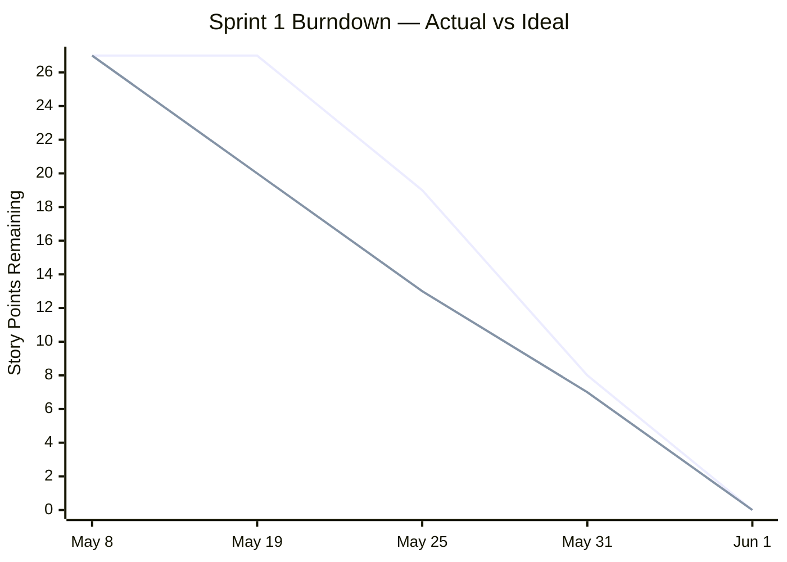

# Sprint 1 — Planning & Design

**Sprint period:** May 8 – May 28, 2026 (actual close: June 1, 2026)  
**Story points planned:** 27

---

## Sprint Goal

Define the full project scope, design the system architecture, and produce a database schema ready for implementation in Sprint 2.

---

## Sprint Backlog

| ID | Story | SP | Priority | Status |
|---|---|---|---|---|
| 1.1 | Analysis of Project Requirements & Scope | 3 | Must | ✅ Done |
| 1.2 | Sprint Planning & Backlog Refinement | 2 | Must | ✅ Done |
| 1.3 | Project Planning & Timeline | 3 | Must | ✅ Done |
| 1.4 | Architecture Design & Tech Stack Decision | 5 | Must | ✅ Done |
| 1.5 | System Design & Architecture Documentation | 5 | Must | ✅ Done |
| 1.6 | Database Schema Design (ERD) | 5 | Must | ✅ Done |
| 1.7 | Risk Analysis | 3 | Must | ✅ Done |
| 1.8 | Sprint 1 Review | 1 | Must | ✅ Done |

---

## Story Outcomes

The Dprint story outcomes are condensed in the below list, since most of the actual Sprint 1 content is within the previous 03 Project Overview section.

### 1.1 Analysis of Project Requirements & Scope
- ✅ Functional requirements listed
- ✅ Non-functional requirements listed
- ✅ Out-of-scope items noted
- ✅ Must-have vs nice-to-have features distinguished via MoSCoW

Full requirements documented in [3.1 Project Management](../../03_Project_overview/301_project_management.md).

### 1.2 Sprint Planning & Backlog Refinement
- ✅ All stories created in Jira with acceptance criteria
- ✅ All stories have story point estimates
- ✅ Stories assigned to the correct sprints
- ✅ Backlog prioritised
- ✅ Burndown chart baseline set in Jira

### 1.3 Project Planning & Timeline
- ✅ Gantt chart covers all 3 sprints with start and end dates
- ✅ Key milestones marked
- ✅ All stories have story point and hour estimates
- ✅ Total estimated hours calculated and compared against 50h project budget

### 1.4 Architecture Design & Tech Stack Decision
- ✅ At least 2 alternatives evaluated per major component
- ✅ Evaluation criteria defined and applied consistently
- ✅ Chosen solution justified per component with clear reasoning

Full decisions documented in [3.2 Architecture Design](../../03_Project_overview/302_architecture_design.md).

### 1.5 System Design & Architecture Documentation
- ✅ Architecture diagram created showing all components
- ✅ Data flow between components described
- ✅ All interfaces listed (Python service, PostgreSQL, pgvector, frontend)
- ✅ External dependencies listed with versions

### 1.6 Database Schema Design
- ✅ Data types, primary keys, foreign keys and constraints defined
- ✅ pgvector column placement decided and justified
- ✅ At least one trigger and stored procedure planned and noted in the schema
- ✅ ERD diagram plan

### 1.7 Risk Analysis
- ✅ 9 risks identified across technical, time and scope dimensions
- ✅ Each risk contains: description, probability, impact, mitigation measure
- ✅ Risk register to be revisited at each sprint review

### 1.8 Sprint 1 Review
- ✅ Completed stories reviewed against acceptance criteria
- ✅ Incomplete items documented with reason
- ✅ Risk register reviewed
- ✅ Retrospective
- ✅ Expert feedback received and recorded

---

## Burndown Chart

*Purple line: actual — Grey line: ideal*

---

## Retrospective

| 😊 What went well | 😟 What did not go well | 🚀 What to change |
|---|---|---|
| All 27 story points completed — no scope reduction needed | Sprint closed late due to an absence that overlapped the entire sprint period | Not planning a Sprint to start on the day I leave for holidays, and ending before I am back |
| Planning work was straightforward — architecture, schema and risk analysis required no major rework | Documentation structure was revised after expert feedback, which added unplanned work at the end of the sprint | Raise structural questions with the expert earlier into the sprint|
| Expert confirmed delay was acceptable — project continues as planned | | |