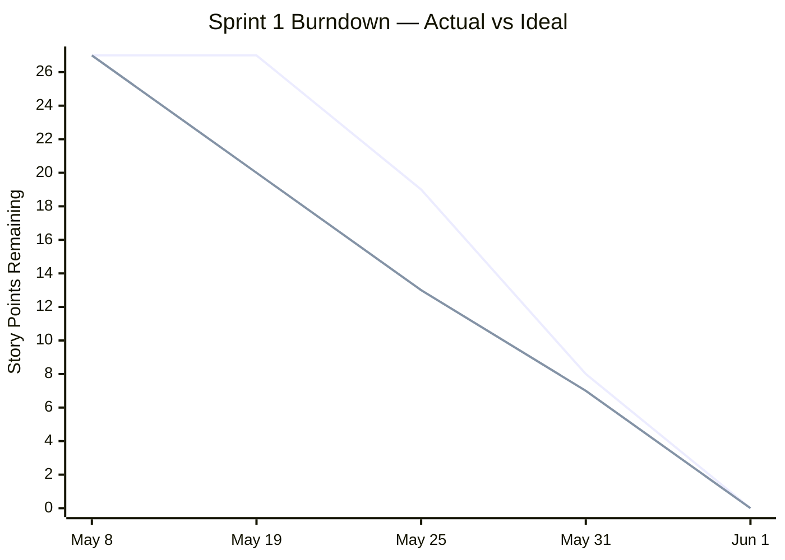

# Sprint 1 — Planning & Design

**Sprint period:** May 8 – May 28, 2026 (actual close: June 1, 2026)  
**Story points planned:** 27

---

## Sprint Goal

Define the full project scope, design the system architecture, and produce a database schema ready for implementation in Sprint 2.

---

## Sprint Backlog

| ID | Story | Sprint | Points | Priority |
|---|---|---|---|---|
| 1.1 | Analysis of Project Requirements & Scope | 1 | 3 | Must |
| 1.2 | Sprint Planning & Backlog Refinement | 1 | 2 | Must |
| 1.3 | Project Planning & Timeline | 1 | 3 | Must |
| 1.4 | Architecture Design & Tech Stack Decision | 1 | 5 | Must |
| 1.5 | System Design & Architecture Documentation | 1 | 5 | Must |
| 1.6 | Database Schema Design (ERD) | 1 | 5 | Must |
| 1.7 | Risk Analysis | 1 | 3 | Must |
| 1.8 | Sprint 1 Review | 1 | 1 | Must |

---

## Story Outcomes

Sprint 1 was entirely planning and design work. All outputs are documented in the Project Overview section rather than here. Each story below links to the relevant section.

### 1.1 Analysis of Project Requirements & Scope

Functional and non-functional requirements defined, out-of-scope items noted, and all stories prioritised with MoSCoW.

Full content: [3.1 Project Management — Functional Requirements](../../03_Project_overview/301_project_management.md#functional-requirements)

---

### 1.2 Sprint Planning & Backlog Refinement

All stories created in Jira with acceptance criteria, story point estimates, sprint assignments, and a burndown baseline set.

Full content: [3.1 Project Management — Product Backlog](../../03_Project_overview/301_project_management.md#product-backlog)

---

### 1.3 Project Planning & Timeline

Gantt chart produced covering all three sprints with start and end dates, key milestones, and hour estimates validated against the 50-hour project budget.

Full content: [3.3 Timeline](../../03_Project_overview/303_timeline.md)

---

### 1.4 Architecture Design & Tech Stack Decision

At least two alternatives evaluated per major component. Each decision is documented with criteria and justification.

Full content: [3.2 Architecture Design — Technology Decisions](../../03_Project_overview/302_architecture_design.md#technology-decisions)

---

### 1.5 System Design & Architecture Documentation

Architecture diagram produced showing all components, data flow, interfaces, and external dependencies.

Full content: [3.2 Architecture Design — System Design](../../03_Project_overview/302_architecture_design.md#system-design)

---

### 1.6 Database Schema Design (ERD)

Schema designed with data types, primary keys, foreign keys, and constraints defined. pgvector column placement decided and justified. ERD produced. At least one trigger and stored procedure planned.

Full content: [3.2 Architecture Design — Database Schema](../../03_Project_overview/302_architecture_design.md#database-schema)

---

### 1.7 Risk Analysis

Nine risks identified across technical, time, and scope dimensions. Each risk contains a description, probability, impact, and mitigation measure.

Full content: [3.1 Project Management — Risk Management](../../03_Project_overview/301_project_management.md#risk-management)

---

### 1.8 Sprint 1 Review

All stories reviewed against acceptance criteria. Risk register reviewed and retrospective completed.

**Points committed:** 27 / **Points completed:** 27

---

## Burndown Chart

*Purple line: actual — Grey line: ideal*

---

## Retrospective

### 😊 What went well

**All 27 story points delivered**

Every story committed at the start of the sprint was completed - no scope was cut. For a first sprint that covered all architecture decisions, schema design and risk analysis from scratch, finishing everything as planned, with documentation kept up to date, was a success for me. On previous projects, my documentation has always been a bit behind my actual progress, so feeling like I'm on track for once feels rewarding. None of the deliverables required major changes after the fact either, which means the planning was solid.

**Expert confirmed the project was on track**

Even though the sprint closed a few days late, the expert meeting confirmed that the delay was acceptable and the project could go on as planned. Receiving feedback and knowing that the foundation of the project (schema, architecture, risk register) was in good shape going into Sprint 2 removed a lot of the uncertainty I was feeling, and helped me stay motivated, even through a shorter Sprint 2.

---

### 😟 What did not go well

**Sprint closed late because of a holiday overlap**

The first sprint spilled a bit into the second, this is because I was on my long holiday of the year, and missed most of sprint 1, so from the day I was back I had to work non-stop on finishing pretty much 80% of the stories in just a few days, which, as expected, was not enough time. Having done some work during the trip meant the delay was limited to a few days, though the risk of it carrying into Sprint 2 remained.

**Documentation structure had to be revised after expert feedback**

During my first two semesters, I have always followed, more or less, the same type of documentation structure. During the expert meeting, it was made clear that the structure needed change, which was a little stressful a few days before the closure of it. This was unplanned and added pressure at an already tight point. This issue could have been avoided by having an earlier meeting, but sadly my absence during my trip made this impossible too.

---

### 🚀 What to change

**Do not plan a sprint around a holiday**

The simplest fix: do not start a sprint on the day of leaving and do not schedule the end before being back. The overlap was predictable and should have been accounted for in planning.

**Raise documentation structure questions with the expert early**

Getting feedback on structure at the end of a sprint leaves no time to act on it without disruption. Asking those questions in the first meeting of a sprint — when there is still room to adjust — avoids the last-minute rework entirely. Maybe I could have shown an example of my past work, or asked directly what they expect of the documentation before I started working on it.