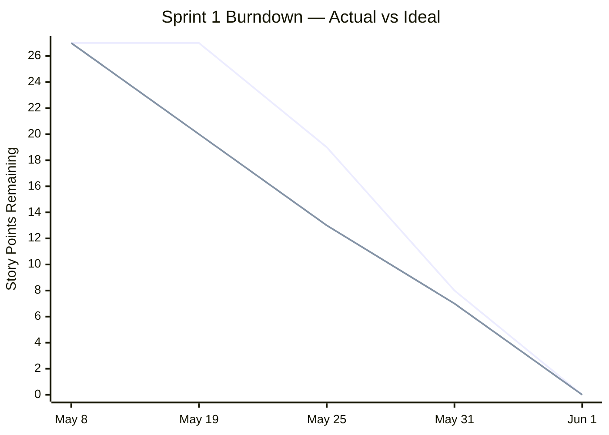

# Sprint 1 — Planning & Design

**Sprint period:** May 8 – May 28, 2026 (actual close: June 1, 2026)  
**Story points planned:** 27

---

## Sprint Goal

Define the full project scope, design the system architecture, and produce a database schema ready for implementation in Sprint 2.

---

## Sprint Backlog

| ID | Story | Sprint | SP | Priority |
|---|---|---|---|---|
| 1.1 | Analysis of Project Requirements & Scope | 1 | 3 | Must |
| 1.2 | Sprint Planning & Backlog Refinement | 1 | 2 | Must |
| 1.3 | Project Planning & Timeline | 1 | 3 | Must |
| 1.4 | Architecture Design & Tech Stack Decision | 1 | 5 | Must |
| 1.5 | System Design & Architecture Documentation | 1 | 5 | Must |
| 1.6 | Database Schema Design (ERD) | 1 | 5 | Must |
| 1.7 | Risk Analysis | 1 | 3 | Must |
| 1.8 | Sprint 1 Review | 1 | 1 | Must |

---

## Story Outcomes

Sprint 1 was entirely planning and design work. All outputs are documented in the Project Overview section rather than here. Each story below links to the relevant section.

### 1.1 Analysis of Project Requirements & Scope

Functional and non-functional requirements defined, out-of-scope items noted, and all stories prioritised with MoSCoW.

Full content: [3.1 Project Management — Functional Requirements](../../03_Project_overview/301_project_management.md#functional-requirements)

---

### 1.2 Sprint Planning & Backlog Refinement

All stories created in Jira with acceptance criteria, story point estimates, sprint assignments, and a burndown baseline set.

Full content: [3.1 Project Management — Product Backlog](../../03_Project_overview/301_project_management.md#product-backlog)

---

### 1.3 Project Planning & Timeline

Gantt chart produced covering all three sprints with start and end dates, key milestones, and hour estimates validated against the 50-hour project budget.

Full content: [3.3 Timeline](../../03_Project_overview/303_timeline.md)

---

### 1.4 Architecture Design & Tech Stack Decision

At least two alternatives evaluated per major component. Each decision is documented with criteria and justification.

Full content: [3.2 Architecture Design — Technology Decisions](../../03_Project_overview/302_architecture_design.md#technology-decisions)

---

### 1.5 System Design & Architecture Documentation

Architecture diagram produced showing all components, data flow, interfaces, and external dependencies.

Full content: [3.2 Architecture Design — System Design](../../03_Project_overview/302_architecture_design.md#system-design)

---

### 1.6 Database Schema Design (ERD)

Schema designed with data types, primary keys, foreign keys, and constraints defined. pgvector column placement decided and justified. ERD produced. At least one trigger and stored procedure planned.

Full content: [3.2 Architecture Design — Database Schema](../../03_Project_overview/302_architecture_design.md#database-schema)

---

### 1.7 Risk Analysis

Nine risks identified across technical, time, and scope dimensions. Each risk contains a description, probability, impact, and mitigation measure.

Full content: [3.1 Project Management — Risk Management](../../03_Project_overview/301_project_management.md#risk-management)

---

### 1.8 Sprint 1 Review

All stories reviewed against acceptance criteria. Risk register reviewed and retrospective completed.

**Points committed:** 27 / **Points completed:** 27

---

## Burndown Chart

*Purple line: actual — Grey line: ideal*

---

## Retrospective

| What went well | What did not go well | What to change |
|---|---|---|
| All 27 story points completed — no scope reduction needed | Sprint closed late due to an absence that overlapped the entire sprint period | Not planning a Sprint to start on the day I leave for holidays, and ending before I am back |
| Planning work was straightforward — architecture, schema and risk analysis required no major rework | Documentation structure was revised after expert feedback, which added unplanned work at the end of the sprint | Raise structural questions with the expert earlier into the sprint |
| Expert confirmed delay was acceptable — project continues as planned | | |