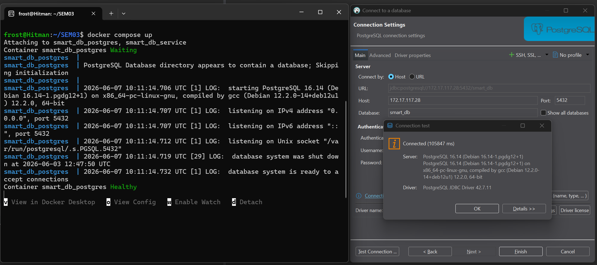
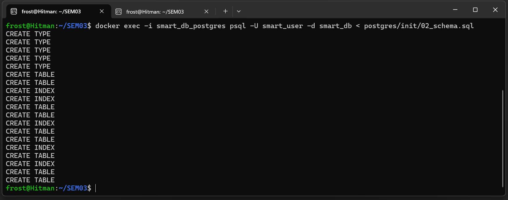
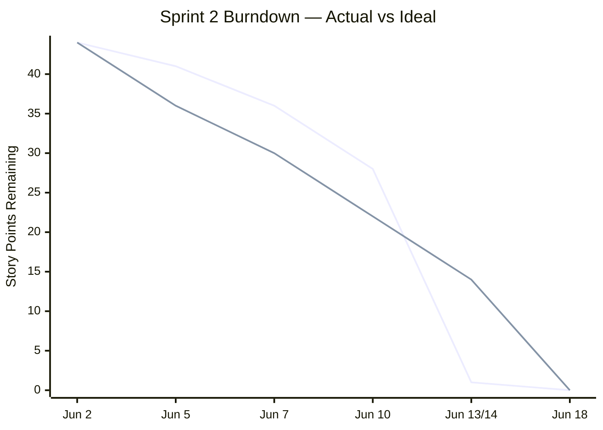

# Sprint 2 — Realization

Burndown Chart

## Sprint Planning

### Sprint Backlog

| 2.1 | Docker Compose Setup | 2 | 3 | Must |
| 2.2 | PostgreSQL Schema Implementation | 2 | 5 | Must |
| 2.3 | Database Abstractions (Triggers, SPs, Functions) | 2 | 13 | Must |
| 2.4 | 3NF Schema Documentation | 2 | 3 | Must |
| 2.5 | Semantic Search Implementation (pgvector) | 2 | 8 | Must |
| 2.6 | Python Service | 2 | 5 | Must |
| 2.7 | Views | 2 | 3 | Should |
| 2.8 | Simple Search Frontend | 2 | 3 | Should |
| 2.9 | Performance Benchmarking (Vector vs LIKE) | 2 | 5 | Should |
| 2.10 | Sprint 2 Review | 2 | 1 | Must |

---

## Story Outcomes


## 2.1 Docker Compose Setup
 
**Points:** 3 | **Status:** Complete
 
### Goal
 
Set up the full stack — PostgreSQL with pgvector and the Python service — in Docker Compose so the entire environment starts with a single command.
 
---
 
### Compose file
 
Two services are defined in `docker-compose.yml`, each running as a separate container:
 
- `smart_db_postgres` — the PostgreSQL database
- `smart_db_service` — the Python HTTP service
**`postgres`** — runs `pgvector/pgvector:pg16`, which includes the pgvector extension pre-installed. The `./postgres/init` directory is mounted into `/docker-entrypoint-initdb.d`, which PostgreSQL uses to automatically execute SQL files on first start. A named volume (`postgres_data`) ensures data persists across container restarts.
 
A healthcheck is configured:
```yaml
healthcheck:
  test: ["CMD-SHELL", "pg_isready -U smart_user -d smart_db"]
  interval: 10s
  timeout: 5s
  retries: 5
```
 
**`python-service`** — built from `./python-service/Dockerfile`. Uses `depends_on` with `condition: service_healthy`, so the Python service only starts once PostgreSQL has passed its healthcheck. This prevents connection errors on startup.
 
---
 
### Starting the stack
 
```bash
docker compose up
```
 

 
The terminal output confirms both containers started successfully and `smart_db_postgres` reached `Healthy` status before the Python service initialised.
 
The connection was verified in DBeaver against `host 172.17.117.28`, port `5432`, database `smart_db` — confirming PostgreSQL 16.14 was reachable from outside the container.
 
---
 
## 2.2 PostgreSQL Schema Implementation
 
**Points:** 5 | **Status:** Complete
 
### Goal
 
Apply the schema designed in Sprint 1 to the running PostgreSQL instance.
 
---
 
### Schema creation
 
The schema was applied by piping `02_schema.sql` into `psql` inside the running container:
 
```bash
docker exec -i smart_db_postgres psql -U smart_user -d smart_db < postgres/init/02_schema.sql
```
 

 
PostgreSQL confirmed creation of 5 ENUMs, 9 tables, and 5 indexes.
 
The schema design decisions — normalisation, constraints, and index choices — are documented in [2.4 3NF Schema Documentation](#24-3nf-schema-documentation).

---

## Story 2.3 — Database Abstractions: Triggers, Stored Procedures, Functions
 
**Points:** 13 | **Status:** Complete
 
### Goal
 
Implement business logic at the database level using triggers and stored procedures, so that critical operations are atomic, consistent, and cannot be bypassed by application code.
This section will also include test scenarios and their outcome based around these triggers and  stored procedures.
 
The expert's requirement: for each abstraction, document the scenario, the mechanism chosen, and the justification.
 
---
 
### Umbrella term: Datenbankabstraktionen
 
The following abstractions were implemented. Each is categorised as either a **Trigger** or a **Stored Procedure**.

**Triggers** fire automatically in response to a database event (INSERT, UPDATE, DELETE). They cannot be called explicitly and cannot be bypassed by application code. Used when the logic must always execute as a side effect of a data change.

**Stored Procedures** are called explicitly by the application. They contain multi-step business logic and have full transaction control. Used when an operation spans multiple tables and must be atomic.

---
 
### Triggers
 
#### Trigger 1 — Price History Logging
 
**Scenario:** When a shop employee updates the price of an inventory entry, the change must be recorded automatically. Without this, there is no audit trail and price history is lost.
 
**Mechanism:** `AFTER UPDATE` trigger on `inventory`, scoped to the `price` column. A `WHEN` guard (`OLD.price IS DISTINCT FROM NEW.price`) ensures the trigger only fires on actual price changes, not on unrelated row updates.
 
**Why a trigger:** Must fire on every price change regardless of what caused it — a trigger cannot be bypassed by application code.

**Design note — `old_price` removed:** `price_history` originally also stored `old_price` alongside `new_price`. Expert feedback identified this as a 3NF violation: `old_price` is a transitive dependency, fully derivable as `LAG(new_price)` over the previous row for the same `inventory_id` — every row's `old_price` is just a copy of the prior row's `new_price`. The column was removed from the schema and from this trigger; the price history itself is unaffected, since the full sequence of changes is still recoverable from `new_price` and `changed_at` alone. See [2.4 3NF Schema Documentation](#24-3nf-schema-documentation) for the full justification.
 
```sql
CREATE OR REPLACE FUNCTION fn_log_price_change()
RETURNS TRIGGER AS $$
BEGIN
    INSERT INTO price_history (inventory_id, new_price)
    VALUES (OLD.id, NEW.price);
    RETURN NEW;
END;
$$ LANGUAGE plpgsql;
 
CREATE TRIGGER trg_log_price_change
AFTER UPDATE OF price ON inventory
FOR EACH ROW
WHEN (OLD.price IS DISTINCT FROM NEW.price)
EXECUTE FUNCTION fn_log_price_change();
```
 
---
 
#### Trigger 2 — Order Status Sync on Payment Confirmation
 
**Scenario:** When a payment is marked as `completed`, the associated order should automatically transition from `pending` to `confirmed`. Requiring two separate updates from the application creates a window where order and payment state can be inconsistent.
 
**Mechanism:** `AFTER UPDATE` trigger on `payments`, scoped to the `status` column. The function checks for the specific `pending → completed` transition before acting, so re-confirming an already-completed payment has no effect.
 
**Why a trigger:** Order status must reflect payment status automatically — a trigger guarantees this regardless of which code path updates the payment.
 
```sql
CREATE OR REPLACE FUNCTION fn_sync_order_on_payment()
RETURNS TRIGGER AS $$
BEGIN
    IF NEW.status = 'completed' AND OLD.status IS DISTINCT FROM 'completed' THEN
        UPDATE orders
        SET status     = 'confirmed',
            updated_at = NOW()
        WHERE id = NEW.order_id
          AND status = 'pending';
    END IF;
    RETURN NEW;
END;
$$ LANGUAGE plpgsql;
 
CREATE TRIGGER trg_sync_order_on_payment
AFTER UPDATE OF status ON payments
FOR EACH ROW
EXECUTE FUNCTION fn_sync_order_on_payment();
```
 
---
 
#### Trigger 3 — Auto-update `updated_at`
 
**Scenario:** `updated_at` must always reflect the true last-modification time of a row. Relying on application code to set this is unreliable — any direct SQL update would bypass it.
 
**Mechanism:** `BEFORE UPDATE` trigger on `inventory`, `orders`, and `customers`. A single shared function `fn_set_updated_at` is registered on all three tables. Uses `clock_timestamp()` rather than `NOW()` — `NOW()` returns transaction start time and does not advance within a transaction, which caused test failures during development.
 
**Why a trigger:** Must fire on every update to all three tables — a trigger guarantees this without relying on application code.
 
```sql
CREATE OR REPLACE FUNCTION fn_set_updated_at()
RETURNS TRIGGER AS $$
BEGIN
    NEW.updated_at = clock_timestamp();
    RETURN NEW;
END;
$$ LANGUAGE plpgsql;
 
CREATE TRIGGER trg_updated_at_inventory
BEFORE UPDATE ON inventory FOR EACH ROW
EXECUTE FUNCTION fn_set_updated_at();
 
CREATE TRIGGER trg_updated_at_orders
BEFORE UPDATE ON orders FOR EACH ROW
EXECUTE FUNCTION fn_set_updated_at();
 
CREATE TRIGGER trg_updated_at_customers
BEFORE UPDATE ON customers FOR EACH ROW
EXECUTE FUNCTION fn_set_updated_at();
```
 
---
 
### Stored Procedures
 
#### SP 1 — `process_purchase`
 
**Scenario:** A customer buys a card. This spans six tables: `inventory`, `orders`, `order_items`, `payments`, `deliveries`, and requires the `customers` record. All steps must succeed together or none at all — a partial write leaves the database in an inconsistent state.
 
**Mechanism:** Stored procedure with full transaction control. Stock is checked and locked with `SELECT FOR UPDATE` before deduction. This prevents a race condition where two concurrent purchases could both read the same available quantity and both succeed when only enough stock exists for one.
 
**Why a stored procedure:** Multi-step operation spanning six tables, called explicitly by the application. Returns the created `order_id` to the caller via an OUT parameter.
 
**Key design decision:** `unit_price` in `order_items` is a snapshot of the price at time of purchase. If `inventory.price` changes later, historical orders retain the original price.
 
```sql
CREATE OR REPLACE PROCEDURE process_purchase(
    p_customer_id    INT,
    p_inventory_id   INT,
    p_quantity       INT,
    p_payment_method payment_method,
    OUT p_order_id   INT
)
LANGUAGE plpgsql AS $$
DECLARE
    v_available   INT;
    v_price       NUMERIC(10, 2);
    v_card_id     INT;
    v_ship_addr   TEXT;
BEGIN
    SELECT quantity, price, card_id
    INTO v_available, v_price, v_card_id
    FROM inventory
    WHERE id = p_inventory_id
    FOR UPDATE;
 
    IF NOT FOUND THEN
        RAISE EXCEPTION 'Inventory entry % does not exist', p_inventory_id;
    END IF;
 
    IF v_available < p_quantity THEN
        RAISE EXCEPTION 'Insufficient stock: requested %, available %', p_quantity, v_available;
    END IF;
 
    SELECT shipping_address INTO v_ship_addr
    FROM customers WHERE id = p_customer_id;
 
    IF NOT FOUND THEN
        RAISE EXCEPTION 'Customer % does not exist', p_customer_id;
    END IF;
 
    UPDATE inventory SET quantity = quantity - p_quantity WHERE id = p_inventory_id;
 
    INSERT INTO orders (customer_id, status)
    VALUES (p_customer_id, 'pending')
    RETURNING id INTO p_order_id;
 
    INSERT INTO order_items (order_id, card_id, quantity, unit_price)
    VALUES (p_order_id, v_card_id, p_quantity, v_price);
 
    INSERT INTO payments (order_id, amount, method, status)
    VALUES (p_order_id, v_price * p_quantity, p_payment_method, 'pending');
 
    INSERT INTO deliveries (order_id, address, status, estimated_date)
    VALUES (p_order_id, COALESCE(v_ship_addr, ''), 'pending', CURRENT_DATE + INTERVAL '5 days');
 
EXCEPTION
    WHEN OTHERS THEN RAISE;
END;
$$;
```
 
---
 
#### SP 2 — `cancel_order`
 
**Scenario:** A customer or employee cancels an order that is still `pending` or `confirmed`. Inventory must be restored and payment and delivery statuses updated consistently.
 
**Mechanism:** Stored procedure. Guards against invalid cancellations (shipped or delivered orders cannot be cancelled through this path — that requires a returns flow). Restores inventory per order item.
 
**Why a stored procedure:** Cancellation is an explicit action with conditional logic — it must be called intentionally, not fire automatically on every status change.

**Known limitation:** The inventory restore targets the first matching `card_id` row rather than the exact original `card_id + condition` combination. If the original inventory entry was deleted after the purchase, stock is still restored but to a different condition entry. This is acceptable for a shop prototype but would require tracking `inventory_id` in `order_items` in a production system.
 
```sql
CREATE OR REPLACE PROCEDURE cancel_order(p_order_id INT)
LANGUAGE plpgsql AS $$
DECLARE
    v_status order_status;
    v_item   RECORD;
    v_inv_id INT;
BEGIN
    SELECT status INTO v_status FROM orders
    WHERE id = p_order_id FOR UPDATE;
 
    IF NOT FOUND THEN
        RAISE EXCEPTION 'Order % does not exist', p_order_id;
    END IF;
 
    IF v_status NOT IN ('pending', 'confirmed') THEN
        RAISE EXCEPTION 'Cannot cancel order % with status %', p_order_id, v_status;
    END IF;
 
    FOR v_item IN
        SELECT card_id, quantity FROM order_items WHERE order_id = p_order_id
    LOOP
        SELECT id INTO v_inv_id FROM inventory WHERE card_id = v_item.card_id LIMIT 1;
        IF FOUND THEN
            UPDATE inventory SET quantity = quantity + v_item.quantity WHERE id = v_inv_id;
        END IF;
    END LOOP;
 
    UPDATE orders  SET status = 'cancelled' WHERE id = p_order_id;
    UPDATE payments SET status = 'refunded'  WHERE order_id = p_order_id AND status IN ('pending', 'completed');
    UPDATE deliveries SET status = 'returned' WHERE order_id = p_order_id AND status = 'pending';
 
EXCEPTION
    WHEN OTHERS THEN RAISE;
END;
$$;
```
 
---
 
#### SP 3 — `restock_inventory`
 
**Scenario:** New stock arrives for a card. If an entry already exists for that `card_id + condition` pair, quantity is incremented. If not, a new entry is created. Without this logic, a restock could create duplicate rows for the same card and condition.
 
**Mechanism:** Stored procedure. Checks for an existing entry first. The `p_update_price` parameter controls whether the price is overwritten — a routine restock does not change the price unless explicitly requested.
 
**Why a stored procedure:** Restock requires conditional logic (insert vs. update) that belongs in the database, not the application layer.

**Interaction with Trigger 1:** When `p_update_price = TRUE`, the price update on the existing row fires `trg_log_price_change` automatically. No additional code needed.
 
```sql
CREATE OR REPLACE PROCEDURE restock_inventory(
    p_card_id      INT,
    p_condition    card_condition,
    p_quantity     INT,
    p_price        NUMERIC(10, 2),
    p_update_price BOOLEAN DEFAULT FALSE
)
LANGUAGE plpgsql AS $$
DECLARE
    v_existing_id INT;
BEGIN
    IF p_quantity <= 0 THEN
        RAISE EXCEPTION 'Restock quantity must be greater than 0';
    END IF;
 
    SELECT id INTO v_existing_id
    FROM inventory WHERE card_id = p_card_id AND condition = p_condition;
 
    IF FOUND THEN
        IF p_update_price THEN
            UPDATE inventory SET quantity = quantity + p_quantity, price = p_price
            WHERE id = v_existing_id;
        ELSE
            UPDATE inventory SET quantity = quantity + p_quantity WHERE id = v_existing_id;
        END IF;
    ELSE
        INSERT INTO inventory (card_id, condition, quantity, price)
        VALUES (p_card_id, p_condition, p_quantity, p_price);
    END IF;
END;
$$;
```
 
---
 
#### SP 4 — `bulk_price_update`
 
**Scenario:** Market prices change and the shop needs to update multiple inventory entries at once. Running individual UPDATE statements would be error-prone and verbose.
 
**Mechanism:** Stored procedure accepting an array of `price_update_input` composite type `(inventory_id, new_price)`. Iterates and updates each entry. The `IS DISTINCT FROM` guard in `trg_log_price_change` means only actual price changes are logged — passing the same price as before produces no `price_history` row.
 
**Why a stored procedure:** Batch update called explicitly by the application — validation and audit logging are enforced in one place.

```sql
CREATE TYPE price_update_input AS (
    inventory_id INT,
    new_price    NUMERIC(10, 2)
);
 
CREATE OR REPLACE PROCEDURE bulk_price_update(p_updates price_update_input[])
LANGUAGE plpgsql AS $$
DECLARE
    v_entry price_update_input;
BEGIN
    FOREACH v_entry IN ARRAY p_updates LOOP
        IF v_entry.new_price <= 0 THEN
            RAISE EXCEPTION 'Price must be greater than 0 for inventory_id %', v_entry.inventory_id;
        END IF;
        UPDATE inventory SET price = v_entry.new_price WHERE id = v_entry.inventory_id;
        IF NOT FOUND THEN
            RAISE EXCEPTION 'Inventory entry % does not exist', v_entry.inventory_id;
        END IF;
    END LOOP;
END;
$$;
```
 
---
 
### Tests
 
All tests are in `06_tests.sql`. The entire file runs inside a `BEGIN / ROLLBACK` block — no test data is persisted to the database.
 
Test data is isolated using a dedicated card (`id=9999`, name `Testmon`), a dedicated customer (`id=9999`, to avoid colliding with real seed customer data), and temporary tables `test_ctx` / `test_ctx2` that capture two separate inventory entries (`mint` and `near_mint`) for that card at runtime. This avoids conflicts with real seed data.
 
---
 
#### TEST 1 — `trg_updated_at` fires on inventory UPDATE
 
**Abstraction under test:** `trg_updated_at_inventory` / `fn_set_updated_at`
 
**Setup:** Read `updated_at` before update. Sleep 0.1s to ensure clock_timestamp() advances between the two reads.
 
**Action:** `UPDATE inventory SET quantity = quantity + 0` — a no-op update that still fires the trigger.
 
**Assertion:** `updated_at` after > `updated_at` before.
 
**Note:** `clock_timestamp()` is used in the trigger instead of `NOW()`. `NOW()` returns transaction start time and does not advance within a transaction, which caused this test to fail during development.
 
**Result:** `PASSED` — `updated_at` advanced from `09:48:09.829` to `09:48:09.933`
 
---
 
#### TEST 2 — `trg_log_price_change` logs a price change
 
**Abstraction under test:** `trg_log_price_change` / `fn_log_price_change`
 
**Setup:** Read current price of test inventory entry. Two price changes are made in sequence (45.00, then 59.99) so the second change has a genuine predecessor row to compare against.
 
**Action:** `UPDATE inventory SET price = 45.00`, then `UPDATE inventory SET price = 59.99`
 
**Assertion:** Exactly 1 row in `price_history` with `new_price = 59.99`. Since `old_price` is no longer stored (see Trigger 1 design note above), the previous price is instead confirmed via `LAG(new_price) OVER (PARTITION BY inventory_id ORDER BY changed_at)`, which must equal 45.00 — proving the full price history remains recoverable without the redundant column.
 
**Result:** `PASSED` — price change logged correctly (45.00 → 59.99), derived previous price matched
 
---
 
#### TEST 3 — `trg_log_price_change` does NOT fire on non-price update
 
**Abstraction under test:** `trg_log_price_change` WHEN guard (`OLD.price IS DISTINCT FROM NEW.price`)
 
**Setup:** Count existing `price_history` rows for test entry.
 
**Action:** `UPDATE inventory SET quantity = 10` — price column not touched.
 
**Assertion:** `price_history` count is unchanged.
 
**Result:** `PASSED` — no spurious audit row created
 
---
 
#### TEST 4 — `trg_sync_order_on_payment` confirms order on payment completion
 
**Abstraction under test:** `trg_sync_order_on_payment` / `fn_sync_order_on_payment`
 
**Setup:** Insert a `pending` order and a `pending` payment for test customer.
 
**Action:** `UPDATE payments SET status = 'completed'`
 
**Assertion:** `orders.status` = `confirmed`.
 
**Result:** `PASSED` — order confirmed automatically after payment update
 
---
 
#### TEST 5 — `process_purchase` happy path
 
**Abstraction under test:** `process_purchase` stored procedure
 
**Setup:** Reset test inventory to `quantity = 10`.
 
**Action:** `CALL process_purchase(customer_id=9999, inventory_id=<test>, quantity=2, method='credit_card')`
 
**Assertions:**
- `inventory.quantity` = 8 (reduced by 2)
- 1 row in `order_items` for the new order
- 1 row in `payments` for the new order
- 1 row in `deliveries` for the new order
**Result:** `PASSED` — inventory reduced, all related records created
 
---
 
#### TEST 6 — `process_purchase` rejects purchase when stock is insufficient
 
**Abstraction under test:** Stock check and `SELECT FOR UPDATE` in `process_purchase`
 
**Setup:** Set test inventory `quantity = 1`.
 
**Action:** `CALL process_purchase(quantity=5)` — requests more than available.
 
**Assertion:** Exception is raised. `inventory.quantity` remains unchanged at 1.
 
**Result:** `PASSED` — exception raised, inventory unchanged at 1
 
---
 
#### TEST 7 — `cancel_order` reverses a purchase
 
**Abstraction under test:** `cancel_order` stored procedure
 
**Setup:** Reset test inventory to `quantity = 10`. Call `process_purchase` with `quantity=2` to create a real order.
 
**Action:** `CALL cancel_order(<order_id>)`
 
**Assertions:**
- `inventory.quantity` restored to 10
- `orders.status` = `cancelled`
- `payments.status` = `refunded`
**Result:** `PASSED` — order cancelled, stock restored, payment refunded
 
---
 
#### TEST 8 — `restock_inventory` increments existing entry without creating duplicates
 
**Abstraction under test:** `restock_inventory` stored procedure
 
**Setup:** Read current quantity of test card (`card_id=9999`, `condition=mint`).
 
**Action:** `CALL restock_inventory(card_id=9999, condition='mint', quantity=5, update_price=FALSE)`
 
**Assertions:**
- `quantity` = previous quantity + 5
- Exactly 1 row exists for `card_id=9999 AND condition='mint'` (no duplicate created)
**Result:** `PASSED` — quantity 10 → 15, no duplicate row
 
---
 
#### TEST 9 — `bulk_price_update` updates prices for multiple inventory entries in one call

**Abstraction under test:** `bulk_price_update` stored procedure + `trg_log_price_change` interaction

**Setup:** Two distinct test inventory entries (`mint` and `near_mint` rows on the same test card) are reset to known prices. Existing `price_history` rows for both are cleared.

**Action:** A single call passing both entries at once: `CALL bulk_price_update(ARRAY[(inv_id_1, 75.00), (inv_id_2, 55.00)])`

**Assertions:**
- `inventory.price` = 75.00 and 55.00 respectively
- Exactly 1 `price_history` row per entry (trigger fired once per row, automatically, inside the loop)

**Result:** `PASSED` — both entries updated and logged correctly. This replaces an earlier version of the test that only passed a single entry, which did not actually exercise the "bulk" (multi-row) behaviour the procedure is named for.

---

#### TEST 10 — `bulk_price_update` rolls back entirely when one entry in the batch is invalid

**Abstraction under test:** Atomicity of `bulk_price_update` across multiple entries in a single call

**Setup:** Same two test inventory entries, reset to known prices.

**Action:** A single call with one valid entry and one invalid entry (`new_price = -5.00`, rejected by the procedure's own validation): `CALL bulk_price_update(ARRAY[(inv_id_1, 99.00), (inv_id_2, -5.00)])`

**Assertion:** An exception is raised, and **neither** row is updated — including the first entry, whose `UPDATE` had already executed successfully before the second entry failed. This confirms the entire call is one atomic unit: a failure partway through the array undoes everything in that call, not just the failing row.

**Result:** `PASSED` — invalid entry rejected, both rows unchanged
 
---
 
#### Coverage summary
 
| # | Abstraction | Type | Result |
|---|---|---|---|
| 1 | `trg_updated_at` | Trigger | PASSED |
| 2 | `trg_log_price_change` — fires on change | Trigger | PASSED |
| 3 | `trg_log_price_change` — does not fire without change | Trigger (WHEN guard) | PASSED |
| 4 | `trg_sync_order_on_payment` | Trigger | PASSED |
| 5 | `process_purchase` — success path | Stored Procedure | PASSED |
| 6 | `process_purchase` — out of stock rejection | Stored Procedure | PASSED |
| 7 | `cancel_order` | Stored Procedure | PASSED |
| 8 | `restock_inventory` | Stored Procedure | PASSED |
| 9 | `bulk_price_update` — multiple entries in one call | Stored Procedure | PASSED |
| 10 | `bulk_price_update` — rollback on invalid entry | Stored Procedure | PASSED |
 
**Known untested edge cases:** cancelling a shipped order, purchasing from a non-existent customer, `restock_inventory` creating a brand-new entry (vs. incrementing an existing one). These would be covered in a production test suite but are out of scope for this prototype.
 
---
 
### Reflection
 
PL/pgSQL was new to me going into this story. Thanks to online guides and AI tools at my dispossal, I only really came across a few issues during testing, which I was able to fix without a major loss in project time. Yves was also able to give me some important feedback before the end of the sprint, which I made sure to implement.
 
---
 
#### Problem — `NOW()` does not advance within a transaction
 
**Failure output:**
```
WARNING:  TEST 1 FAILED: updated_at did not change
```
 
**Cause:** `fn_set_updated_at` used `NOW()`, which returns the timestamp at transaction start and stays frozen for the entire transaction. The before and after reads returned the same value even after the update.
 
**Fix:** Changed `fn_set_updated_at` to use `clock_timestamp()`, which returns real wall time and advances even within a transaction.
 
```sql
-- Before (broken)
NEW.updated_at = NOW();
 
-- After (fixed)
NEW.updated_at = clock_timestamp();
```

---

#### Design change — removal of `price_history.old_price`

During an expert review, `old_price` in `price_history` was flagged as a 3NF violation: it is a transitive dependency, fully derivable as the previous row's `new_price` for the same `inventory_id`. Storing it duplicates information already present in the table.

The column was removed from `02_schema.sql`, the `INSERT` in `fn_log_price_change` (Trigger 1, above), and `06_tests.sql`. TEST 2 was rewritten to confirm the previous price is still recoverable via a `LAG()` window function rather than reading a stored column — demonstrating that no information was lost, only the redundant copy of it.

This is the same type of justified 3NF exception as `orders.total` (see [2.4 3NF Schema Documentation](#24-3nf-schema-documentation)), except in this case the redundant column was removed rather than kept, since nothing in the application or views depended on it being directly readable.
 
---
 
#### Design limitation — `cancel_order` inventory restore
 
`cancel_order` restores stock to the first matching inventory entry for that card, not necessarily the exact one originally purchased. This happens because `order_items` does not store `inventory_id`. A known limitation — fixing it mid-sprint would have required a schema change.
 
---
 
#### `SELECT FOR UPDATE` in `process_purchase`
 
When two purchases happen at the exact same time, both read the database simultaneously. Without the lock, both see `quantity = 1`, both think there's enough stock, and both go through — ending at `quantity = -1`.
 
`SELECT FOR UPDATE` makes the second purchase wait until the first one is done. By then the quantity is already 0, so it gets rejected cleanly.

---

## 2.4 3NF Schema Documentation

**Points:** 3 | **Status:** Complete

### Goal

Demonstrate that the Smart DB schema satisfies Third Normal Form (3NF) by documenting functional dependencies per table and justifying any design decisions that affect normalisation.

---

### Normalisation recap

**3NF rule:** Every non-key column must depend only on the primary key — not on another non-key column.

**2NF** is automatically satisfied because all tables use a single `id` as primary key. There are no composite keys, so no partial dependencies can exist.

---

### Table-by-table analysis

#### `sets`

| Column | Depends on |
|---|---|
| name | id |
| release_date | id |

**3NF satisfied.**

---

#### `cards`

| Column | Depends on |
|---|---|
| name | id |
| number | id |
| rarity | id |
| set_id | id |
| vector | id |

`set_id` is a foreign key reference, not a transitive dependency. `vector` is an embedding generated from name and rarity at insert time; once stored it depends on `id` and does not create a dependency between other columns. **3NF satisfied.**

---

#### `customers`

| Column | Depends on |
|---|---|
| name | id |
| email | id |
| address | id |
| shipping_address | id |
| created_at | id |
| updated_at | id |

`address` and `shipping_address` are independent columns, both describing the customer directly. Neither depends on the other. **3NF satisfied.**

---

#### `inventory`

| Column | Depends on |
|---|---|
| card_id | id |
| condition | id |
| quantity | id |
| price | id |
| created_at | id |
| updated_at | id |

`price` is set per inventory entry and does not depend on `condition`. `quantity` does not depend on `price`. **3NF satisfied.**

---

#### `price_history`

| Column | Depends on |
|---|---|
| inventory_id | id |
| new_price | id |
| changed_at | id |

Point-in-time snapshot. `new_price` is recorded at the moment of change.

---

#### `orders`

| Column | Depends on |
|---|---|
| customer_id | id |
| status | id |
| created_at | id |
| updated_at | id |

No derived or calculated columns. A `total` column was considered during design but removed because it could be derived by summing `order_items.quantity * unit_price`, which would violate 3NF. Order total is computed from `order_items` via the `order_summary` view. **3NF satisfied.**

---

#### `order_items`

| Column | Depends on |
|---|---|
| order_id | id |
| card_id | id |
| quantity | id |
| unit_price | id |

`unit_price` is a price snapshot at time of purchase, not a reference to `inventory.price`. This is intentional: inventory prices change over time, but the price a customer paid must not change retroactively. It depends directly on the row, not transitively on any other column. **3NF satisfied.**

---

#### `deliveries`

| Column | Depends on |
|---|---|
| order_id | id |
| address | id |
| status | id |
| estimated_date | id |

`address` is a snapshot of `customers.shipping_address` copied at order time. It is stored on the delivery row so that later changes to the customer profile do not affect historical records. **3NF satisfied.**

---

#### `payments`

| Column | Depends on |
|---|---|
| order_id | id |
| amount | id |
| method | id |
| status | id |

`amount` does not depend on `method`. `status` does not depend on `amount`.

`amount` is, in the current data, equal to the order total derivable from `order_items` — the same relationship that was removed from `orders.total`. It is kept here as an independent stored fact rather than a derived value, since a payment amount can differ from the order total (partial payments, discounts, surcharges), even though no such case exists in the current seed data. **3NF satisfied** under this reading; flagged here for transparency.

---

### Summary

| Table | 3NF | Notes |
|---|---|---|
| sets | ✓ | — |
| cards | ✓ | vector stored at insert, not a transitive dependency |
| customers | ✓ | — |
| inventory | ✓ | — |
| price_history | ✓ | old_price removed (transitive dependency); recoverable via LAG() |
| orders | ✓ | total removed; computed via order_summary view |
| order_items | ✓ | unit_price is a snapshot, not a derived value |
| deliveries | ✓ | address is a snapshot, not a reference |
| payments | ✓ | amount kept as independent fact, justified as payments may diverge from order total |

All tables satisfy 3NF.

---

## 2.5 Semantic Search Implementation (pgvector)

**Points:** 8 | **Status:** Complete

### Goal

Implement semantic search over the card catalogue using pgvector, so that users can find cards by approximate or misspelled names — something LIKE search cannot handle. Compare both approaches with real query results.

---

### How it works

Each card is represented as a text string combining its name, rarity, and set name:

```
"Mega Charizard X ex Ultra Rare Phantasmal Flames"
```

This string is converted to a 384-dimension vector using the `all-MiniLM-L6-v2` model from `sentence-transformers`. The vector is stored in `cards.vector`. At search time, the query is embedded using the same model and pgvector finds the nearest neighbours by L2 distance.

**Why this text combination:** name and rarity are the attributes a user would search by. Set name adds context that helps distinguish cards with the same name across sets. No manual description is needed — the data already has everything required.

**Model choice — `all-MiniLM-L6-v2`:** Produces 384-dimension vectors, matching the `VECTOR(384)` column in the schema. Lightweight, loads in seconds, and runs fully locally inside Docker with no external API calls. A larger model like `all-mpnet-base-v2` produces 768-dimension vectors and would be more accurate, but requires a schema change, uses more memory, and is slower at query time. For 242 short card name strings the accuracy difference does not outweight the resources it requires.

---

### Implementation

**Embedding generation — `import_cards.py`**

Reads `sets.csv` and `cards.csv`, generates one embedding per card, and inserts all records with their vectors in a single pass. Run once after `docker compose up`:

```bash
docker exec smart_db_service python import_cards.py
```

**Vector search — `/search`**

```python
embedding = MODEL.encode(query).tolist()
cur.execute("""
    SELECT c.id, c.name, c.rarity, s.name AS set_name,
           c.vector <-> %s::vector AS distance
    FROM cards c
    JOIN sets s ON c.set_id = s.id
    ORDER BY distance
    LIMIT 10
""", (embedding,))
```

The `<->` operator is pgvector's L2 distance. Lower distance = more similar.

**LIKE search — `/search/like`**

```sql
WHERE c.name ILIKE %s OR c.rarity ILIKE %s OR s.name ILIKE %s
```

Case-insensitive substring match across name, rarity, and set name. Fast, but requires the exact characters to be present.

---

### Comparison: vector search vs LIKE

Test query: `charizard` (clean) and `charirzard` (typo — extra `r`).

#### Clean query — `charizard`

**Vector search (`/search?q=charizard`)**

| # | Name | Rarity | Set | Distance |
|---|---|---|---|---|
| 1 | Mega Charizard Y ex | Mega Hyper Rare | Ascended Heroes | 0.9802 |
| 2 | Mega Charizard X ex | Mega Hyper Rare | Phantasmal Flames | 0.9965 |
| 3 | Mega Charizard X ex | Ultra Rare | Phantasmal Flames | 1.0112 |
| 4 | Mega Charizard X ex | Special Illustration Rare | Phantasmal Flames | 1.0383 |
| 5 | Mega Dragonite ex | Mega Hyper Rare | Ascended Heroes | 1.1437 |

**LIKE search (`/search/like?q=charizard`)**

| # | Name | Rarity | Set |
|---|---|---|---|
| 1 | Mega Charizard X ex | Ultra Rare | Phantasmal Flames |
| 2 | Mega Charizard X ex | Special Illustration Rare | Phantasmal Flames |
| 3 | Mega Charizard X ex | Mega Hyper Rare | Phantasmal Flames |
| 4 | Mega Charizard Y ex | Mega Hyper Rare | Ascended Heroes |

Both return the 4 Charizard cards. LIKE returns exactly those 4. Vector returns the same 4 plus 6 loosely related cards ranked by distance.

---

#### Typo query — `charirzard`

**Vector search (`/search?q=charirzard`)**

| # | Name | Rarity | Set | Distance |
|---|---|---|---|---|
| 1 | Mega Charizard Y ex | Mega Hyper Rare | Ascended Heroes | 1.1110 |
| 2 | Mega Charizard X ex | Mega Hyper Rare | Phantasmal Flames | 1.1445 |
| 3 | Mega Charizard X ex | Ultra Rare | Phantasmal Flames | 1.1451 |
| 4 | Psyduck | Illustration Rare | Ascended Heroes | 1.1577 |
| 5 | Mega Charizard X ex | Special Illustration Rare | Phantasmal Flames | 1.1581 |

**LIKE search (`/search/like?q=charirzard`)** — no results.

Vector search still surfaces all 3 Charizard X ex variants and Mega Charizard Y ex within the top 5 results despite the typo. LIKE returns nothing.

---

### Results summary

| | Clean query | Typo query |
|---|---|---|
| Vector search | ✓ Correct results, distances 0.98–1.04 | ✓ Charizards in top 5, distances 1.11–1.16 |
| LIKE search | ✓ Exact matches only | ✗ No results |

**Conclusion:** For clean queries both approaches return the same relevant cards. The difference is typo tolerance — LIKE fails completely on `charirzard`, vector search recovers the correct cards. The trade-off is precision; vector search is configured to always returns 10 results ranked by distance, including noise, while LIKE returns only exact matches. For a card shop where users are likely mistype names, vector search provides meaningful resilience that LIKE cannot.

The distances on the typo query (1.11–1.18) are higher than the clean query (0.98–1.04), showing that the model has lower confidence on the result.

---

## 2.6 Python Service

**Points:** 5 | **Status:** Complete

### Goal

Build a minimal Python service that connects to PostgreSQL, calls stored procedures programmatically, and exposes semantic search — all running inside Docker Compose alongside the database.

---

### Design

The service is intentionally minimal. The database contains all business logic — the service only connects to it and exposes endpoints. No framework was used; Python's built-in `http.server` is sufficient for the scope.

| Endpoint | Method | Purpose |
|---|---|---|
| `/` | GET | Serves the search frontend |
| `/health` | GET | Confirms database connectivity |
| `/search` | GET | Semantic search via pgvector |
| `/search/like` | GET | LIKE search for comparison |
| `/purchase` | POST | Calls `process_purchase` stored procedure |

---

### Stored procedure call — `/purchase`

The purchase endpoint accepts a JSON body and calls `process_purchase` directly. All business logic — stock check, inventory deduction, order creation, payment, delivery — runs inside the stored procedure. The service passes parameters and returns the created `order_id`.

```python
cur.execute(
    "CALL process_purchase(%s, %s, %s, %s::payment_method, NULL)",
    (customer_id, inventory_id, quantity, payment_method),
)
order_id = cur.fetchone()[0]
conn.commit()
```

**Example request:**
```bash
curl -X POST http://localhost:8000/purchase \
  -H "Content-Type: application/json" \
  -d '{"customer_id": 1, "inventory_id": 1, "quantity": 1, "payment_method": "credit_card"}'
```

**Response:**
```json
{"status": "ok", "order_id": 22}
```

**Resulting database state (order 22):**

| order_id | order_status | quantity | unit_price | method | payment_status | address | delivery_status |
|---|---|---|---|---|---|---|---|
| 22 | pending | 1 | 9.12 | credit_card | pending | Bahnhofstrasse 1, Zurich | pending |

One call to the service created rows across `orders`, `order_items`, `payments`, and `deliveries` atomically. Inventory quantity was decremented. If any step had failed, the entire transaction would have rolled back.

---

### Real purchase — Mega Dragonite ex (Ascended Heroes)

To demonstrate a realistic scenario, a second purchase was made for a specific card by first finding its inventory id:

```bash
curl -X POST http://localhost:8000/purchase \
  -H "Content-Type: application/json" \
  -d '{"customer_id": 1, "inventory_id": 289, "quantity": 1, "payment_method": "credit_card"}'
```

**Response:**
```json
{"status": "ok", "order_id": 23}
```

**Resulting database state (order 23):**

| order_id | order_status | card | set_name | quantity | unit_price | method | payment_status | address | delivery_status |
|---|---|---|---|---|---|---|---|---|---|
| 23 | pending | Mega Dragonite ex | Ascended Heroes | 1 | 60.62 | credit_card | pending | Bahnhofstrasse 1, Zurich | pending |

---

### Out of stock rejection

Attempting a second purchase of the same card immediately after returned an error — inventory was already at 0:

```json
{"error": "Insufficient stock: requested 1, available 0"}
```

The stored procedure's stock check and `SELECT FOR UPDATE` lock prevented the purchase. No rows were written to any table.

---

### Semantic search

The `/search` endpoint accepts a query, generates an embedding via `sentence-transformers`, and returns the 10 nearest cards by vector distance. Full implementation details, example queries, and results are documented in [2.5 Semantic Search Implementation](#25-semantic-search-implementation-pgvector).

---

### Usage

```bash
# Start the stack
docker compose up -d

# Import cards and generate embeddings (first run only)
docker exec smart_db_service python import_cards.py

# Health check
curl http://localhost:8000/health

# Semantic search
curl "http://localhost:8000/search?q=charizard"

# LIKE search
curl "http://localhost:8000/search/like?q=charizard"

# Purchase (example command)
curl -X POST http://localhost:8000/purchase \
  -H "Content-Type: application/json" \
  -d '{"customer_id": 1, "inventory_id": 1, "quantity": 1, "payment_method": "credit_card"}'
```


---

## 2.7 Views

**Points:** 3 | **Status:** Complete

### Goal

Create reusable views over commonly needed queries so that data can be read in a useful format without repeating complex joins.

---

### Views implemented

#### 1. `inventory_value`

Total value of current stock per inventory entry (`quantity * price`). Useful for assessing which cards represent the highest tied-up capital.

```sql
SELECT * FROM inventory_value LIMIT 5;
```

| card_name | rarity | set_name | condition | quantity | price | total_value |
|---|---|---|---|---|---|---|
| Acerola's Mischief | Special Illustration Rare | Mega Evolution | mint | 3 | 79.11 | 237.33 |
| Mega Gengar ex | Special Illustration Rare | Ascended Heroes | mint | 3 | 78.52 | 235.56 |
| Mega Zygarde ex | Special Illustration Rare | Perfect Order | mint | 3 | 78.20 | 234.60 |
| Mega Charizard Y ex | Mega Hyper Rare | Ascended Heroes | mint | 1 | 217.23 | 217.23 |
| Mega Starmie ex | Special Illustration Rare | Perfect Order | mint | 3 | 72.31 | 216.93 |

---

#### 2. `top_selling_cards`

Cards ranked by total units sold. Useful for identifying which cards move fastest.

```sql
SELECT * FROM top_selling_cards LIMIT 5;
```

| card_name | rarity | set_name | units_sold | revenue |
|---|---|---|---|---|
| Bulbasaur | Illustration Rare | Mega Evolution | 3 | 27.36 |
| Mega Dragonite ex | Special Illustration Rare | Ascended Heroes | 1 | 60.62 |

---

#### 3. `low_stock`

Inventory entries with quantity ≤ 2. Useful for identifying cards that need restocking soon.

```sql
SELECT * FROM low_stock LIMIT 5;
```

| card_name | rarity | set_name | condition | quantity | price |
|---|---|---|---|---|---|
| Mega Dragonite ex | Special Illustration Rare | Ascended Heroes | mint | 0 | 60.62 |
| Acerola's Mischief | Ultra Rare | Mega Evolution | mint | 1 | 9.03 |
| Air Balloon | Ultra Rare | Mega Evolution | near_mint | 1 | 14.55 |
| Anthea & Concordia | Ultra Rare | Ascended Heroes | mint | 1 | 18.63 |
| Anthea & Concordia | Ultra Rare | Ascended Heroes | excellent | 1 | 12.11 |

---

#### 4. `out_of_stock`

Inventory entries with quantity = 0. Useful for knowing exactly which cards cannot currently be sold.

```sql
SELECT * FROM out_of_stock LIMIT 5;
```

| card_name | rarity | set_name | condition | price |
|---|---|---|---|---|
| Mega Dragonite ex | Special Illustration Rare | Ascended Heroes | mint | 60.62 |

The Mega Dragonite ex appears here because it was purchased during the 2.6 demo, driving stock to 0.

---

#### 5. `revenue_by_set`

Total revenue grouped by set. Useful for understanding which sets are generating the most sales.

```sql
SELECT * FROM revenue_by_set;
```

| set_name | items_sold | total_revenue |
|---|---|---|
| Ascended Heroes | 1 | 60.62 |
| Mega Evolution | 3 | 27.36 |

---

#### 6. `order_summary`

One row per order showing customer, card, payment, and delivery status. Replaces a multi-table join for any order overview query, and computes `order_total` from `order_items` directly — no stored total column needed.

```sql
SELECT * FROM order_summary;
```

| order_id | customer_name | card_name | rarity | set_name | quantity | unit_price | order_total | order_status | payment_method | payment_status | delivery_status |
|---|---|---|---|---|---|---|---|---|---|---|---|
| 23 | Juan Cardoso | Mega Dragonite ex | Special Illustration Rare | Ascended Heroes | 1 | 60.62 | 60.62 | pending | credit_card | pending | pending |
| 22 | Juan Cardoso | Bulbasaur | Illustration Rare | Mega Evolution | 1 | 9.12 | 9.12 | pending | credit_card | pending | pending |
| 21 | Juan Cardoso | Bulbasaur | Illustration Rare | Mega Evolution | 1 | 9.12 | 9.12 | pending | credit_card | pending | pending |
| 20 | Juan Cardoso | Bulbasaur | Illustration Rare | Mega Evolution | 1 | 9.12 | 9.12 | pending | credit_card | pending | pending |

---

### Summary

| View | Purpose |
|---|---|
| inventory_value | Stock value per entry |
| top_selling_cards | Units sold and revenue ranking |
| low_stock | Entries with quantity ≤ 2 |
| out_of_stock | Entries with quantity = 0 |
| revenue_by_set | Revenue grouped by set |
| order_summary | Full order overview across all related tables |

---

## 2.9 Performance Benchmarking (Vector vs LIKE)
 
**Points:** 5 | **Status:** Dropped
 
This story was a MoSCoW **Should have**. The comparison of vector search and LIKE was covered directly in [2.5 Semantic Search Implementation](#25-semantic-search-implementation-pgvector) with real query results and a conclusions table. Dropped per MoSCoW prioritisation — no technical content was lost.
No real performance benchmarking was possible, the dataset is too small and there is no noticeable difference in query execution time.
The real takeaway from Vector vs LIKE is being able to have customers write typos and have results delivered to them regardless, along with some extra results that may result in extra purchases, since the customer may otherwise never have seen the product.
 
---

## 2.10 TCG Price & Image Sync
 
**Points:** 3 | **Status:** Complete
 
### Goal
 
Replace the placeholder seed prices in `inventory` with real TCGPlayer market prices, and populate `cards.image_url` with card images — both fetched from the TCG Price Lookup API. This is a **Could have** in MoSCoW; the database functions without it, but it makes the demo a lot more realistic and meaningful, specially with the addition of the image of the actual product, which not everyone is familiar with.
 
---
 
### How it works
 
`sync_prices.py` fetches current market data from the TCG Price Lookup API (free tier, 200 requests/day). For each card:
 
1. Searches by card name and number — the API uses the format `"Mega Charizard X ex - 125/094"`, so name and number are combined to get an exact match.
2. Extracts the `near_mint` TCGPlayer market price as the base price.
3. Derives condition-specific prices by applying multipliers (`mint=1.00`, `near_mint=0.85`, `excellent=0.65`, `good=0.45`, `played=0.25`, `poor=0.10`).
4. Updates `inventory` via the `bulk_price_update` stored procedure — price changes are automatically logged to `price_history` via `trg_log_price_change`.
5. Stores `image_url` directly on `cards`.
Prices are stored in USD as received from TCGPlayer.

**Note** that the condition multipliers for the cards are made-up, these values vary from card to card and there is no set standard, but for the purpose of this project and to not overcomplicate everything,  multipliers were used.
 
**Rate limit handling:** 3 seconds between API requests to stay within the 200 req/day limit. The script supports `--dry-run` for previewing changes and `--rarity` for targeting specific rarities.
 
---
 
### Sync run — Special Illustration Rare
 
45 API requests were made targeting Special Illustration Rare cards. The daily limit was reached mid-run at card 35, after fixing most of the errors caused during testing.
 
```
Prices found   : 31
Images found   : 33
Not found      : 12  (2 not found by name, 10 hit 429 rate limit)
 
Inventory entries updated : 22
Images stored             : 33
```
 
**Notable prices synced:**
 
| Card | Price (NM) |
|---|---|
| Mega Gengar ex | $1,398.44 |
| Mega Charizard X ex | $833.09 |
| Mega Dragonite ex | $874.63 |
| Team Rocket's Mewtwo ex | $462.55 |
| Mega Lucario ex | $233.24 |
 
**Not found / rate-limited:** `Rotom ex` and `Pikachu ex` were not found by the API (likely not indexed under those names). Cards 36–45 hit HTTP 429 before completing — the daily limit was exhausted. These will be retried on the next day's quota, but serves as a good example for the documentation, as it hits a few interesting possible test cases.
 
---
 
### Interaction with `trg_log_price_change`
 
`bulk_price_update` updates `inventory.price` row by row. For each row where the new price differs from the old, `trg_log_price_change` fires automatically and writes a row to `price_history`. The sync script does not need to write to `price_history` directly — the trigger handles it.
 
The `IS DISTINCT FROM` guard in the trigger means cards whose price hasn't changed (9 inventory entries were skipped as unchanged) produce no audit row.
 
---
 
### Schema change — `cards.image_url`
 
`image_url` was not in the original schema — it was added as a migration after Sprint 2 was underway:
 
```sql
ALTER TABLE cards ADD COLUMN IF NOT EXISTS image_url TEXT;
```
 
This is `08_add_image_url.sql`. It runs after the base schema and is safe to re-run (`IF NOT EXISTS`). The column is nullable — cards without a synced image simply show no image in the frontend.
 
---
 
#### Remarks
 
The 200 req/day free tier limit was tighter than expected. Targeting all 242 cards in one run is not possible — the full catalogue requires roughly 242 requests plus overhead. The current approach (target by rarity, run across multiple days) works within the constraint, which is fine for this projects purpose, but the testing and fixing phase took quite a few API calls that resulted in a lower than expected amount of cards added onto the database, but at least it doesn't cost anything, which is overall positive.

One card matching issue: two cards (`Rotom ex`, `Pikachu ex`) were not found even though the name and number matched the CSV. The API may index them under a different name format. These were left without prices and images rather than applying incorrect data.

---

## Sprint Review


**Points committed:** 46 / **Points completed:** 46

---

## Burndown Chart
 

 
---

## Retrospective
 
### 😊 What went well

**A working database, built from scratch**

My very first time working with actual database code resulted in a functional system. Not a prototype that technically runs, but a database with enforced constraints, atomic transactions, an audit trail, and a semantic search layer. Databases have always been an interest of mine at work — I have often been involved in supporting them or teaching others how to run queries and collect data, but I was never on the coding side of things. I barely knew how to write my own `SELECT`. So all in all, I am very happy with the outcome, now I have new skills that I can bring into my workplace.

**Documentation kept up throughout the sprint**

After each working session, I updated my documentation with what was done that day. It was not continuous, commit-by-commit documentation after every topic, but it was good enough that nothing was left unwritten at the end of the sprint. This is a real change compared to my previous projects, where the documentation was consistently left as an afterthought, or for Sprint 3. This time around, I feel like I have much more time available to improve my documentation during the final sprint, without feeling like I have too much pending to recover from previous sprints.

**Working on something genuinely enjoyable**

The project was genuinely enjoyable to work on. Working on a topic I care about — Pokémon TCG and databases — changed the dynamic entirely. During the work week I found myself thinking about improvements to make when I got home. The TCG price and image sync was a nice-to-have that was never part of the actual scope; it got built on a weekend because the motivation was there, not because it was needed. I spent eight hours on a single weekend day because I care about the topic of the project and wanted to make something I would be proud to show in a demo. When I first finished the database, the prices of the cards were made up and there were no pictures shown with the products, which I felt would be underwhelming for the project reviewers, since they probably do not know a whole lot about the topic at hand. Being able to see the product with how much it actually costs improves the quality of the project as a whole.

**Using expert meetings actively, not as a formality**

In this sprint I put deliberate effort into using Einzelbesprechungen as working sessions rather than as checkpoints at the end, when there is no time left to act on the feedback. Meeting with Yves while the implementation was still in progress meant his feedback on the schema could actually be applied — the `price_history.old_price` issue was caught and fixed before the sprint closed, not after. This approach is being carried forward into Sprint 3. The same can be said about the meetings with Florian, which always improve my documentation, structure, and approach.

---

### 😟 What did not go well

**Triggers and stored procedures: technically demanding and it showed**

Creating triggers and stored procedures and testing everything was really complex and led to a few mistakes along the way, which, thanks to Yves, I was able to look back at and fix. I do have to admit that, even though I have already created my first database, I do not feel like I know as much as I should. Writing my own DB code and queries still feels like a blurry topic for me, and it will take some more time to learn — but all in all, I definitely know much more now than I did before.

**Sprint 1 carrying over into Sprint 2**

Closing Sprint 1 late carried over into Sprint 2. The first days of the sprint were not spent doing implementation work, but rather hurrying to finish what was left undone. This slowed down the transition into coding. The Docker Compose setup and schema implementation were the first real deliverables, and they came several days after the sprint had already begun. It took me a while to really get into Sprint 2 — even some time after starting it, I was still wondering whether there were any topics I might have missed for the first sprint. Going on holiday for such a long time did not do me any favors.

---

### 🚀 What to change

**Evaluate story feasibility properly at planning time**

Story 2.9 (Performance Benchmarking) was dropped mid-sprint, but the real problem was that it should never have been committed in the first place without a closer look. The dataset was never meant to be large, so a measurable response-time difference between vector and LIKE search is pretty much impossible to tell, and the quality comparison reduces to a single observation already documented in Story 2.5 — which is definitely not a benchmark. The lesson learned is to take my time and understand what is being planned and what needs to be implemented. If I had really understood how vector search works, I would have known that for this specific project, it was always meant to be a search that returns results even after the user makes a typo.